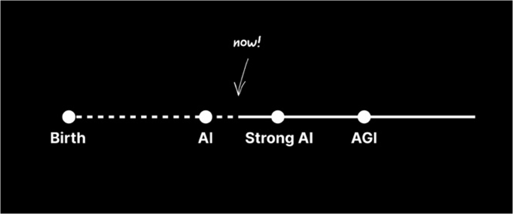

# 2024년 회고

<figure><figcaption>
AI의 현주소
</figcaption></figure>

연말연초가 되면서 감회가 새로운것 같습니다. 지난 2024년은 저에게 생각이상으로 뜻깊은 한해였고 굉장히 도전적이었던 한해라고 생각합니다. 4월에 시작된 저의 첫 사회생활은 어느덧 10개월에 접어들고 있습니다. 새롭게 마주한 팀 동료들은 다들 개성이 강하면서도 한사람이 갖출수없는 장점을 각각 지니고 있었고, 이러한 팀원들이 모여있는 공간은 스스로의 성장이 이루어질 수 밖에 없는 환경이 만들어진것 같습니다. 25년에는 분명 떠나는 동료와 새롭게 합류하는 동료들이 생길텐데 그때가 되어서도, 그 이후에도 지금의 동료들과 꾸준히 인연이 이어지면 좋겠다는 생각을 자주하게 됩니다. 하반기에 들어선 이후부터는 커리어적 성장이 발현될 준비를 하는 시간이라 말할 수 있을것 같습니다. 회사생활과 더불어 최대한 많은 업계사람을 만나려고 노력했고 그들로부터 얻는 경험과 대화는 스스로의 위치를 점검함과 동시에 앞으로의 방향성을 알 수있는 계기가 되었습니다. 가장 와닿은 점은 현재 몸담고 있는 분야가 생각보다 더 등장한지 얼마 되지 않아 제가 얼마든지 선두주자가 될 수 있겠다는 가능성을 체감한 것 같습니다. 2025년에도 초심을 잃지않고 더욱 발전하고자 하는 마음가짐을 유지해야겠습니다. 한편, AI의 발전이 굉장히 매섭습니다. 등장한 시기에 비하면 굉장히 오래되었으나 급진적인 성장을 이룬것이 얼마 지나지 않았습니다. 이 거대한 흐름속에서 어떠한 스탠스를 가지고 나아갈지 신중하게 결정해야할 것으로 보입니다. AI Researcher로 발돋움한지 1년 가까이 되었지만 아직도 이루어야 할 것이 많은것 같습니다. 적어도 RAG, Agent에 관해서는 그 누구도 따라오지 못할 깊이를 가지고자 부단히 노력하겠습니다 😁
