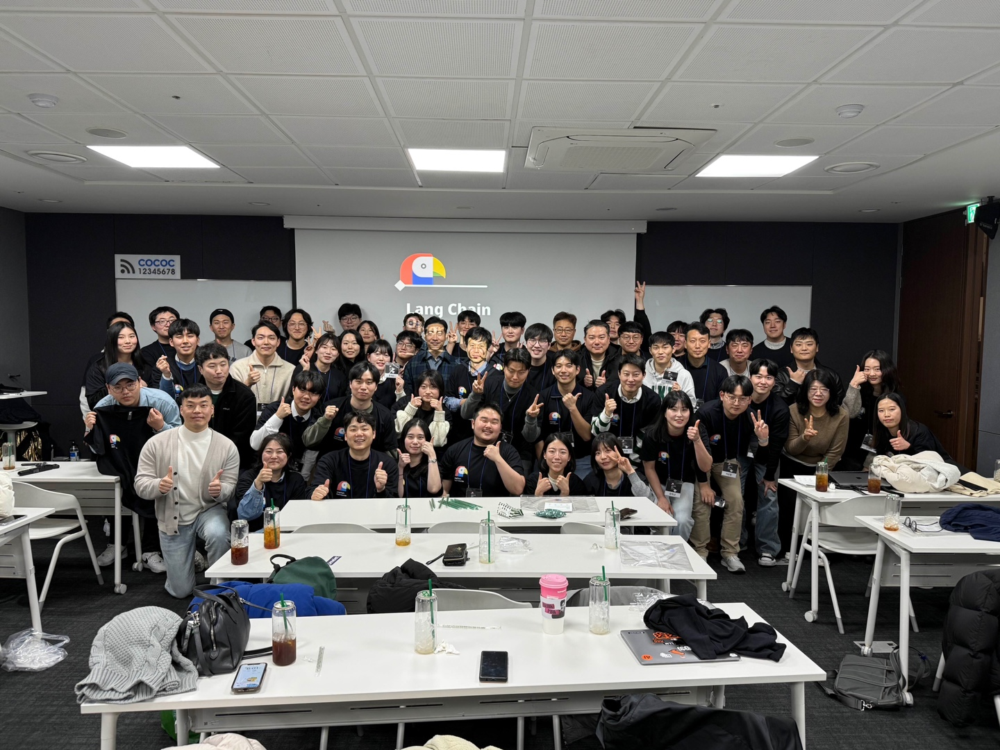
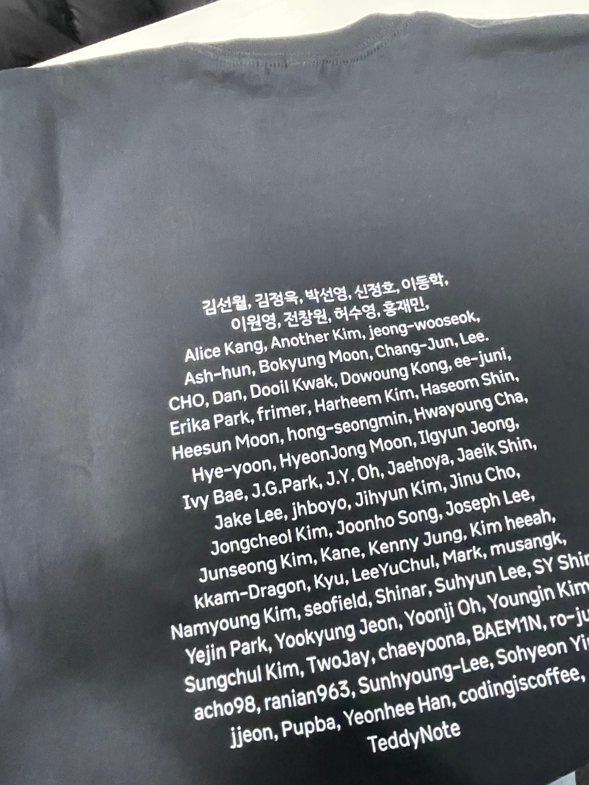

# LangChainOpenTutorial를 진행하며

<figure><figcaption>
LangChainOpenTutorial
</figcaption></figure>

## 2달간의 오픈소스 여정을 마치고

24년 12월부터 이야기가 나와 25년 2월 말까지 약 2달간의 오픈소스 프로젝트 여정이 마무리를 지었습니다. 어떤 오픈소스 프로젝트이냐!! 바로, [**LangChainOpenTutorial**](https://github.com/LangChain-OpenTutorial/LangChain-OpenTutorial)이라는 이름의 프로젝트로, 생성형AI 필드에서 근무하시는 분들은 한번쯤은 사용해보셨을법한 LangChain이라는 프레임워크의 글로벌 튜토리얼을 만들어내는 아주 의미있고 값진 프로젝트라고 자신있게 소개할 수 있겠습니다 👏👏👏👏

## 시작은 어떠했지?

사실 시작할때 생각보다 큰 기대도, 어려움도 없는 무난한 프로젝트가 될 것이라고 생각했습니다. OpenSource 경험이 없는것도 아니고, git도 잘 사용하며 Langchain은 0.0.1 버전이 되기도 전부터 사용했던 사람이니 "뭐... 별거 있겠어?" 라는 생각으로 임했고 저는 이 생각을 두고두고 후회하게 됩니다..

가장 어려웠던 부분은 역시 현업과의 병행이었습니다. 이게 생각보다 더 시간이 많이 안나더라구요. 퇴근 후에 작업을 수행한다는 것이 소요가 많았고, 특히 기존에 존재하지 않는 새로운 컨텐츠를 개발하는 파트를 담당하는 저에게 많은 부담을 주었던 것 같습니다.

## 과정은 순조로웠나?

프로젝트를 수행하는 과정은 의외로 순조로웠습니다. 역시나 굉장히 뛰어나신 분들이 모여있어서 그런지 원활하게 진행되었습니다. 다만, 아쉬웠던 점이 있다면 일주일단위로 작업을 수행하는데 정해진 일수안에 작업하여 PR을 올리고 남은 기간은 Peer Review를 올리는 등의 일정이 충분한 여유를 가질 수 있는 구조는 아니었습니다. 개발은 다 마쳤으나 제가 선택한 주제의 모토는 "구현은 쉬운데 성능 올리기는 어려운 것"이었어서 그런지 평소에 가지고 있던 많은 인사이트를 드러내기 부족했던 기간에 굉장히 큰 아쉬움을 표합니다.

## 그래서 결과는?

당연히 할당된 내용은 All-Clear! 개인적으로 80명 가까이 되는 인원과 협업한 경험은 색다르게 와닿았고, 더더욱 소통과 체제확립의 중요성을 알게 된 시간이었습니다. 한편 해당 아티클을 작성하는 날 최종 워크샵 및 회식을 다녀왔는데, 거기서 본 프로젝트의 주도자인 유튜버 테디노트님의 배경과 프로젝트가 가지는 의의를 설명들었습니다. 거기서 알게된 또 하나의 참뜻은 개인의 전문성을 키우는것과 이것을 PR하는 것은 어느것도 우열을 가리지 않고 중요하다는 것입니다. 이번 프로젝트가 저 개인의 다양한 면을 성장시키는데 크게 영향을 준 것 같습니다. 아래 참고링크를 남기니 많이 들러서 봐주세요😁

_(P.S. Author 부분의 'Jaehun Choi' 혹은 'Ash-hun'으로 된 것이 제 컨텐츠입니다)_

***

* **LangChainOpenTutorial Github** : [https://github.com/LangChain-OpenTutorial/LangChain-OpenTutorial](https://github.com/LangChain-OpenTutorial/LangChain-OpenTutorial)
* **LangChainOpenTutorial Gitbook** : [https://langchain-opentutorial.gitbook.io/langchain-opentutorial](https://langchain-opentutorial.gitbook.io/langchain-opentutorial)
* **Ash-hun's LinkedIn Article** : [https://www.linkedin.com/posts/choijaehun\_25%EB%85%84-1%EC%9B%94%EB%B6%80%ED%84%B0-2%EC%9B%94%EA%B9%8C%EC%A7%80-%EC%95%BD-2%EB%8B%AC%EA%B0%84-%EC%A7%84%ED%96%89%ED%95%9C-langchainopentutorial-activity-7299066146849267712-iVIE?utm\_source=share\&utm\_medium=member\_desktop\&rcm=ACoAADbFYvQBmRNOR0dJZ7jWhTAwpI5X8zmFEuA](https://www.linkedin.com/posts/choijaehun_25%EB%85%84-1%EC%9B%94%EB%B6%80%ED%84%B0-2%EC%9B%94%EA%B9%8C%EC%A7%80-%EC%95%BD-2%EB%8B%AC%EA%B0%84-%EC%A7%84%ED%96%89%ED%95%9C-langchainopentutorial-activity-7299066146849267712-iVIE?utm_source=share\&utm_medium=member_desktop\&rcm=ACoAADbFYvQBmRNOR0dJZ7jWhTAwpI5X8zmFEuA)

<figure><figcaption>
LangChainOpenTutorial
</figcaption></figure>

<figure><figcaption>
기념 티셔 : Ash-hun이 저랍니다😆
</figcaption></figure>
