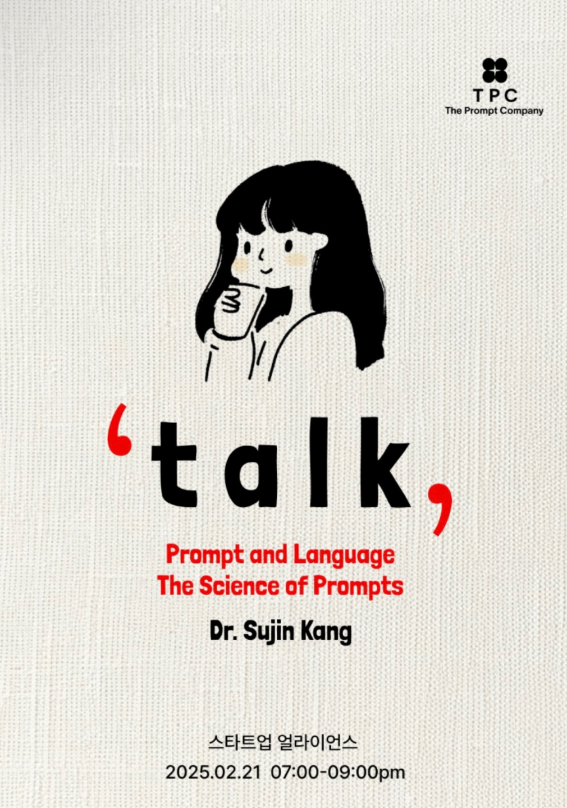

# Talk: Prompt and Language The Science of Prompts

<figure><figcaption>
'talk' prompt and language the science of prompts form Dr.Sujin Kang
</figcaption></figure>

25년 2월 20일 쌀쌀한 날씨를 견디며 퇴근후 강서까지 이동하였습니다. 이날 하루는 이 행사를 갈 생각에 계속 들떠있었던것 같습니다. 교통체증을 피하고 미리 강연장 근처에 가있을 생각에 충동적으로 시간단위 연차를 사용하기도 했고, 강연 1시간 전부터 근처에 도착해 카페에 앉아있었습니다. 그만큼 요즘 큰 기대를 가지고 듣게된 강연이 바로 **'talk, Prompt and Language The Science of Prompts (from Dr.Sujun Kang)** 바로 이 강연입니다! 강연자분은 [_**@teddynote**_](https://www.youtube.com/@teddynote) 님 채널에서 처음 알게된 프롬프트 엔지니어 **강수진 박사님**이십니다. 저는 이분의 언행을 굉장히 선호하는데 그 이유가 이분의 말씀 하나하나에서 일반 개발자 혹은 AI의 사고방식이 잘 뭍어나지 않고 원초적인 언어학적 개념이 배어있어서 그렇습니다. 물론 박사님께서는 언어학 박사학위를 가지고 계시고 이를 활용하여 생성형 AI 필드에서 일하고 계시니 공통분모를 찾기에 더할나위없이 좋은 환경이라 더 이끌리는 것도 있습니다만, 이것을 배제하고도 박사님의 연사를 듣다보면 저에게 배경지식이 부족한 '언어학'적인 인사이트를 너무 많이 얻을 수 있어 좋은 것 같습니다.&#x20;

앞서 거의 종교와 같은 찬사를 보낸 박사님의 코어 분야를 프롬프트와 접목시킨 행사는 어떨것 같나요?\
저는 개인적으로 제 예상을 완전히 벗어난 내용을 다뤄주셔서 또 한번 놀랬습니다. 생성형AI의 필드에 있는 사람은 궁극적으로 인간의 행동과 사고방식을 기술적으로 모방하고 구현하여 더 많은 혁신을 이루어내는데 앞서있는 사람들이라고 생각하는데요, 그러한 관점에서 인간의 행동과 사고, 본질적인 개념을 더 깊게 알 수 있는 매우매우 뜻깊은 시간이었습니다. 필기도 엄청했구요😁 정말로.. 남주기 아까운 이런 내용들을 너무나도 다양하게 알기쉽게 공유해주신 박사님께 이렇게 블로그로라도 멀리서나마 감사의 말씀을 남깁니다.
