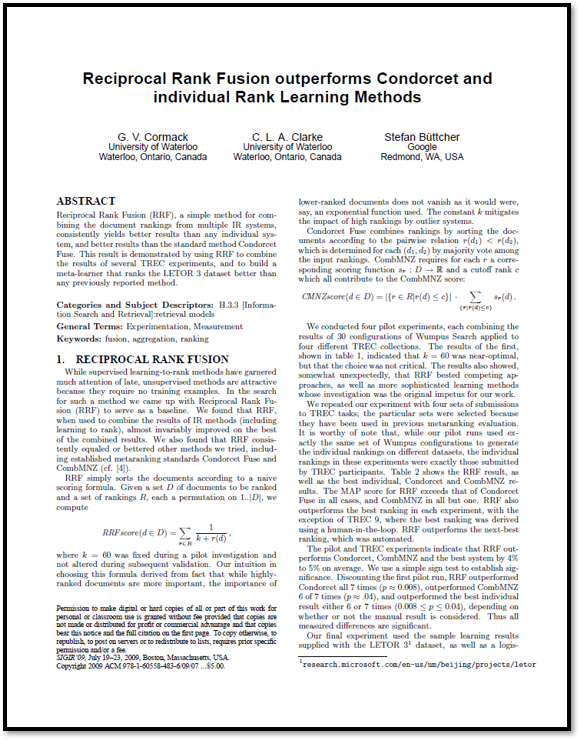

# \[2009] Reciprocal Rank Fusion outperforms Condorcet and individual Rank Learning Methods

<figure><figcaption><p>Reciprocal Rank Fusion outperforms Condorcet and individual Rank Learning Methods</p></figcaption></figure>

> **Paper Link** : [https://research.google/pubs/reciprocal-rank-fusion-outperforms-condorcet-and-individual-rank-learning-methods/](https://research.google/pubs/reciprocal-rank-fusion-outperforms-condorcet-and-individual-rank-learning-methods/)

```
※ 본 포스팅은 논문의 가장 중요한 내용에 대한 리뷰를 정리하여 올리기 때문에 다소 축약되거나 의역된 내용이 많습니
```


## 0. ABSTRACT

Reciprocal Rank Fusion (RRF)는 여러 정보 검색(IR) 시스템에서 생성된 문서 순위를 결합하는 간단한 방법으로, 개별 시스템보다 일관되게 더 나은 결과를 제공하며, 기존의 Condorcet Fuse 방법보다도 우수한 성능을 보여줍니다. 이러한 결과는 RRF를 사용하여 여러 TREC 실험 결과를 결합하고, LETOR 3 데이터셋에서 이전에 보고된 어떤 방법보다 더 우수한 순위를 산출하는 meta-learner를 구축함으로써 입증되었습니다.

## Ⅰ. RECIPROCAL RANK FUSION

최근 지도 학습 기반의 랭킹 학습 방법이 많은 주목을 받고 있는 반면, 비지도 학습 방법은 학습 예제가 필요하지 않다는 점에서 매력적입니다. 이러한 방법을 탐구하는 과정에서 우리는 Reciprocal Rank Fusion(RRF)을 기준선 방법으로 제안하게 되었습니다. 우리는 RRF를 정보 검색(IR) 방법(랭킹 학습을 포함한)의 결과를 결합하는 데 사용했을 때, 거의 항상 결합된 결과 중 가장 우수한 결과를 능가한다는 것을 발견했습니다. 또한 RRF는 Condorcet Fuse와 CombMNZ와 같은 기존의 메타랭킹 표준 방법을 포함하여 우리가 시도한 다른 방법들에 비해 일관되게 동등하거나 더 나은 성능을 보였습니다.&#x20;

RRF는 단순한 점수 산정 공식에 따라 문서를 정렬합니다. 순위를 매겨야 하는 문서 집합 $$D$$와 순위 집합 $$R$$ ,(각각이 $$1..|D|$$ 범위의 순열인)이 주어졌을 때, 우리는 RRF Score를 계산합니다:

$$
RRF_{score}(d \in D) = \sum_{r \in R} \frac{1}{k+r(d)}
$$

여기서 상수 $$k=60$$ 는 예비실험 중에 고정되었으며 이후의 검증 과정에서도 변경되지 않았습니다. 이 공식을 선택한 우리의 직관은, 상위에 순위가 매겨진 문서가 더 중요하긴 하지만, 지수 함수 등을 사용할 경우처럼 하위 순위 문서의 중요성이 완전히 사라지지 않는다는 점에서 비롯되었습니다. 상수 $$k$$는 이상치 시스템에 의한 높은 순위의 영향을 완화하는 역할을 합니다.

Condorcet Fuse는 문서 간 순위 관계 $$r(d_1) < r(d_2)$$에 따라 문서를 정렬하여 순위를 결합합니다. 이 관계는 각 $$(d1,d2)$$ 쌍에 대해 입력된 순위들의 다수결로 결정됩니다. CombMNZ는 각 순위 $$r$$ 에대해 이에 대응하는 점수 함수 $$s_r : D \rightarrow \mathbb{R}$$와 기여하는 모든 요소를 포함하는 cutoff-rank $$c$$가 필요하며, 이를 통해 CombMNZ 점수를 계산합니다:

$$
CMNZ_{score}(d \in D) = |\{ r \in D | r(d)\leq c\}| \cdot \sum_{\{r|r(d)\leq c\}} s_r(d)
$$

우리는 네 가지 파일럿 실험을 수행했으며, 각각은 Wumpus Search의 30가지 설정을 네 가지 다른 TREC 컬렉션에 적용한 결과를 결합한 것입니다. table 1 에 제시된 첫 번째 실험 결과는 $$k=60$$이 최적값에 가까운 것으로 나타났으나, 이 선택이 결정적이지는 않음을 보여주었습니다. 또한 다소 예상 밖으로 RRF가 경쟁 방법뿐만 아니라 우리가 원래 연구를 시작하게 된 계기가 되었던 더 정교한 학습 방법들보다도 우수한 성능을 보였다는 점이 확인되었습니다.

우리는 TREC task에 제출된 네 가지 세트를 사용하여 실험을 반복했습니다. 이 세트들은 이전 meta-ranking 평가에서 사용된 적이 있어 선택되었습니다. 주목할 점은, 예비실험에서는 동일한 Wumpus 설정 세트를 사용하여 서로 다른 데이터셋에서 개별 순위를 생성했지만, 이번 실험에서는 TREC 참가자들이 제출한 순위 자체를 그대로 사용했다는 것입니다. table 2는 RRF 결과와 함께 최고 개별 순위, Condorcet Fuse, CombMNZ 결과를 보여줍니다. RRF의 MAP 점수는 모든 경우에서 Condorcet Fuse를 능가했으며, CombMNZ를 모든 경우에서 하나를 제외하고 능가했습니다. 또한, RRF는 TREC 9를 제외한 모든 실험에서 최고 순위를 능가했습니다. TREC 9에서는 인간이 개입한 방식으로 도출된 순위가 최고였으며, RRF는 이와 비교했을 때 자동화된 방식으로 생성된 차선의 순위를 능가했습니다.

예비실험과 TREC 실험 결과, RRF는 평균적으로 Condorcet, CombMNZ, 그리고 최고 시스템을 4%에서 5% 정도 능가하는 것으로 나타났습니다. 우리는 간단한 부호 검정을 사용하여 통계적 유의성을 확인했습니다. 첫 번째 예비실험을 제외하고, RRF는 Condorcet를 7번 모두 능가했으며$$(p \approx 0.008)$$, CombMNZ는 7번 중 6번을 능가했습니다$$(p \approx 0.04)$$. 또한, RRF는 최고 개별 결과를 6번 또는 7번 능가했으며$$(0.008 \leq p \leq 0.04)$$, 이는 manual한 결과가 포함된 여부에 따라 다릅니다. 따라서 측정된 모든 차이는 통계적으로 유의미합니다.

<figure><figcaption><p>Table 1 : 예비실험, TREC topic 351-400에 대한 30개의 모델 시스템 결과에서 RR Fusion의 k 값이 MAP에 미치는 영향. 비교를 위해 최고 모델 시스템과 경쟁적인 융합 방법들의 결과가 함께 제시됩니다. 동일한 시스템을 3가지 다른 테스트 컬렉션에 적용했을 때도 유사한 결과가 나타났습니다.</p></figcaption></figure>

<figure><figcaption><p>Table 2 : TREC 3, TREC 5, TREC 9의 애드혹 태스크와 TREC 2004 robust한 트랙에 제출된 실행 결과들의 융합에 대한 MAP 점수.</p></figcaption></figure>

<figure><figcaption><p>Table 3 : LETOR 3 코퍼스에서 583,850개의 문서-쿼리 쌍에 대한 개별 순위와 융합. <br>각 방법에 대한 MAP 점수와 융합 결과와 개별 MAP 점수 간의 차이, 95% 신뢰 구간.</p></figcaption></figure>

우리의 마지막 실험에서는 LETOR 3 데이터셋과 함께 제공된 샘플 학습 결과를 사용했으며, 우리가 개발 중인 로지스틱 경사 하강법(LGD)도 사용했습니다. 분석을 위해, 우리는 7개의 문서-쿼리 쌍 세트를 하나로 결합하고 전체 MAP 점수를 계산했습니다. 또한 RRF와 개별 MAP 점수 간의 차이, 95% 신뢰 구간, p-value(차이가 0이라는 귀무 가설 하에서의 가능성)를 계산했습니다. table 3은 이러한 결과를 보여줍니다. RRF는 모든 개별 순위를 능가했으며$$(p < 0.003)$$, 가장 우수한 순위는 0.02의 차이$$(4\%)$$로 능가했습니다. Condorcet는 RRF보다 열등했으며$$(p \approx 0.004)$$, 개별 순위는 다소 개선된 것으로 보였습니다$$(p \approx 0.2)$$. CombMNZ는 RRF를 약간 능가했으나$$(p \approx 0.2)$$, 기본 시스템 간의 측정된 차이 중 유의미한 차이는 없었습니다.

## Ⅱ. DISCUSSION

간결함을 위해, 시스템 성능의 척도로 MAP을 보고합니다. P@k, R-precision, NDCG는 유사한 결과를 제공합니다. RRF는 Condorcet Fuse보다 더 간단하고 효과적이며, 특정 랭킹 방법에서 반환된 임의의 점수에 관계없이 순위를 결합한다는 귀중한 특성을 공유합니다. RRF는 특별한 투표 알고리즘이나 전역 정보를 필요로 하지 않으며, 순위는 한 시스템씩 계산하고 합산할 수 있어 모든 순위를 메모리에 저장할 필요가 없습니다. 우리는 RRF가 Condorcet보다 더 우수하다고 추측하는데, 이는 개별 순위 내에서의 다양성을 더 잘 활용할 수 있기 때문입니다. 문서를 높게 순위 매기는 한두 개의 시스템이 해당 문서의 순위를 더 인기 있는 문서들에 비해 크게 향상시킬 수 있습니다. Condorcet에서는 약한 선호의 단순 다수가 훨씬 강한 선호를 누를 수 있습니다.

CombMNZ는 개별 시스템의 보정되지 않은 점수의 합을 각 순위의 이진 양자화 합과 곱합니다. 이로 인해 그 결과의 분산이 더 크며, RRF보다 약간 더 우수하거나 Condorcet보다 상당히 더 나쁜 결과가 나오는 것은 놀랄 일이 아닐 수 있습니다. 우리는 이 효과가 일부 점수가 다른 점수들보다 우연히 더 잘 맞아떨어지기 때문이라고 추측합니다.

우리가 아는 한, LETOR 기준 랭킹 학습 방법에 융합을 적용하여 형성된 meta-learner의 성능을 능가하거나 맞먹는 결과는 보고된 바 없습니다. 따라서 meta-learner는 현재 알려진 가장 우수한 방법을 구성하며, 이 결과는 데이터셋에서 학습 가능한 것의 하한을 높입니다. 후자의 질문은 흥미로운 문제로, LETOR 3의 MAP 점수가 인간 평가자가 판별한 관련성으로 달성 가능한 65%에 근접하고 있기 때문입니다.

