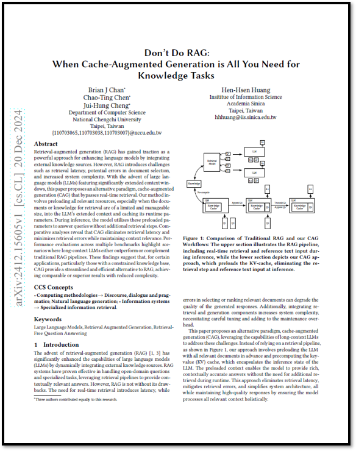

# \[2024] Don't Do RAG : When Cache-Augmented Generation is All you Need for Knowledge Tasks

<figure><figcaption><p>Don't Do RAG : When Cached-Augmented Generation is All You Need for Knowledge Tasks</p></figcaption></figure>

> **Paper Link** : [https://arxiv.org/pdf/2412.15605](https://arxiv.org/pdf/2412.15605)

```
※ 본 포스팅은 논문의 가장 중요한 내용에 대한 리뷰를 정리하여 올리기 때문에 다소 축약되거나 의역된 내용이 많습니
```

## 0. Abstract

Retrieval-augmented generation(RAG)은 외부 지식 소스를 통합하여 언어 모델의 성능을 강화하는 강력한 접근방식으로 주목받고 있습니다. 그러나 RAG는 검색 지연, 문서 선택 오류 가능성, 시스템의 복잡성 증가와 같은 문제를 동반합니다. 대규모 언어 모델(LLM)의 context-window가 크게 확장된 최근에는 이러한 문제를 해결할 수 있는 대안적인 패러다임으로, 실시간 검색을 생략한 **캐시 증강 생성 (Cache-augmented generation, CAG)**&#xC744; 제안합니다.

본 연구에서 제안하는 방법은, <mark style="color:red;">**검색해야 할 문서나 지식의 크기가 제한적이고 관리 가능한 경우, 관련 리소스를 LLM의 확장된 문맥 창에 미리 로드하고, 실행 시 필요한 매개변수를 캐싱하는 방식**</mark>입니다. 추론 과정에서는 추가적인 검색 없이 이러한 미리 로드된 매개변수를 활용하여 질의에 응답합니다.

비교 분석 결과, CAG는 검색 지연을 제거하고 검색 오류를 최소화하면서 문맥 적합성을 유지한다는 점을 확인했습니다. 다양한 벤치마크를 통한 성능 평가에서는, 긴 문맥 처리가 가능한 LLM이 기존 RAG 파이프라인을 능가하거나 이를 보완하는 시나리오가 다수 나타났습니다. 이러한 결과는 특히 지식 기반이 제한적인 특정 애플리케이션에서 CAG가 RAG에 비해 간소화된 구조와 효율성을 바탕으로 동등하거나 더 나은 성과를 달성할 수 있음을 시사합니다.

#### CCS Concepts

* Computing methodologies -> Discourse, dialogue and pragmatics; Natural language generation;
* Information Systems -> Specialized information retrieval

## 1. Introduction

Retrieval-augmented generation(RAG)의 등장은 외부 지식 소스를 동적으로 통합함으로써 대규모 언어 모델(LLM)의 역량을 크게 향상시켰습니다. RAG 시스템은 오픈 도메인 질문이나 전문적인 작업을 처리하는 데 효과적이며, 검색 파이프라인을 활용해 문맥에 적합한 답변을 제공합니다. 그러나 RAG에는 몇 가지 단점도 존재합니다. 실시간 검색이 필요하다는 점에서 지연(latency)이 발생할 수 있으며, 관련 문서를 선택하거나 순위를 매기는 과정에서의 오류는 생성된 응답의 품질을 저하시킬 수 있습니다. 또한, 검색 및 생성 구성 요소를 통합하는 과정에서 시스템의 복잡성이 증가하고, 세심한 조정이 필요하며 유지 관리의 부담도 늘어납니다.

<figure><figcaption><p>Figure 01 : 전통적인 RAG와 CAG 워크플로우 비교: 위쪽 섹션은 RAG 파이프라인을 보여주며, 추론 과정에서 실시간 검색과 참조 텍스트 입력을 포함합니다. 반면, 아래쪽 섹션은 CAG 접근 방식을 나타내며, KV-캐시를 미리 로드하여 추론 시 검색 단계와 참조 텍스트 입력을 제거합니다.</p></figcaption></figure>

본 논문은 이러한 문제를 해결하기 위해 **캐시 증강 생성(Cache-augmented generation, CAG)**&#xC774;라는 대안적 패러다임을 제안하며, <mark style="color:red;">**긴 문맥 처리가 가능한 LLM의 역량을 활용**</mark>합니다. **Figure 01**에서 보이는 것처럼 검색 파이프라인에 의존하는 대신, 본 접근법은 LLM에 모든 관련 문서를 사전에 로드하고, 추론 상태를 캡슐화하는 **키-값(KV) 캐시**를 사전에 계산합니다. 이렇게 미리 로드된 문맥은 실행 시 추가 검색 없이도 풍부하고 문맥적으로 정확한 답변을 제공할 수 있도록 합니다.

이 방식은 검색 지연을 제거하고 검색 오류를 줄이며, 관련 문맥을 전체적으로 처리함으로써 응답 품질을 유지하는 동시에 시스템 아키텍처를 간소화합니다.

최근 연구들에서는 RAG 과제에서 긴 문맥을 처리할 수 있는 모델의 성능을 조사했으며, GPT-o1, GPT-4, Claude 3.5와 같은 최신 모델들이 대량의 검색 데이터를 효과적으로 처리하며, 많은 상황에서 전통적인 시스템을 능가할 수 있음을 밝혔습니다. 연구 결과에 따르면, 모든 문서가 확장된 문맥 길이 내에 포함될 수 있는 경우, 전통적인 RAG 시스템을 이러한 긴 문맥 모델로 대체할 수 있습니다.

이와  비슷하게, TurboRAG에서는 사전 계산된 KV 캐싱이 효율성을 향상시킨다는 점을 입증했지만, 올바른 동작을 위해 position ID Rearrangement가 필요하다는 한계가 있음을 지적했습니다. 그럼에도 불구하고, 이러한 방법들은 여전히 RAG 시스템 고유의 검색 실패 문제에 취약합니다.

전통적인 RAG 워크플로우와 제안된 접근법을 비교하는 일련의 실험을 통해, 긴 문맥을 처리할 수 있는 LLM이 효율성과 정확성 모두에서 RAG를 능가하는 시나리오를 확인했습니다. 본 논문은 기술적, 실용적 시사점을 다루며, 특히 검색해야 할 문서나 지식의 크기가 제한적이고 관리 가능한 경우, CAG가 RAG를 대체할 수 있는 간소화되고 효과적인 대안으로 작용할 수 있는 이유와 시점에 대한 통찰을 제공합니다.

이 연구 결과는 지식 통합 작업에서 RAG에 대한 기본적인 의존에 도전하며, 긴 문맥 LLM의 확장된 역량을 활용하기 위한 간단하고 견고한 솔루션을 제시합니다. 본 논문의 기여는 다음 세 가지로 요약됩니다:

* **검색 없는 긴 문맥 패러다임**: 미리 로드된 문서와 사전 계산된 KV 캐시를 활용하는 새로운 접근 방식을 제안하여 검색 지연, 오류, 시스템 복잡성을 제거했습니다.
* **성능 비교**: 광범위한 실험을 통해 긴 문맥 LLM이 특히 관리 가능한 지식 기반을 가진 경우 전통적인 RAG 시스템을 능가하는 시나리오를 확인했습니다.
* **실용적 통찰**: 지식 집약적 워크플로우를 최적화하기 위한 실질적인 통찰을 제공하며, 특정 애플리케이션에서 검색 없는 방식의 실현 가능성을 입증했습니다. 우리의 CAG 프레임워크는 공개적으로 제공됩니다.

## 2. Methodology

우리의 CAG 프레임워크는 긴 문맥을 처리할 수 있는 LLM의 확장된 문맥 처리 능력을 활용하여, 검색 없이 지식을 통합할 수 있도록 설계되었습니다. 외부 지식 소스 (예: 문서 집합 $$\mathcal{D} = \{ d_1, d_2, \cdots \}$$,를 미리 로드하고, 키-값(KV) 캐시 $$C_{KV}$$​를 사전에 계산함으로써 전통적인 RAG 시스템에서 발생하는 실시간 검색의 계산적 문제와 비효율성을 해결합니다. 프레임워크의 작동은 다음 세 가지 단계로 나뉩니다:

1. **External Knowledge Preloading**\
   이 단계에서는 대상 애플리케이션과 관련된 문서 집합$$D$$를 선별하여 모델의 확장된 문맥 창에 맞도록 전처리하고 형식을 조정합니다. LLM $$\mathcal{M}$$, 모델의 매개변수 $$\theta$$ , process $$\mathcal{D}$$를 처리하여 사전 계산된 KV 캐시를 생성합니다:\
   \
   $$C_{KV} = \text{KV-Encode}(\mathcal{D})$$ .................. (1)\
   \
   이 KV Cache는 LLM의 추론 상태를 캡슐화하며, 이후 사용을 위해 디스크 또는 메모리에 저장됩니다. $$\mathcal{D}$$를 처리하는 데 필요한 계산 비용은 한 번만 발생하며, 이후의 질의 수와 관계없이 재사용됩니다.
2. **Inference**\
   추론 과정에서는 사전 계산된 KV 캐시 $$C_{KV}$$와 사용자의 질의 $$\mathcal{Q}$$를 함께 로드합니다. LLM은 이 캐시된 문맥을 활용하여 응답을 생성합니다:\
   \
   $$\mathcal{R} = \mathcal{M}(\mathcal{Q} | C_{KV})$$ .................. (2)\
   \
   외부 지식을 미리 로드함으로써, 이 단계에서는 검색 지연을 제거하고 동적 검색에서 발생할 수 있는 오류나 누락의 위험을 줄입니다. 결합된 프롬프트 $$\mathcal{P} = \text{Concat}(\mathcal{D}, \mathcal{Q})$$는 외부 지식과 사용자 질의를 모두 통합하여 이해할 수 있도록 보장합니다.
3.  **Cache Reset**\
    여러 추론 세션에 걸쳐 시스템 성능을 유지하기 위해, 메모리에 저장된 KV Cache는 효율적으로 초기화할 수 있습니다. KV Cache는 새로운 토큰 $$t_1, t_2, \cdots, t_k$$ ​이 순차적으로 추가되는 방식으로 확장되므로, 초기화는 이러한 새로운 토큰들을 잘라내는 과정을 포함합니다:\
    \
    $$C_{KV}^{reset} = \text{Truncate}(C_{KV}, t_1, t_2, \cdots, t_k)$$ .................. (3)

    \
    이 방식은 전체 캐시를 디스크에서 다시 로드하지 않고 빠르게 재초기화할 수 있도록 하여, 지속적인 속도와 반응성을 보장합니다.

제안된 방법론은 전통적인 RAG 시스템에 비해 여러 가지 중요한 장점을 제공합니다:

* **단축된 추론 시간**: 실시간 검색이 필요 없으므로 추론 과정이 더 빠르고 효율적이 되어 사용자 질의에 대한 응답이 더 신속하게 이루어집니다.
* **통합된 문맥**: 전체 지식 집합을 LLM에 미리 로드함으로써 문서에 대한 전체적이고 일관된 이해를 제공하며, 이로 인해 다양한 작업에서 응답 품질과 일관성이 향상됩니다.
* **간소화된 아키텍처**: 검색기와 생성기를 통합할 필요가 없으므로 시스템이 더 간소화되어 복잡성이 줄어들고, 유지 관리가 용이해지며 개발 부담이 경감됩니다.

앞으로, 우리의 접근법은 LLM의 예상되는 발전에 따라 더욱 강력해질 것입니다. 미래의 모델들이 context length를 확장함에 따라, 한 번의 추론 단계에서 점점 더 큰 지식 집합을 처리할 수 있게 될 것입니다. 또한, 이러한 모델들이 긴 문맥에서 관련 정보를 추출하고 활용하는 능력이 향상됨에 따라 성능이 더욱 개선될 것입니다. 이 두 가지 트렌드는 우리의 접근법의 활용 범위를 크게 확장시켜, 더 복잡하고 다양한 애플리케이션을 처리할 수 있게 할 것입니다. 그 결과, 우리의 방법론은 차세대 LLM의 성장하는 능력을 활용하여 지식 집약적인 작업에 강력하고 다재다능한 솔루션으로 자리 잡을 것입니다.

<figure><figcaption><p>Table 1 : 참조하는 텍스트 길이에 따라 달라지는 SQuAD와 HotPotQA 테스트 세트의 개요로, 각 구성에 대해 문서 수, 질문 수, 및 관련 응답을 강조합니다.</p></figcaption></figure>

## 3. Experiments

### 3.1 Experimental Set up

우리의 제안된 방법의 효과를 평가하기 위해, 두 가지의 널리 인정받는 QA 벤치마크를 사용하여 실험을 수행했습니다 : **Stanford Question Answering Dataset (SQuAD)** 과 **HotPotQA Dataset**입니다. 이 데이터셋들은 상호 보완적인 도전을 제공하며, SQuAD는 단일 본문 내에서 정확하고 문맥에 맞는 답변에 중점을 두고, HotPotQA는 여러 문서에 걸친 다중 단계 추론을 강조합니다. 두 데이터셋 모두 문서 $$\mathcal{D}=\{d_1, d_2, \cdots \}$$ 와 질문 $$\mathcal{Q}{S} = \{ q_1, q_2, \cdots \}$$ 그리고 정답(=golden response) $$\mathcal{R} = \{ r_1, r_2, \cdots \}$$이 짝지어져 구성됩니다. 이 데이터셋들은 단일 문맥 이해(=single context comprehension)와 복잡한 다중 단계 추론(=complex multi-hop reasoning)을 평가할 수 있는 강력한 플랫폼을 제공합니다.

참조 텍스트 길이가 검색의 난이도에 미치는 영향을 조사하기 위해, 우리는 각 데이터셋에 대해 참조 텍스트의 크기를 다르게 설정한 세 가지 테스트 세트를 만들었습니다. 예를 들어, HotPotQA의 small 설정에서는 HotPotQA 문서 집합에서 16개의 문서 $$\mathcal{D}_S \subset \mathcal{D}$$를 샘플링하여 긴 참조 텍스트를 구성한 후 $$\mathcal{D}_S$$와 관련된 QA 쌍을 테스트 인스턴스로 선택하였습니다. 동일한 방법론을 사용하여 SQuAD의 테스트 세트도 생성했습니다.

데이터셋 통계는 Table 1에 요약되어 있습니다. 문서 수(즉, 참조 텍스트의 길이)가 증가함에 따라, 특히 RAG 시스템에서 작업이 더 어려워집니다. <mark style="background-color:yellow;">**더 긴 참조 텍스트는 정확하게 올바른 정보를 검색하는 난이도를 높이며, 이는 LLM이 고품질의 응답을 생성하는 데 중요한 요소**</mark>입니다.

주요 작업은 각기 다른 미리 로드된 본문을 기반으로 SQuAD와 HotPotQA 질문에 대해 정확하고 문맥에 맞는 답변 $$\hat{\mathcal{R}} = \{ \hat{r}_1, \hat{r}_2, \cdots\}$$을 생성하는 것입니다. 사전계산된 키-값캐시 $$C_{KV} = \text{KV-Encode}(\mathcal{D})$$를 활용하여, 우리의 시스템은 추론 중 검색 메커니즘에 의존하지 않고 응답 $$\hat{r}i = \mathcal{M}(q_i | C_{KV})$$를 생성합니다. 이 통합된 접근법은 전통적인 RAG 시스템과 직접적인 성능 비교를 가능하게 하여, 다양한 QA 과제에서 우리의 방법의 강점과 한계를 부각시킵니다.

실험은 Tesla V100 32G × 8 GPUs에서 실행되었습니다. 모든 실험에서 우리는 Llama 3.1 8B Instruction 모델을 기본 LLM으로 사용했으며, 이는 RAG 기준 시스템과 제안된 방법 모두에서 사용되었습니다. 이 모델은 최대 128k 토큰의 입력 크기를 지원하여, 방대한 문맥을 처리할 수 있습니다. 제안된 방법에서는 각 데이터셋의 문맥이 사전 계산된 키-값(KV) 캐시를 통해 모델에 미리 로드되었습니다. SQuAD의 경우, 문서 $$D_S$$는 KV 캐시 $$D_H$$는 $$C_{KV}^{H} = \text{KV-Encode}(\mathcal{D}_H)$$로 인코딩되었습니다. 이 캐시들은 오프라인으로 저장되었으며, 추론 중에 로드되어 실시간 검색의 필요성을 없앴고, 각 데이터셋에 대해 모든 관련 정보에 대한 포괄적인 접근을 보장했습니다.

### 3.2 Baseline Systems

기본 RAG 시스템은 LlamaIndex 프레임워크를 사용하여 구현되었으며, 두 가지 검색 전략을 채택했습니다: 희소 검색을 위한 BM25와 밀집 검색을 위한 OpenAI 인덱스입니다. 각 데이터셋 (SQuAD와 HotPotQA)은 별도로 평가되었으며, 검색 시스템은 해당 데이터셋에서만 본문을 가져오도록 설정하여 집중적이고 공정한 평가가 이루어지도록 했습니다. 각 기본 시스템의 세부 사항은 다음과 같습니다:

1.  Sparse Retrieval System (BM25) : \
    첫 번째 기본 시스템은 검색을 위해 BM25 index를 사용했습니다. BM25는 희소 검색 알고리즘으로, 용어 빈도-역문서 빈도(TF-IDF)와 문서 길이 정규화를 기반으로 문서를 순위 매깁니다. 주어진 질의 $$q_i$$에 대해, BM25는 인덱스된 컬렉션 $$\mathcal{D}$$에서 상위 $$k$$개의 passage $$\mathcal{P}_k = \{ p_1, p_2, \cdots, p_k \}$$을 검색합니다. 그런 다음 이 본문들은 생성기 $$\mathcal{M}$$에 전달되어 답변을 합성합니다.\
    \
    $$\hat{r}_i = \mathcal{M}(q_i | \mathcal{P}_k)$$ .................. (4)

    \
    BM25는 키워드 매칭이 필요한 작업에 적합한 강력하고 해석 가능한 검색 메커니즘을 제공합니다.
2. Dense Retrieval System (OpenAI Index) : \
   두 번째 baseline은 OpenAI 인덱스를 활용했으며, 이는 문서와 질의를 공유된 의미 공간에서 표현하기 위해 밀집 임베딩(dense embeddings)을 사용합니다. 질의 $$q_i$$에 대해 밀집 검색은 질의와 의미적으로 일치하는 상위 $$k$$개의 구절($$P_k$$)을 선택하며, 희소(sparse) 방법에 비해 더 나은 맥락 이해를 제공합니다. 이렇게 선택된 구절들은 동일하게 생성기로 전달되어 Equation 4에 따라 답변을 생성합니다. 이 시스템은 단순한 단어 일치 이상으로 세밀한 맥락적 매칭이 필요한 질문에 특히 효과적입니다.

우리의 실험은 SQuAD와 HotPotQA 데이터셋을 사용하여 다양한 시스템의 성능을 평가했으며, 평가 기준으로는 BERTScore를 사용하여 정답과의 유사성을 측정했습니다. RAG 기준점에서는 상위 1개, 3개, 5개, 10개의 검색된 구절을 추론에 활용했습니다. 반면, 우리의 CAG는 각 데이터셋에 특화된 사전 로드된 맥락을 활용하여 검색 제약 없이 답변을 생성했습니다.

### 3.3 Results

<figure><figcaption><p>Table 2 : 실험 결과</p></figcaption></figure>

Table 2에서 볼 수 있듯이, 실험 결과는 우리가 제안한 방법과 기존 RAG 시스템 간의 뚜렷한 차이를 보여주었습니다. 제안된 접근 방식은 대부분의 상황에서 가장 높은 BERTScore를 기록하며 RAG 시스템을 능가했습니다. 테스트 세트의 전체 맥락을 사전 로드함으로써, 우리의 시스템은 검색 오류를 제거하고 모든 관련 정보를 바탕으로 한 포괄적인 추론을 가능하게 했습니다. 이러한 장점은 특히 RAG 시스템이 불완전하거나 관련 없는 구절을 검색하여 최적이 아닌 답변을 생성할 가능성이 있는 상황에서 두드러집니다. 이 결과는 특히 소스 자료에 대한 통합적인 이해가 필요한 작업에서 우리 방법의 견고함과 효율성을 잘 보여줍니다. OpenAI Indexes와 같은 밀집 검색 방법이 BM25와 같은 희소 검색 방법보다 더 나은 성능을 보이지만, 두 방법 모두 검색 정확성과 순위 결정 휴리스틱에 의존한다는 근본적인 한계를 가지고 있습니다. 우리의 접근 방식은 이러한 한계를 극복하여 Llama 3.1 모델의 긴 맥락 처리 능력을 활용함으로써 우수한 성능을 달성했습니다.&#x20;

<figure><figcaption><p>Table 3 : 생성시간 비교</p></figcaption></figure>

Table 3은 참조 텍스트를 추론 중에 동적으로 제공하며 실시간 KV-cache 계산이 필요한 표준 맥락 학습 (In-Context Learning)과 우리의 CAG 접근 방식을 비교한 것입니다. 결과는 참조 텍스트 길이가 길어질수록 CAG가 생성 시간을 획기적으로 단축함을 보여줍니다. 이러한 효율성은 KV-cache를 사전에 로드하여 참조 텍스트를 실시간으로 처리할 필요를 없앴기 때문입니다. 게다가 CAG는 검색 단계를 완전히 생략하기 때문에 기존 RAG 시스템보다도 더 빠릅니다. RAG와 달리, CAG는 추론 중에 검색이나 참조 텍스트 입력이 필요하지 않아 과정을 단순화하고 효율성을 더욱 높였습니다. 이러한 장점 덕분에 CAG는 방대한 참조 맥락이 필요한 상황에서도 성능을 저하시키지 않으면서 상당한 시간 절약을 제공하는 최적의 솔루션으로 자리잡습니다.

## 4. Conclusion

Long-Context LLM이 발전함에 따라, 우리는 전통적인 RAG 워크플로우를 재고할 필요성에 대해 강력한 주장을 제시합니다. 본 연구는 검색 지연을 없애는 데 중점을 두지만, 미리 로딩과 선택적 검색을 결합한 하이브리드 접근법의 가능성도 있습니다. 예를 들어, 시스템은 기본 문맥을 미리 로드하고, 검색은 엣지 케이스나 매우 특정한 질의를 보완하는 데만 사용할 수 있습니다. 이렇게 하면 미리 로딩의 효율성과 검색의 유연성을 균형 있게 맞출 수 있어, 문맥의 완전성과 적응성이 모두 중요한 상황에 적합할 것입니다.
