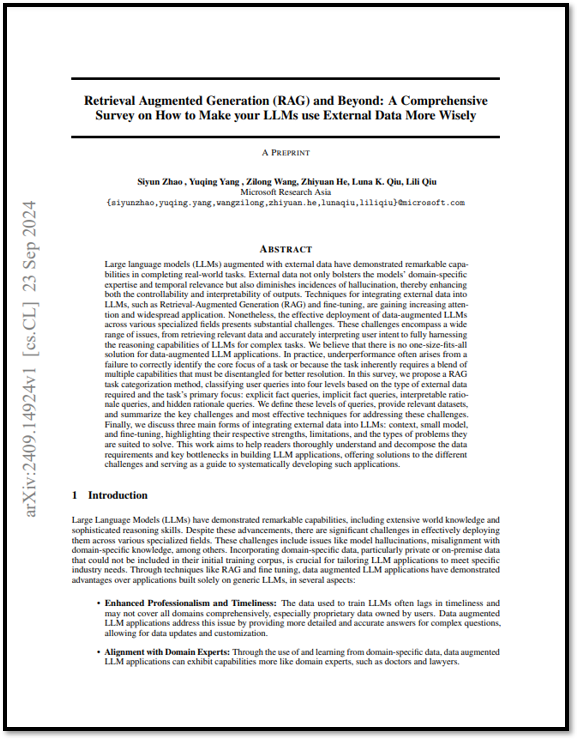

# \[2024] Retrieval Augmented Generation (RAG) and Beyond

<figure><figcaption><p>RAG and Beyond : A Comprehensive survey on How to make your LLMs use External Data More Wisely</p></figcaption></figure>

> **Paper Link** : [https://arxiv.org/pdf/2409.14924](https://arxiv.org/pdf/2409.14924)

```
※ 본 포스팅은 논문의 가장 중요한 내용에 대한 리뷰를 정리하여 올리기 때문에 다소 축약되거나 의역된 내용이 많습니
```

## ABSTRACT

외부 데이터를 활용한 대규모 언어 모델(LLM)은 실제 과제를 수행하는 데 있어 뛰어난 능력을 보여주고 있습니다. 외부 데이터는 모델의 특정 도메인 전문성과 시의성(= 시간적 시점에 대한 관련성)을 강화할 뿐 아니라 환각(hallucination) 발생을 줄여 결과물의 제어 가능성과 해석 가능성을 높이는 데 기여합니다. 검색 기반 생성 (RAG, Retrieval-Augmented Generation) 및 파인튜닝과 같은 외부 데이터를 LLM에 통합하는 기술은 점점 더 주목받고 있으며, 다양한 분야에서 널리 응용되고 있습니다. 그럼에도 불구하고, 데이터로 강화된 LLM을 다양한 전문 분야에 효과적으로 배치하는 것은 여전히 큰 도전 과제로 남아 있습니다. 이러한 도전 과제는 관련 데이터 검색 및 사용자 의도 해석에서부터 복잡한 과제를 해결하기 위한 LLM의 추론 능력을 온전히 활용하는 것에 이르기까지 광범위한 영역에 걸쳐 있습니다. 우리는 데이터로 강화된 LLM 응용에 있어 만능 해결책이 존재하지 않는다고 믿습니다. <mark style="color:red;">**실제로 성과 부진은 종종 작업의 핵심 초점을 올바르게 파악하지 못하거나, 작업이 본질적으로 여러 능력을 조합해야 하는 경우로 인해 발생합니다. 이러한 능력을 분리해 문제 해결에 최적화하지 못했기 때문입니다.**</mark>

이 논문에서는 _**RAG 작업 분류 방법**_ 을 제안하며, 외부 데이터의 유형과 작업의 주요 초점에 따라 <mark style="background-color:red;">사용자 쿼리를 네 가지 수준으로 분류</mark>합니다: **명시적 사실 쿼리(= explicit fact query), 암시적 사실 쿼리(= implicit fact query), 해석 가능한 근거 쿼리(= interpretable rationale query), 숨겨진 근거 쿼리(= hidden rationale query)**. 우리는 이러한 쿼리 수준을 정의하고, 관련 데이터셋을 제공하며, 이러한 과제를 해결하는 데 있어 주요 도전 과제와 가장 효과적인 기술을 요약합니다. 마지막으로, 외부 데이터를 LLM에 통합하는 세 가지 주요 형태를 논의합니다: 컨텍스트 제공, 소형 모델 활용, 파인튜닝. 각각의 강점, 한계, 그리고 적합한 문제 유형을 강조합니다. 본 연구는 독자들이 LLM 응용 개발 시 데이터 요구 사항과 주요 병목현상을 철저히 이해하고 분해할 수 있도록 돕고, 다양한 도전 과제에 대한 해결책을 제시하며, 이러한 응용을 체계적으로 개발하는 데 있어 가이드 역할을 하는 것을 목표로 합니다.

## 1. Introduction

대규모 언어 모델(LLM)은 광범위한 세계 지식과 정교한 추론 능력을 포함하여 놀라운 역량을 보여주고 있습니다. 그러나 이러한 발전에도 불구하고, 다양한 전문 분야에 효과적으로 적용하는 데는 여전히 중요한 과제들이 존재합니다. 여기에는 모델의 환각(= hallucination), 특정 도메인 지식과의 불일치(= misalignment with domain-specific knowledge) 등과 같은 문제가 포함됩니다. 특히 초기 학습 데이터셋에 포함되지 않은 비공개 데이터나 온프레미스 데이터와 같은 도메인별 데이터를 통합하는 것은 특정 산업의 요구를 충족시키기 위해 LLM 응용 프로그램을 맞춤화하는 데 매우 중요합니다. 검색 기반 생성(RAG) 및 파인튜닝과 같은 기술을 통해 데이터를 활용한 LLM 응용 프로그램은 기존의 일반적인 LLM만으로 구축된 응용 프로그램에 비해 여러 측면에서 우위를 보여주고 있습니다.

* **향상된 전문성과 시의성 (= Enhanced Professionalism and Timeliness)** : LLM 학습에 사용된 데이터는 시의성이 부족하거나 특정 도메인을 포괄적으로 다루지 못할 수 있으며, 특히 사용자가 소유한 독점 데이터는 포함되지 않는 경우가 많습니다. 데이터를 활용한 LLM 응용 프로그램은 복잡한 질문에 대해 보다 상세하고 정확한 답변을 제공하며, 데이터 업데이트와 맞춤화를 가능하게 함으로써 이러한 문제를 해결합니다.
* **도메인 전문가와의 일치성 (=Alignment with Domain Experts)** : 도메인별 데이터를 활용하고 학습함으로써 데이터를 강화한 LLM 응용 프로그램은 의사나 변호사와 같은 도메인 전문가에 더 가까운 역량을 발휘할 수 있습니다.
* **모델 환각 감소 (= Reduction in Model Hallucination)** : 데이터를 기반으로 응답을 생성함으로써, 데이터로 강화된 LLM 응용 프로그램은 사실에 근거한 반응을 제공하며, 환각(hallucination) 발생 가능성을 크게 줄입니다.
* **향상된 제어 가능성과 설명 가능성 (= Improved Controllability and Explainability)** : 사용된 데이터는 모델의 예측에 대한 참조로 활용될 수 있어, 제어 가능성과 설명 가능성을 모두 강화합니다.

이러한 발전에 대한 기대감에도 불구하고, 개발자들은 높은 성공률(예: 질의응답에서의 높은 정확도)을 달성하기 위해 많은 인적 자원을 투자해야 하는 어려움에 직면하고 있습니다. 다양한 연구에서는 검색 기반 생성(RAG)이나 파인튜닝과 같은 기술을 기반으로 한 데이터로 강화된 LLM 응용 프로그램을 구축하는 과정에서 특히 법률, 의료, 제조와 같은 전문 분야에서 발생하는 도전과 좌절을 강조하고 있습니다.

이러한 도전 과제는 데이터 파이프라인 구축(예: 데이터 처리 및 색인 생성)에서부터 LLM의 능력을 활용하여 복잡한 지능형 추론을 수행하는 데 이르기까지 광범위하게 걸쳐 있습니다. 예를 들어, 금융 분야 응용 프로그램에서는 고차원 시계열 데이터를 이해하고 활용해야 하는 경우가 자주 발생하며, 의료 분야에서는 의료 이미지나 시계열 의료 기록이 필수적입니다. 이러한 다양한 형태의 데이터를 LLM이 이해할 수 있도록 하는 것은 반복적으로 나타나는 과제입니다.

한편, 법률 및 수학 응용 분야에서는 LLM이 서로 다른 구조 간의 장거리 의존성을 이해하는 데 어려움을 겪는 경우가 많습니다. 또한, 특정 응용 분야에 따라 LLM 응답의 해석 가능성과 일관성에 대한 요구가 증가하고 있습니다. 그러나 LLM은 본질적으로 낮은 해석 가능성과 높은 불확실성으로 특징지어지는 경우가 많아 이러한 요구를 충족시키는 데 어려움이 따릅니다. 특히 정밀성과 책임이 중요한 분야에서는 LLM의 투명성을 높이고 불확실성을 줄이는 것이 결과에 대한 신뢰성과 신뢰를 높이는 데 매우 중요합니다.

도메인 전문가와 개발자들과의 광범위한 논의, 그리고 그들이 직면한 문제들을 면밀히 분석한 결과, 데이터로 강화된 LLM 응용 프로그램이 만능 해결책이 아님을 깊이 이해하게 되었습니다. 특히 전문 분야에서는 현실적인 요구가 매우 복잡하며, 주어진 데이터와의 관계나 필요한 추론의 난이도에서 크게 차이날 수 있습니다. 그러나 개발자들은 종종 이러한 차이를 인식하지 못한 채, 성능 저하 문제로 가득 찬 솔루션 (비유하자면, 여기저기 물이 새는 집과 같은)을 만들어내는 경우가 많습니다. 반면, 서로 다른 수준의 요구와 그에 따른 독특한 도전 과제를 충분히 이해할 수 있다면, 그에 맞게 응용 프로그램을 구축하고 단계적으로 견고하고 신뢰할 수 있는 프로그램(마치 한 단계씩 튼튼한 집을 짓는 것처럼)을 만들어갈 수 있을 것입니다.

하지만, 기존의 연구와 관련된 설문 조사는 종종 이러한 수준 중 하나 또는 특정 기술 주제에만 초점을 맞추고 있습니다. 이러한 한계를 극복하기 위해, 우리는 이 포괄적인 설문 조사를 작성하게 되었습니다. 이 조사는 서로 다른 쿼리 수준을 명확히 정의하고, 각각에 수반되는 고유한 도전 과제를 식별하며 (**Figure 01**), 이를 해결하기 위한 관련 연구와 노력을 나열하는 것을 목표로 합니다. 이 설문 조사는 독자들이 데이터로 강화된 LLM 응용 프로그램에 대한 조감도를 갖도록 돕고, 이러한 응용 프로그램을 체계적으로 개발하는 방법에 대한 안내서 역할을 할 것입니다.

## 2. Problem Definition

데이터로 augmented된 LLM application은 도메인별 데이터를 기반으로 하는 질문-응답 봇에서부터 복잡한 데이터 파이프라인 내에서의 의미적 처리 연산자, 또는 다중 에이전트 시스템에서 특정 단계를 처리하는 에이전트에 이르기까지 다양한 형태를 취할 수 있습니다. 그러나 일반적으로 데이터로 augmented된 LLM application은 다음과 같은 공식을 따른다:

$$
f: \mathcal{Q} \xrightarrow{\mathcal{D}} \mathcal{A}
$$

여기서 $$\mathcal{Q}$$ , $$\mathcal{A}$$ 그리고 $$\mathcal{D}$$는 각각 사용자의 입력(Query), 기대되는 응답(Answer), 제공된 데이터(Data)를 나타냅니다. Application의 task인 $$f$$는 $$\mathcal{D}$$를 기반으로 $$\mathcal{Q}$$ 에서 $$\mathcal{A}$$ 로 mapping하는 것입니다.

기존의 사전 학습된 지식만을 사용하는 Standalone LLM system과 달리, 데이터로 augmented된 LLM application은 외부 데이터 $$\mathcal{D}$$ 에 의존하여 제기된 질문 $$\mathcal{Q}$$ 에 정확히 답하는 것이 특징입니다.&#x20;

외부 데이터 $$\mathcal{D}$$ 의 통합은 LLM의 능력을 크게 향상시켜, 최신의 도메인별 지식을 활용하고 전문가의 논리적 근거를 이해할 수 있는 능력을 제공합니다. 질문은 외부 데이터를 활용하는 정도와 방식에 따라 복잡성 수준이 다양한 층위로 나뉠 수 있으며, 이는 질문에서 요구되는 참여의 깊이와 성격을 반영합니다.

### 2.1 Stratification of Queries

데이터로 augmented된 LLM application의 맥락에서, Query는 복잡성과 요구되는 데이터 상호작용의 깊이에 따라 계층화될 수 있습니다. 이러한 계층화는 LLM이 정확하고 관련성 높은 응답을 생성하기 위해 수행해야 하는 다양한 수준의 인지적 처리를 이해하는 데 도움을 줍니다. 단순한 사실 검색에서 암시적 지식의 정교한 해석에 이르기까지, 각 계층은 LLM이 처리해야 할 과제의 정교함이 한 단계씩 높아지는 것을 나타냅니다. 아래에서는 이러한 계층을 구분하여 각 단계에서 요구되는 고유한 도전 과제와 필요 역량에 대한 통찰을 제공합니다.

<figure><figcaption><p><strong>Figure 01</strong> : 4단계 Query에 대한 Main Focus</p></figcaption></figure>

#### <mark style="color:purple;">Level 1 : Explicit Facts</mark>

이러한 질문은 주어진 데이터에 명시적으로 존재하는 사실을 직접적으로 묻는 것으로, 추가적인 추론이 필요하지 않습니다. 이는 가장 간단한 형태의 질문으로, 모델의 주요 과제는 관련 정보를 찾아 추출하는 것입니다. 예를 들어, "2024년 하계 올림픽은 어디에서 열리나요?"라는 질문은 외부 데이터에 포함된 사실을 목표로 합니다.

#### <mark style="color:purple;">Level 2 : Implicit Facts</mark>

이러한 질문은 데이터에 포함된 명시적이지 않은 사실을 묻는 것으로, 즉각적으로 드러나지 않으며 어느 정도의 상식적 추론이나 기본적인 논리적 유추가 필요할 수 있습니다. 필요한 정보는 여러 부분에 흩어져 있거나 간단한 추론 과정을 거쳐야 할 수도 있습니다. 예를 들어, "캔버라가 위치한 국가에서 현재 다수당은 무엇인가요?"라는 질문은 캔버라가 호주에 있다는 사실과 호주의 현재 다수당에 대한 정보를 결합하여 답할 수 있습니다.

#### <mark style="color:purple;">Level 3 : Interpretable Rationales</mark>

이러한 질문은 단순히 사실적 내용을 이해하는 것을 넘어, 데이터의 맥락에 통합된 분야별 논리를 이해하고 적용하는 능력을 요구합니다. 이러한 논리는 외부 자료에 명시적으로 제공되는 경우가 많으며, 일반적인 대규모 언어 모델의 사전 학습 단계에서는 포함되지 않거나 드물게 접하게 되는 경우가 많습니다. 예를 들어, 제약 분야에서는 대규모 언어 모델이 FDA 가이드라인(FDA Guidance) 문서를 해석하여 특정 약물 신청이 규제 요구사항을 준수하는지 평가해야 할 수 있습니다. 비슷하게, 고객 지원 시나리오에서는 사용자 문의를 효과적으로 처리하기 위해 사전에 정의된 워크플로우의 복잡성을 이해해야 합니다. 의료 분야에서는 급성 흉통 환자 관리를 위한 지침과 같은 표준화된 진단 기준을 제공하는 많은 진단 매뉴얼이 있습니다. 이러한 외부 논리를 효과적으로 따름으로써 흉통 관리와 같은 특정 분야에 전문화된 언어 모델 전문가 시스템을 개발할 수 있습니다. 이는 고객 지원 담당자의 상호작용을 안내하는 절차적 단계와 의사 결정 트리를 이해하여, 응답이 정확할 뿐만 아니라 회사의 서비스 기준과 프로토콜을 준수하도록 보장하는 것을 포함합니다.

#### <mark style="color:purple;">Level 4 : Hidden Rationales</mark>

이 범주의 질문은 더 어려운 영역으로, 논리가 명시적으로 문서화되어 있지 않고, 외부 데이터에서 관찰된 패턴과 결과를 기반으로 추론해야 하는 경우를 다룹니다. 여기서 숨겨진 논리는 암묵적인 추론 체계와 논리적 관계뿐만 아니라, 각 질문에 필요한 외부 논리를 식별하고 추출하는 본질적으로 까다롭고 복잡한 작업을 포함합니다. 예를 들어, IT 운영 시나리오에서 클라우드 운영 팀은 과거에 여러 사건을 처리했으며, 각각 고유한 상황과 해결 방법을 가지고 있습니다. 대규모 언어 모델(LLM)은 이러한 풍부한 암묵적 지식의 저장소를 탐색하여 성공적인 전략과 의사 결정 과정을 도출할 수 있어야 합니다. 마찬가지로, 소프트웨어 개발에서는 이전 버그의 디버깅 기록이 풍부한 암묵적 통찰을 제공할 수 있습니다. 각 디버깅 결정의 단계별 논리가 체계적으로 기록되어 있지 않을 수도 있지만, LLM은 해당 결정을 이끈 기본 원칙을 추출할 수 있어야 합니다. 이러한 숨겨진 논리를 종합함으로써, LLM은 정확할 뿐만 아니라, 오랜 경험을 통해 숙련된 전문가들이 다듬어온 암묵적인 전문성과 문제 해결 접근 방식을 반영한 응답을 생성할 수 있습니다.

<figure><figcaption><p><strong>Figure 02</strong> : 데이터 augmented된 LLM applications에서의 Query Level 요약</p></figcaption></figure>

요약하자면, 질문을 여러 수준으로 분류하는 것은 복잡성과 LLM(대규모 언어 모델)이 요구하는 이해 유형의 점진적인 단계를 반영합니다. Figure 01과 Figure 02에서 예시된 바와 같이, 첫 번째와 두 번째 수준인 **Explicit Facts**와 **Implicit Facts**은 각각 명시적으로 주어진 정보이든, 기본적인 추론이 필요한 정보이든 사실적 데이터를 검색하는 데 초점을 맞춥니다. 이 두 수준은 LLM이 데이터를 추출하고 이를 일관된 사실로 종합하는 능력을 시험합니다. 반대로, **Interpretable Rationales**와 **Hidden Rationales**로 이루어진 후속 두 수준은 데이터를 뒷받침하는 논리를 학습하고 적용하는 LLM의 능력에 초점을 맞춥니다. 이러한 수준은 각각 LLM이 전문가적 사고방식과 조율하거나 비구조화된 역사적 데이터에서 지혜를 추출해야 하는 더 깊은 인지적 참여를 요구합니다.

이 기준에 따라 일반적인 사실 기반 질문 데이터셋을 분류한 결과는 Table 01에 나타나 있습니다. 각 수준은 고유한 과제를 제시하며, 효과적으로 해결하기 위해 맞춤형 솔루션이 필요합니다. 다음 섹션에서는 이러한 수준의 세부 사항을 탐구하며, LLM이 다양한 유형의 질문에서 데이터 기반 애플리케이션의 복잡성을 극복할 수 있도록 하는 구체적인 전략과 방법론을 살펴볼 것입니다. 이러한 탐구는 LLM의 현재 역량을 강조하는 동시에, 이 분야에서 진행 중인 발전과 미래 잠재력을 조명할 것입니다.

## 3. Explicit Fact Queries (L1)

<figure><figcaption><p>Table 01 : Common Dataset 계층화에 따른 Fact 제공 분류</p></figcaption></figure>

### 3.1 Overview

Explicit Fact Query는 data-augmented query 중 가장 단순한 유형에 해당합니다. 이 수준의 질문은 해당 도메인 내의 특정 문서나 chunk에 직접 접근하여 답변할 수 있습니다. 이러한 질문의 답변은 종종 문서 내에 명시적으로 기술된 평범한 텍스트 형태로 제공되며, 응답 생성 과정에서 최소한의 추론이나 간단한 논리만 요구됩니다.

이 수준의 가장 중요한 특징은 특정 외부 데이터 조각에 대해 명확하고 직접적으로 의존한다는 점입니다.

#### 3.1.1 Data Dependency

데이터셋 $$\mathcal{D}$$는 다양한 방식으로 문서 혹은 일종의 세그먼트(=chunk로 이해해도 괜찮을듯) $$D_1, D_2, \cdots, D_n$$으로 나타낼 수 있다.

$$
\mathcal{D} = \{D_1, D_2, \cdots, D_n\}
$$

각 세그먼트 $$D_i$$는 상대적으로 짧으며, 더 세밀하고 구체적인 내용을 포함하고 있습니다.

주어진 질의 $$q \in \mathcal{Q}$$에 대해, $$\mathcal{D}$$ 의 모든 세그먼트가 응답을 형성하는 데 반드시 필요한 것은 아닙니다. 특정 질의 $$q$$에 대해 데이터 세그먼트 $$d \in \mathcal{D}$$ 의 필요성을 나타내는 함수 $$\delta : \mathcal{Q} \times \mathcal{D} \rightarrow \{0,1\}$$를 정의합니다. 여기서 $$\delta(q,d)=1$$은 데이터 세그먼트 $$d$$가 질의 $$q$$에 답하기 위해 필요함을 의미하며, $$\delta(q,d)=0$$은 그렇지 않음을 나타냅니다. 따라서 질의 $$q$$의 데이터 의존성은 질의 $$q$$를 해결하는 데 필수적인 세그먼트의 부분 집합으로 정의됩니다.

$$
Dep(q) = \{d\;|\;d\in \mathcal{D}\; \text{and}\;\delta(q,d)=1\}
$$

쉽게 이해할 수 있듯이, $$Dep(q) \in \mathcal{P}(\mathcal{D})$$이고, 여기서 $$\mathcal{P}(\mathcal{D})$$는 $$\mathcal{D}$$의 멱집합을 의미한다.

#### 3.1.2 Definition

Explicit Fact Queries은 $$\mathcal{Q}_1$$로 나타내며, 데이터셋 $$\mathcal{D}$$내의 특정한 데이터 세그먼트에서 답변을 직접적으로 검색할 수 있다는 특징이 있습니다. 이러한 질문은 data-augmented LLM system의 맥락에서 다음과 같이 정의될 수 있습니다:

질문 $$q$$와 그에 대응하는 답변 $$a$$에 대해, 명시적 사실 질문은 다음 조건을 만족하는 경우를 의미합니다:

* **검색 컴포넌트(= retrieval component)** $$r_{\mathcal{D}} : \mathcal{Q} \rightarrow \mathcal{P}(\mathcal{D})$$는 질문 $$q$$에 답하기 위해 필요한 데이터셋 $$\mathcal{D}$$에서 관련한 데이터 세그먼트를 식별하는 역할을 합니다. 이 컴포넌트는 $$r_\mathcal{D}$$가 $$q$$에 응답하는 데 필요한 $$\mathcal{D}$$의 최소 부분 집합인 $$Dep(q)$$와 최대한 일치하도록 보장합니다.
* **응답 생성기(=response generator)** $$\theta$$는 일반적으로 프롬프트를 활용한 LLM 추론으로 구현되며, $$r_{\mathcal{D}}$$에 의해 검색된 정보만을 기반으로 답변 $$a$$를 생성합니다. 생성된 응답 $$\theta (r_{\mathcal{D}}(q))$$는 $$a$$와 같거나 유사해야 하며, 질문이 명시적이고 직접적으로 접근 가능한 사실에 의존한다는 점을 입증합니다.

이 정의는 explicit fact queries가 복잡한 추론이나 식별된 데이터 세그먼트 범위를 넘어서는 추가적인 추론 없이, 직접적인 데이터 검색에 의존한다는 점을 강조합니다. 다음은 이 수준의 질문에 해당하는 몇 가지 예입니다:

* What method was used in Paper X to solve problem Y? \
  (Given a collection of academic papers)
* What’s the AI strategy of company X? \
  (Given a series of the latest news and articles about company X)

### 3.2 Challenge and Solutions

이 수준의 질문은 주로 LLM이 정확한 응답을 제공하기 위해 올바른 데이터를 검색하는 것이 필요합니다. RAG는 효과적이고 유연하며 비교적 비용이 낮기 때문에 이 수준의 질문을 처리하는 데 가장 널리 채택되는 기술 솔루션입니다. 그러나 RAG를 사용하더라도 견고하고 고품질의 시스템을 구축하는 데는 상당한 도전 과제가 있습니다. 이러한 과제는 다음과 같습니다:

*   **데이터 처리의 어려움**:

    외부 데이터는 종종 매우 비정형적이며, 표, 이미지, 동영상 등과 같은 다중 모드 구성 요소를 포함하고 있습니다. 또한 이러한 데이터를 세그먼트화하거나 "청킹(chunking)"하는 과정에서 원래의 맥락과 의미를 유지하는 데 어려움이 따릅니다.
*   **데이터 검색의 어려움**:

    대규모 비정형 데이터셋에서 관련 데이터 세그먼트를 검색하는 작업은 계산적으로 부담이 크고 오류가 발생하기 쉽습니다. 효율적이고 정확한 검색 메커니즘을 개발하는 것이 주요 과제입니다.
*   **평가의 어려움**:

    특히 RAG 시스템의 구성 요소 수준에서 성능을 평가하는 것은 복잡한 작업입니다. 데이터 검색과 응답 생성의 품질을 정확히 평가할 수 있는 견고한 평가 지표를 개발해야 합니다.

RAG의 인기로 인해 이러한 과제를 해결하기 위한 다양한 연구와 도구들이 개발되었습니다. 이 섹션의 나머지 부분에서는 RAG를 개선하기 위한 가장 실용적이고 영향력 있는 향상 방안을 소개할 것입니다. 또한 RAG를 넘어 사용할 수 있는 대체 기술 솔루션에 대해서도 논의할 예정입니다.

### 3.3 Retrieval-augmented Generation (RAG)

**Retrieval-Augmented Generation** (RAG)은 언어 모델이 생성 과정에서 외부 정보를 동적으로 검색하여 자연어 생성 능력을 보강하는 방법론을 의미합니다. 이 기술은 대규모 언어 모델(LLM)의 생성 능력과 방대한 데이터베이스나 문서에서 정보를 검색하는 기능을 결합합니다. 일반적으로 이 과정은 데이터 인덱스 구축, 검색 시스템 구성, 그리고 응답 생성의 단계를 거쳐 구현됩니다.

#### 3.3.1 Data Processing Enhancement

이 수준에서 Document Parsing은 텍스트, 표, 도표 등에서 정보를 일관성 있게 추출하며, 관련 있는 스니펫을 정확히 식별하고 검색하는 것을 목표로 합니다.

* **Multi-modal Document Parsing** source document에 포함된 차트, 표, 또는 동영상(예: 회의 녹화)과 같은 multi-modal content를 처리하는 것은 가장 자주 제기되는 질문 중 하나입니다. 이를 해결하기 위해 두 가지 접근법이 주로 사용됩니다. 첫번째 approach는 multi-modal content를 textual-form으로 변환하는 것입니다. 예를 들어, Table-to-Text 방법은 표를 텍스트로 변환하며, 다른 기술들은 시각적 콘텐츠를 텍스트 또는 속성 기반 설명으로 변환합니다. 이렇게 변환된 데이터는 대규모 언어 모델(LLM)에서 처리됩니다. 두번째 approach는 multi-modal embedding을 활용하여 multi-modal data에서 검색된 embedding을 입력을 위한 soft prompt로 사용한다.
* **Chunking Optimization** 긴 텍스트의 경우 문서를 텍스트 청크로 분할하는 작업은 일반적이고 필요한 작업입니다. 텍스트 chunk가 클수록 컨텍스트의 의미 일관성을 더 많이 보존할 수 있지만, 각 chunk 내에 더 많은 노이즈가 포함되는 경향이 있습니다. 일반적으로 사용되는 Chunking Strategy에는 fixed-size chunking, recursive chunking, sliding window chunking, paragraph-based chunking, semantic chunking 등이 있습니다. 일부 방법은 질의가 요구하는 세부 수준을 파악한 뒤, 이를 기반으로 검색에 적합한 detail한 수준의 텍스트 chunk를 선택하도록 설계되었습니다. 또 다른 방법은 텍스트를 더 작은 세그먼트로 나누어 정보 완전성을 높은 수준으로 유지하도록 처리하고 정제하는 방식을 채택합니다. 또한 비전 모델을 사용하여 원본 문서 구조에 따라 텍스트를 분할하는 접근 방식도 있습니다.

#### 3.3.2 Data Retrieval Enhancement

정보 검색(IR) 기술은 RAG 애플리케이션에 원활하게 적용될 수 있습니다. 주요 단계에는 데이터 인덱스 설정, 질의 처리, retrieving 및 matching, re-ranking, evaluation이 포함됩니다.

**Indexing** : 이 단계의 목적은 검색어와 텍스트 세그먼트를 연결하는 매핑을 설정하고, 검색 시스템이 작동하는 논리를 결정하는 것입니다. 인덱싱 방법은 크게 세 가지로 분류됩니다: 희소(sparse), 밀집(dense), 혼합(hybrid) 검색. 희소 검색(Sparse Retrieval)는 특정 단어를 사용하여 텍스트 세그먼트를 인덱싱합니다. 반면, 밀집 검색(Dense Retrieval)은 텍스트 세그먼트를 특징의 밀집 벡터 공간에 매핑합니다. 혼합 검색(Hybrid Retrieval)은 희소 검색과 밀집 검색의 요소를 결합한 방식입니다.

* **희소 검색(Sparse Retrieval)** : 이 방식은 간단하고 직관적이기 때문에 처음으로 널리 채택된 인덱싱 방법입니다. TF-IDF와 BM25와 같은 기술은 각 텍스트 세그먼트의 상대적인 빈도를 기준으로 가장 대표적인 키워드를 식별하도록 설계되었습니다. 이러한 방법은 여전히 많은 RAG 프로젝트에서 널리 사용되고 있습니다. 그러나 단어 매칭 방식은 동의어를 인식하지 못하기 때문에 검색 손실이 발생할 수 있습니다. 이를 해결하기 위해 KNN과 같은 방법을 사용하여 키워드의 유사성 기반 매칭을 수행할 수 있습니다. 또는 키워드와 같은 인덱스를 변경하여 해당 텍스트 세그먼트에 대한 질의 토큰의 확률을 예측하는 방식으로 전환할 수도 있습니다.
* **밀집 검색(Dense Retrieval)** : 이 방식은 주로 사전 학습되었거나 세분화된 텍스트 인코더를 사용하여 텍스트를 질의 요구사항에 맞는 밀집 벡터 공간으로 매핑하는 것을 포함합니다. BERT 기반 인코더는 종종 DPR, ANCE, SimCSE, TAS-B와 같은 방법을 사용하여 비지도 데이터에서 밀집 검색기로 fine tuning 됩니다. 또 다른 접근법으로는 Contriever와 같은 unsupervised contrastive learning을 통해 fine tuning을 수행하는 방식이 있습니다. LLM로부터 피드백을 받아 검색기의 학습 목표를 안내하면 검색기가 LLM에 더 적합하도록 효과적으로 개선할 수 있습니다. LLM의 강력한 능력과 표현 가능성 덕분에 최근에는 LLM 기반 밀집 검색이 주요 관심 영역으로 떠오르고 있습니다. LLM2vec는 사전 학습된 LLM의 어텐션 메커니즘을 양방향으로 수정하고, 마스킹된 다음 토큰 예측 방법을 사용하여 비지도 학습을 수행함으로써 LLM 기반의 밀집 검색 임베더를 생성합니다. 마찬가지로, Llama2Vec는 LLaMA 아키텍처를 기반으로 두 가지 사전 작업(임베딩 기반 자동 인코딩 및 임베딩 기반 자동 회귀)을 활용하여 비지도 밀집 검색 인코더를 학습합니다. 이를 통해 검색 작업 성능이 크게 향상되었습니다.
* **기타(Others)** : 희소 검색과 밀집 검색을 결합하는 것은 텍스트 세그먼트의 핵심 주제와 전반적인 특징을 동시에 집중할 수 있는 효과적인 방법입니다. Feng 등(2023)은 질의에 답변하기 위해 필요한 지식 도메인을 먼저 고정된 전문 영역으로 결정한 다음, 이 도메인 내에서 밀집 검색을 사용해 보조 정보를 검색하는 방식을 제안했습니다. 여러 연구에서는 밀집 벡터 인덱싱과 희소 인코더 인덱싱을 결합하여 텍스트 블록의 의미 정보를 더 잘 포착하고, 목표 단락 검색의 정확도를 향상시키는 다양한 방법을 탐구해 왔습니다. 한편, Tang 등(2024)은 LLM의 인덱싱 및 검색 능력을 미세 조정하여 이러한 기능을 LLM에 직접 통합하는 방식을 개선했습니다. 이를 통해 LLM이 각 질의에 대해 자율적으로 데이터 인덱스와 텍스트 세그먼트를 생성할 수 있도록 했습니다.

**Query Document Alignment** : 이 단계의 목표는 외부 데이터에서 질의와 문서 세그먼트를 일치시켜, 질의에 답변하는 데 가장 적합한 문서 세그먼트를 식별하는 것입니다. Figure 03에서 설명된 것처럼, 이러한 alignment에는 주로 3가지 접근 방식이 있습니다: **전통적 정렬(traditional alignment)**, **문서 도메인 정렬(document domain alignment)**, **질의 도메인 정렬(query domain alignment)**&#xC785;니다. **전통적 정렬(Traditional Alignment)**&#xC740; 문서 세그먼트와 질의를 동일한 인코딩 공간으로 매핑하는 방식입니다. 예를 들어, 듀얼 인코더 기반의 많은 밀집 검색 아키텍처는 특화된 질의 인코더를 사용하는 특징이 있습니다. 반대로, RAG와 같은 시스템이 희소 검색을 사용하는 경우, 검색을 위해 질의에서 키워드를 추출해야 합니다. 검색 정확도를 더욱 개선하기 위해 **질의 재작성 (query rewriting)** 기술을 활용할 수 있습니다. 이는 사용자 용어의 부정확성이나 모호한 설명과 관련된 문제를 완화하여 검색 결과의 정밀도를 효과적으로 향상시킵니다. **문서 도메인 정렬 (Document Domain Alignment)**&#xC740; 먼저 합성 답변(synthetic answer)을 생성한 다음, 이러한 답변을 사용하여 관련 데이터를 검색하는 방식을 포함합니다. 이를 통해 질의와 검색된 데이터가 동일한 분포 공간에 있지 않은 문제를 효과적으로 해결할 수 있습니다. 이 분야에서 주목할 만한 연구는 **HyDE**입니다. **질의 도메인 정렬(Query Domain Alignment)**&#xC740; 각 텍스트의 원자적 단위에 대해 합성 질문 세트를 생성하고, 텍스트 세그먼트를 질의 공간으로 매핑한 다음, 원래 질의와 가장 가까운 합성 질문과 해당 텍스트 세그먼트를 검색하는 방식입니다. 이 방법은 질의에 답변하기 위해 가장 관련 있고 맥락적으로 적합한 세그먼트를 선택할 수 있도록 보장합니다. **SlimPLM**은 소규모 프록시 모델을 사용하여 휴리스틱 답변을 생성하고, 이를 통해 질문에 답변하는 데 필요한 지식을 예측합니다. 이 접근법은 질의를 문서 공간에 정렬하는 효과적인 방법을 제공합니다.

<figure><figcaption><p><strong>Figure 03</strong> : Query Document Alignment의 3가지 유형</p></figcaption></figure>

**Re-ranking and Correction** : 최상위 $$k$$개의 텍스트 블록을 검색한 후, RAG 시스템은 이 세그먼트를 filtering하고 reordering해야 합니다. 대부분의 RAG 시스템은 검색기가 제공하는 관련성 점수를 순위 기준으로 사용하지만, 일부 연구에서는 perplexity나 perplexity gain과 같은 특정 지표를 순위 기준으로 활용하기도 합니다. 또 다른 접근법으로는 LLM을 사용하여 검색된 텍스트 블록의 신뢰성과 유용성을 평가하고, 검색기 출력 결과를 개선하기 위해 플러그인 방식의 보상 기반 contextual adapter를 학습시키는 방법이 있습니다. 추가적으로, 일부 연구는 사실 검증에 특화된 소형 언어 모델을 사전 학습하여 부정확한 검색 텍스트 청크를 필터링하는 데 사용하는 것에 초점을 맞추고 있습니다. 이를 통해 검색된 텍스트의 품질을 향상시킬 수 있습니다.

**Recursive Retrieval and Iterative Retrieval** : 단일 검색 시도의 정확성에 내재된 한계를 고려할 때, 이를 완화하는 효과적인 전략은 여러 번의 검색을 수행하여 누락된 부분을 점진적으로 보완하는 것입니다. Kim 등(2023)은 나무(tree) 형태의 재귀적 검색 방법을 도입하여 가지치기(pruning) 전략을 결합함으로써, 모호한 질문을 점차 명확한 질문으로 분해하고, 궁극적으로 가장 정확한 답변에 도달하는 방식을 제안했습니다. 비슷하게, **SEATER**는 $$k$$-평균 알고리즘 (k-means)을 사용하여 검색할 항목의 계층적 트리 구조를 구성하고, 트리 구조 내의 노드를 반복적으로 검색하는 방식을 채택합니다.

#### 3.3.3 Response Generation Enhancement

응답을 생성하려면 검색된 정보가 충분한지, 추가적인 외부 데이터가 필요한지를 판단해야 합니다. 또한, 검색된 지식과 모델의 내재된 사전 지식 간의 충돌을 처리하는 것도 중요합니다. 지도 학습 기반 미세 조정(Supervised Fine-Tuning)은 RAG 시스템에서 응답 생성 성능을 향상시키는 효과적인 방법입니다.

검색된 문맥이 부적절하거나 잘못된 정보인 경우, 사전 학습된 대규모 언어 모델은 쉽게 오도되어 잘못된 응답을 생성할 수 있습니다. 많은 연구는 RAG 시스템의 훈련 데이터를 신중하게 설계함으로써, 미세 조정 또는 사전 학습을 통해 이러한 문제를 효과적으로 완화할 수 있음을 보여주었습니다.

**RAAT**는 실험적 분석을 통해, 관련 없는 검색 노이즈, 관련 있는 검색 노이즈, 그리고 반사실적(counterfactual) 검색 노이즈가 RAG 모델에 미치는 부정적인 효과가 점진적으로 증가함을 입증했습니다. 이러한 훈련 과정을 통합함으로써, LLM은 내부적으로 노이즈가 있는 문맥을 인식할 수 있게 되어, 노이즈가 있는 검색 상황에서도 응답 생성 품질이 크게 향상됩니다. 더 나아가, RAG 시스템 내에서 검색기(retriever)와 생성기(generator) 간의 성능 일관성을 보장하기 위해, 일부 연구에서는 학습 단계에서 검색기와 생성기를 공동으로 훈련하는 방식을 채택하고 있습니다.

## 4. Implicit Fact Queries (L2)

### 4.1 Overview

이러한 질의는 즉각적으로 명확하지 않은 데이터 의존성을 포함하며, 일정 수준의 상식적 추론이나 기본적인 논리적 유추가 필요할 수 있습니다. 필요한 정보는 여러 세그먼트에 분산되어 있을 수도 있고, 간단한 추론을 요구할 수도 있습니다. (예시는 Figure 02 참조)

이 수준의 질의는 컬렉션 내 여러 문서에서 정보를 수집하고 처리하는 작업이 필요합니다. 필요한 정보의 양이 단일 검색 요청의 범위를 초과할 수 있어, 원래 질의를 여러 검색 작업으로 분해하고 결과를 종합하여 포괄적인 답변을 구성해야 할 수도 있습니다. 이 수준은 도메인별 전문 지식 없이도 상식적 추론이 자주 요구됩니다.

이 유형의 질의는 통계적 질의, 기술적 분석 질의, 기본적인 집계 질의 등을 포함할 수 있습니다. 예를 들어, **"몇 개?"**, **"가장 많은 것은 무엇인가?"**&#xC640; 같은 질의에서는 카운팅, 비교, 추세 분석, 선택적 요약 등의 작업이 흔히 수행되며, 다중 단계 추론이 자주 사용됩니다. 따라서, 레벨-2 질의($$\mathcal{Q}_2$$)를 다음과 같이 정의할 수 있습니다 :

어떤 질의 $$q$$와 그에 대응하는 답변 $$a$$에 대해, $$\mathcal{Q}_2$$는 다음 조건을 만족하는 경우를 말합니다:

*   데이터셋 $$\mathcal{D}$$ 내의 특정 데이터 세그먼트에서 직접 검색할 수 있는 명시적 사실 질의의 집합 $$\{ q_1, q_2, \cdots, q_m \} \subset \mathcal{Q}_1$$이 존재하며, 이는 다음과 같이 나타냅니다 : $$r_{D}(q) = \bigcup_{i=1}^{m} r_D(q_i)$$

    여기서 $$r_D(q_i)$$는 $$q_i$$에 답하기 위해 필요한 데이터셋 $$D$$의 관련 데이터 세그먼트를 식별하며, 이러한 세그먼트들의 합집합이 $$q$$에 답변하는 데 필요한 정보를 제공합니다.
* 응답 생성기 $$\theta$$는 일반적으로 프롬프트를 활용한 LLM 추론으로, $$q$$에 대한 답변 $$a$$를 다음과 같은 응답들의 집합 $$\{ \theta(r_D(q_1)), \theta(r_D(q_2)), \cdots, \theta(r_D(q_m))\}$$을 종합하고 상식적 추론을 적용하여 데이터에 명시적으로 나타나지 않은 답변을 도출합니다. 생성된 응답 $$\theta(r_D(q))$$는 올바른 답변 $$a$$에 근접해야 하며, 이는 $$q$$라는 질의가 $$\mathcal{Q}_1$$ 질의들의 응답을 종합하여 효과적으로 해결될 수 있음을 입증합니다.

이 정의는 $$\mathcal{Q_2}$$ 질의가 복잡한 질의를 더 단순하고 명시적인 사실 기반의 $$\mathcal{Q_1}$$ 질의 집합으로 분해할 수 있는 능력에 의존한다는 점을 강조합니다. 이후 $$\mathcal{Q_1}$$의 답변을 결합하여 원래의 $$\mathcal{Q_2}$$ 질의에 대한 올바른 응답을 생성할 수 있습니다. 다음은 이 수준의 질의에 대한 몇 가지 예입니다:

* 실험 기록 모음이 주어졌을 때, 샘플 크기가 1000개를 초과하는 실험은 몇 개입니까?
* 의료 기록 모음이 주어졌을 때, 가장 자주 언급된 증상 3가지는 무엇입니까?
* 회사 X와 회사 Y의 AI 전략의 차이점은 무엇입니까? (회사 X와 Y에 대한 최신 뉴스와 기사 모음이 주어진 경우)

### 4.2 Challenges and Solutions

이 수준의 질의는 여전히 사실 기반 질문을 중심으로 이루어지지만, 답변이 단일 텍스트 구절에 명시적으로 제시되지 않습니다. 대신, 여러 가지 사실을 결합하고 상식적인 추론을 통해 결론에 도달해야 합니다. 레벨 2 질의의 주요 도전 과제는 다음과 같습니다:

* **Adaptive Retrieval Volumes** : 질문에 따라 검색해야 하는 문맥의 수가 다를 수 있으며, 검색해야 할 문맥의 정확한 수는 질문과 데이터셋 모두에 따라 달라질 수 있습니다. 고정된 검색 횟수를 설정하면 정보 과잉(노이즈)이 발생하거나 정보가 부족할 가능성이 있습니다.
* **Coordination between reasoning and retrieval** : 추론은 검색해야 할 정보의 초점을 안내할 수 있으며, 검색된 정보에서 얻은 통찰은 추론 전략을 반복적으로 개선할 수 있습니다. 이러한 복잡성을 해결하려면 외부 데이터를 지능적으로 통합하고 선별적으로 활용하며, LLM(대형 언어 모델)의 내재된 추론 능력을 최대한 활용해야 합니다.

이 수준의 문제를 해결하기 위한 방법으로는 반복적인 RAG(추론과 검색 결합), 그래프/트리 기반 RAG, SQL 기반 RAG 등이 있습니다.

### 4.3 Iterative RAG

암시적 사실 질의는 Multi-Hop RAG(추론과 검색 결합) 작업과 유사합니다. 이 방법 카테고리는 다단계 RAG 프로세스를 동적으로 제어하며, 올바른 답변에 도달할 때까지 반복적으로 정보를 수집하거나 수정합니다.

* **Planning-based** : 검색 이전 단계에서 단계별 검색 계획을 생성하거나, 검색 과정 중 동적으로 계획을 생성하여 각 검색의 초점을 세분화하고, 반복적인 RAG 시스템을 효율적으로 안내할 수 있습니다. 예를 들어, **ReAct** \[93]는 각 단계의 목표를 점진적으로 업데이트하여 질문에 답하기 위해 필요한 지식 격차를 줄입니다. **IRCoT** \[94]와 **RAT** \[95]는 연쇄적 사고(Chain of Thought)를 활용해 RAG 파이프라인을 안내하며, 이전에 회상한 정보에 기반해 현재 검색 목표를 결정합니다. **GenGround** \[96]은 LLM(대형 언어 모델)이 최종 답변에 도달할 때까지 두 단계를 반복하도록 합니다: (1) 더 단순한 단일 단계 질문을 생성하고 직접적인 답변을 생성하는 단계, (2) 질문-답변 쌍을 검색된 문서로 다시 추적하여 예측의 부정확성을 확인하고 수정하는 단계. 이러한 반복적인 프로세스는 더 신뢰할 수 있고 정확한 응답을 보장합니다.
* **Information Gap Filling Based** : **ITRG** \[97]은 반복적인 검색-생성 협력 프레임워크를 도입하여, 기존 지식을 바탕으로 답변을 생성한 뒤, 이후 라운드에서 응답의 알려지지 않은 부분을 검색 및 생성하여 보완합니다. 비슷하게, **FLARE** \[50]는 각 반복 단계에서 생성된 답변의 낮은 확률의 토큰을 수정하며 개선합니다. 반면, **Self-RAG** \[92]는 대형 모델을 미세 조정하여 언제 검색을 중단하고 질문에 답변을 시작할지 자율적으로 결정할 수 있도록 합니다.

### 4.4 Graph / Tree Question Answering

암시적 사실 질의를 해결하기 위해서는 여러 참조 자료에서 정보를 종합하는 작업이 필요합니다. 그래프나 트리 구조는 지식 기반이든 데이터 기반이든 간에 텍스트 간의 관계 구조를 자연스럽게 표현할 수 있어, 이러한 유형의 데이터 검색 문제에 매우 적합합니다.

*   **Traditional Knowledge Graph** : 대형 언어 모델(LLM)의 효율성을 향상시키기 위해 고려된 초기 구조 중 하나는 전통적인 지식 그래프입니다. 이 그래프에서 각 노드는 개체(entity)를 나타내고, 노드 간의 연결(엣지)은 개체들 간의 관계를 나타냅니다. \[98]은 LLM과 지식 그래프(KG)의 발전을 위한 다음과 같은 미래지향적인 로드맵을 제안했습니다 : **KG-enhanced LLMs**: LLM의 사전 학습(pre-training) 및 추론(inference) 단계에서 KG를 통합하여 모델의 지식 이해를 심화, **LLM-enhanced KGs**: KG 임베딩, 완성(completion), 구축(construction), 그래프-텍스트 생성, 질문 응답 등 다양한 KG 작업에 LLM을 활용, **Collaborative LLM+KG 접근법**: LLM과 KG가 상호 보완적인 역할을 하여 데이터와 지식에 기반한 양방향 추론으로 서로를 강화.\


    **Rigel-KQGA 모델** \[99]은 질의에 기반하여 필요한 지식 그래프 노드를 예측하고 이를 LLM과 결합해 답변을 도출하는 엔드 투 엔드 KGQA 모델입니다. **Think-on-Graph** \[100] 및 **KnowledgeNavigator** \[101]와 같은 연구는 질의와 관련된 개체를 추출한 후, 그래프에서 반복적인 BFS 검색을 수행하며 LLM을 사고 기계로 활용하여 최적의 탐색 경로를 결정하고 가지치기를 수행합니다. **R3** \[102]는 LLM을 통해 질의에 대응할 수 있는 여러 상식적 공리를 도입하고, 연관된 지식 하위 그래프를 순차적으로 검색하여 현재 정보로 질의를 해결할 수 있는지 평가하며, 해결될 때까지 계속합니다.
*   **Data Chunk Graph / Tree** : LLM의 뛰어난 독해 능력은 텍스트를 가장 세부적인 수준으로 나누지 않고도 효과적으로 이해할 수 있게 합니다. 이와 관련하여 연구자들은 텍스트 청크나 데이터 청크를 그래프나 트리의 노드로 사용하고, 엣지를 통해 고수준 또는 정교하게 설계된 관계를 표현하는 실험을 시작했습니다. **Knowledge-Graph-Prompting** \[103]은 암시적 사실을 탐구해야 하는 세 가지 유형의 질문을 논의합니다:

    * **Bridging Questions** : 순차적 추론에 의존.
    * **Comparing Questions** : 다른 구절 간의 병렬적 추론에 의존.
    * **Structural Questions** : 문서 구조에 대응하는 내용을 가져오는 데 의존.

    이를 해결하기 위해 **Knowledge-Graph-Prompting**은 개체 인식, TF-IDF, KNN, 문서 구조 계층을 활용하여 문서 그래프를 구성하고, 질문에 답하기 위한 하위 그래프를 추출합니다. **MoGG** \[44]는 하나 또는 두 문장을 가장 작은 의미 단위로 간주하며 이를 노드로 사용하고, 노드 간의 의미적 유사성을 기반으로 엣지를 구축합니다. 또한, 예측기를 훈련시켜 질문에 답하기 위해 필요한 텍스트의 세분화 정도와 필요한 하위 그래프의 크기를 결정합니다. **RAPTOR** \[43]는 텍스트 블록 간의 상위 의미 관계를 포착하기 위해 클러스터링 알고리즘을 사용하여 가장 세분화된 텍스트 블록을 계층적으로 클러스터링합니다. 각 계층 수준에서 새로운 의미 정보를 요약하고, 노드가 축소된 트리 내에서 가장 필요한 정보를 호출합니다. 이와 유사하게, **GraphRAG** \[104]도 클러스터링 접근 방식을 채택합니다. 초기에는 가장 작은 텍스트 블록을 의미적 유사성을 기반으로 연결하고, 이후 커뮤니티 탐지 알고리즘을 사용하여 노드를 그룹화 합니다. 마지막으로, 각 노드 커뮤니티 내의 응답을 분석하여 질문에 대한 글로벌 답변을 요약합니다.

### 4.5 Natural Language to SQL Queries

구조화된 데이터를 처리할 때, 자연어 질의를 SQL로 변환(NL2SQL)하는 것은 효과적인 접근 방식이 될 수 있습니다. **Chat2DB**와 같은 도구는 사용자 질의를 데이터베이스 질의로 변환하여 이 과정을 용이하게 합니다. 대형 언어 모델(LLM)의 시대에 들어와, 텍스트를 SQL로 변환하는 기술(text-to-SQL)\[105, 106, 107, 108]이 크게 발전하면서, 이러한 도구를 활용해 구조화된 데이터베이스에서 정보를 검색할 수 있게 되었습니다.

이 기능은 LLM의 생성 능력을 강화하기 위한 가치 있는 외부 데이터 소스로 작용합니다. Text-to-SQL 도구를 \[109] 통합함으로써, LLM은 구조화된 데이터에 접근하고 이를 통합하여 보다 정확하고 맥락적으로 적합한 응답을 생성할 수 있습니다. 이러한 통합은 생성 콘텐츠의 깊이와 품질을 향상시킬 뿐만 아니라 LLM의 활용 범위를 확장하여, 데이터베이스 콘텐츠와의 상호작용 및 해석이 필요한 보다 복잡한 작업을 수행할 수 있도록 합니다.

### 4.6 Discussion on Fact Queries

_**Whether to Use-Finetuing (파인튜닝을 사용할지에 대한 여부)**_

일부 연구 \[110]는 LLM(대형 언어 모델)이 파인튜닝을 통해 새로운 사실적 지식을 습득하는 데 어려움을 겪는다는 점을 보여줍니다. 이 과정은 LLM의 전반적인 성능 저하를 초래하여 정확한 응답 생성 능력을 약화시키고, 환각(hallucination)이 더 많이 발생하는 결과를 낳을 수 있습니다. 또한 연구 \[111]에 따르면, 새로운 사실적 데이터를 사용하여 LLM을 파인튜닝하면 모델이 사실 진술을 기계적으로 암기할 가능성이 있습니다. 흥미롭게도, 이러한 암기된 사실의 표현 방식을 변경하면 최근 학습된 지식이 효과를 잃을 수 있으며, 이는 LLM이 표면적인 수준의 이해와 기억만을 유지하고 있음을 나타냅니다. 이러한 결과는 현재의 파인튜닝 프로세스가 가진 한계를 보여주며, 새로운 정보를 효과적으로 통합하고 적응시키기 위한 보다 정교한 방법이 필요하다는 것을 시사합니다.

_**Wheter to Seperate Different Levels of Fact Queries (사실 질의의 수준을 구분할 필요성)**_

**명시적 사실 질의 (Explicit Fact Query)**&#xC640; **암시적 사실 질의 (Implicit Fact Query)**&#xB294; 모두 사실 기반 질의에 속하지만, 데이터 증강 기반 LLM 애플리케이션을 구축하기 전에 이 질의들이 어떤 수준에 속하는지 판단하는 것이 매우 중요합니다. 명시적 사실 질의를 암시적 사실 질의로 잘못 분류하면, 관련 있어 보이지만 궁극적으로는 질문에 도움이 되지 않는 피상적인 정보가 과도하게 검색되어 LLM을 오도하거나 불필요한 계산 자원을 낭비할 수 있습니다. 반대로, 암시적 사실 질의를 명시적 사실 질의로 잘못 분류하면, 충분하고 포괄적인 외부 보조 데이터를 검색하기 위한 적절한 방법을 사용하지 못할 수 있습니다. 암시적 사실 질의는 대개 질의의 맥락에 따라 동적으로 정보를 통합해야 하는 반면, 명시적 사실 질의는 일반적으로 단일 데이터 조각만 필요하며 고정된 양의 외부 데이터를 검색하는 것으로 충분합니다. 따라서 잘못된 분류는 LLM의 성능 저하로 이어질 수 있습니다. 따라서, 목표 작업에 대한 철저한 이해를 바탕으로 질의의 수준을 사전에 구별하는 것이 유리합니다. 또한, 검색된 정보가 충분한지 여부를 자율적으로 평가할 수 있도록 모델을 훈련하는 데 상당한 노력이 기울여지고 있으며, **Self-RAG** \[92]와 같은 접근법이 그 예시입니다.

## 5. Interpretable Rationale Queries (L3)

### 5.1 Overview

이 섹션과 다음 섹션에서는 문제 해결을 위해 외부 데이터를 활용하여 근거(rationale)를 제공해야 하는 질의를 탐구합니다. 이러한 질의는 사실적 내용을 이해하는 것뿐만 아니라, 데이터의 맥락에 내재된 도메인에 특화된 근거를 이해하고 적용할 수 있는 능력을 요구합니다. 우리는 이러한 질의를 논거의 특성에 따라 **해석 가능한 근거에 기반한 질의**와 **숨겨진 근거에 기반한 질의**의 두 가지 범주로 분류합니다. 이 내용은 **Figure 04**에 나타나 있습니다.

해석 가능한 근거에 기반한 질의는 외부 데이터를 활용하여 근거를 제공해야 하는 애플리케이션 중 비교적 단순한 범주에 속합니다. 이 유형의 질의를 위한 보조 데이터는 문제 해결에 사용되는 사고 과정을 명확하게 설명하는 경우가 많습니다. 이러한 데이터는 여러 가지 형식으로 구성될 수 있습니다:

* Plain Text : 텍스트로 표현된 설명은 해석 가능한 논거를 제공하는 가장 일반적인 형식입니다. 여기에는 핸드북, 가이드라인과 같은 전문 문서나 도메인 특화 매뉴얼, 운영 가이드가 포함될 수 있습니다. 이러한 텍스트는 복잡한 상황에서 의사결정을 용이하게 하는 추론 과정을 명확히 설명합니다. 예를 들어, 제약 공장을 위한 FDA 지침이나 의사를 위한 약물 사용 가이드는 FDA 검사관이나 의사와 같은 전문가들이 특정 사례에 접근하는 방식을 보여줍니다.
* Structured Instruction : 더 명확한 추론 관계나 의사결정 경로는 구조화된 형식으로 제시될 수 있습니다. 이러한 논거는 **텍스트 조건 기반 무어 머신(Text-Conditioned Moore Machine)** 또는 \*\*텍스트 조건 기반 밀리 머신(Text-Conditioned Mealy Machine)\*\*으로 이해될 수 있습니다.
  * **무어 머신**은 출력 값이 현재 상태에 의해서만 결정되는 유한 상태 머신입니다. 상태 전환을 제어하는 조건은 텍스트로 표현되며, 이는 LLM이 해석해야 합니다. 예를 들어, 고객 지원 에이전트가 제품 교환이나 환불 요청을 처리하기 위해 핸드북을 따르는 경우가 이에 해당합니다.
  * **밀리 머신**은 출력 값이 현재 상태와 입력 모두에 의해 결정되는 유한 상태 머신입니다. 여기서 액션(API 호출 등)은 현재 상태뿐만 아니라 이전 상태의 전환과 관련된 텍스트 메시지에 의해 결정됩니다.

도메인 특화 논거는 워크플로우, 의사결정 트리, 의사코드(pseudocode)와 같은 형식으로 표현될 수 있습니다.

<figure><figcaption><p><strong>Figure 04</strong> : Rationale Data의 분류와 예시</p></figcaption></figure>

**해당 레벨에서의 질의 예시**

* 가슴 통증과 특정 증상 설명이 있는 환자는 어떻게 진단하고 치료해야 하는가? (가슴 통증 관리 지침이 주어진 경우)
* 실제 상황에서 사용자의 질문에 어떻게 응답해야 하는가? (고객 서비스 워크플로우가 주어진 경우)

### 5.2 Challenges and Solution

해석 가능한 논거 질의(interpretable rationale queries) 영역에서는 도메인 특화 논거를 LLM에 이해하기 쉬운 방식으로 통합하는 데 추가적인 도전 과제가 존재합니다. 주요 과제는 다음과 같습니다:

* **프롬프트 최적화 비용(Prompt Optimization Costs)** : 프롬프트를 최적화하는 과정은 높은 시간적, 계산적 자원을 요구합니다. 각기 다른 질의는 맞춤형 배경 지식과 의사결정 기준을 필요로 하며, 이를 위해 다양한 예시가 요구됩니다. 수동으로 설계된 프롬프트는 매우 효과적일 수 있지만, 많은 노동력과 시간이 소요됩니다. 또한, 다양한 질의에 맞춤형 프롬프트를 생성하도록 모델을 훈련시키는 과정은 상당한 계산 비용을 초래합니다.
* **제한된 해석 가능성(Limited Interpretability)** : 프롬프트가 LLM에 미치는 영향은 불투명합니다. 많은 경우, LLM의 내부 매개변수에 접근하는 것이 제한적이기 때문에 다양한 프롬프트가 모델에 어떤 영향을 미치는지 파악하는 일이 어렵습니다. 이러한 투명성 부족은 LLM이 서로 다른 프롬프트에 대해 생성한 응답의 해석 가능성을 일관되게 이해하고 검증하는 데 장애물이 됩니다.

### 5.3 Prompt Tuning

해석 가능한 논거 질의에서는 외부 데이터에서 제공된 논거를 LLM에 효과적으로 통합하고, 모델이 이러한 논거를 정확히 따르고 반응하도록 보장하는 것이 핵심 과제입니다. **Text2MDT** \[112]는 이와 관련해 유용한 사례를 제시하며, 의학 가이드라인과 교과서에서 의학적 의사결정 트리를 자동으로 추출하는 두 가지 방법을 소개합니다. 이 과정을 통해 긴 의학 텍스트 내 논리적 체계를 명확히 하여 이해를 더 용이하게 만듭니다. 이와 유사하게, **MedDM** \[113]은 LLM이 실행 가능한 임상 가이드 트리(CGT)를 개발하고, 이를 기반으로 추론하는 방법론과 환자와 LLM 간 다중 대화 턴을 위한 프레임워크를 제안합니다. **InstructRec** \[114]는 추천 시스템에서 LLM의 역량을 활용하기 위해, 사용자의 선호도, 의도, 작업 형태, 맥락을 자연어로 설명하는 범용 포맷을 설계하여 고성능 언어 기반 추천 시스템을 구축합니다.

논거를 자연어 지침으로 LLM에 직접 통합하는 것이 항상 최적의 성능을 보장하지는 않으며, 수동으로 프롬프트를 설계하는 데는 많은 시간이 소요됩니다. 이를 해결하기 위해 **프롬프트 튜닝(prompt tuning)** 기술이 필수적이며, 이를 통해 LLM이 특정 논거를 더 잘 따를 수 있도록 강화할 수 있습니다. **TEMPERA 프레임워크** \[115]: 제한된 지침, 예제, 단어화(verbalizer)를 강화 학습의 액션 공간에 포함하는 프롬프트를 설계합니다. 이 과정에서 LLM이 정확한 응답을 생성할 확률을 보상으로 삼아, 데이터셋 전반에서 최적의 프롬프트 구성을 발견하도록 모델을 안내합니다. **RLPrompt** \[116]: 강화 학습 기법을 사용해 어댑터를 훈련시켜, LLM의 응답 정확성에 대한 피드백을 기반으로 작은 언어 모델이 최적의 프롬프트를 생성할 수 있도록 돕습니다. **Directional Stimulus Prompting**: LLM의 다운스트림 작업 성능을 보상 메커니즘으로 활용하여, 개별 사례에 맞춘 특정 단서나 키워드를 프롬프트로 사용하도록 모델을 훈련합니다. 이를 통해 LLM의 행동이 예상 결과에 더욱 잘 부합하도록 합니다.

**GrIPS** \[117]: 소규모 데이터셋을 평가 기준으로 사용하여 다양한 프롬프트 수정(삭제, 교체, 패러프레이징, 추가)을 실험함으로써 신속하고 효과적으로 최적의 프롬프트 구성을 찾아냅니다.

**OPRO** \[120]: LLM이 과거 데이터와 해당 성능 지표를 바탕으로 새로운 프롬프트 솔루션을 생성하고, 이를 평가하여 최적화 과정을 간소화합니다. **Reflexion** \[121]: 언어적 피드백을 기반으로 프롬프트 최적화를 수행하는 새로운 접근법으로, LLM 출력을 분석하고 이를 에피소드 메모리 버퍼에 저장합니다. 이 메모리는 과거의 통찰을 활용해 의사결정을 정교화하고, 향후 상호작용에서 결과를 평가하는 데 도움을 줍니다. 이러한 접근법들은 프롬프트 최적화를 효과적으로 수행하며, LLM의 성능을 향상시키고 다양한 도메인 특화 논거를 활용하는 데 중요한 역할을 합니다.

### 5.4 CoT Prompting

복잡한 논거를 처리하려면 LLM이 확장된 추론 체인을 수행해야 하며, 이는 일반적인 사실 질의에서의 이질적인 사실 정보를 기반으로 한 추론과는 구별됩니다. 그러나 **Chain-of-Thoughts (CoT)** \[122], **Tree-of-Thoughts** \[123], 또는 **Graph-of-Thoughts** \[124]와 같은 방법론은 이러한 시나리오에서 효과적임이 입증되었습니다. 이러한 연구들은 많이 연구되었고 일반적인 적용 가능성이 높은 문제에 대해서는 수동으로 CoT 프롬프트를 설계하는 것이 유용한 해결책으로 나타났습니다. **Ji et al. (2023)** \[125]는 지식 습득과 답변 생성을 통합한 **자기 반성(self-reflection)** 방법을 제안했습니다. 외부 도구를 활용하고 프롬프트를 설계하여, 다음 세 가지 유형의 자기 반성 루프를 구축했습니다: **사실적 지식 습득 루프(Factual Knowledge Acquiring Loop), 지식 일관성 답변 루프(Knowledge-Consistent Answering Loop), 질문 함의 답변 루프(Question-Entailment Answering Loop).** 이 루프를 통해 외부 논거를 모델 처리 과정에 통합했습니다. 또한, **Wu et al. (2024)** \[126]는 임상 기록에서 발생하는 오류 유형을 수동으로 분석하고, **GPT-4 모델** \[127]이 개입, 진단, 관리 오류에 초점을 맞추도록 유도하는 세 가지 CoT 프롬프트를 개발했습니다. 이 맞춤형 프롬프트는 임상 기록에서 자동 오류 감지, 스팬 식별, 수정 작업을 지원합니다.

수동 CoT 프롬프트 설계는 매우 효과적이지만, 상당한 인적 자원과 시간이 필요합니다. 이를 해결하기 위해 **Automate-CoT** \[128]는 최소한의 레이블링이 된 데이터셋을 사용하여 논거 체인을 증강하는 기술을 제안했습니다. 이 접근법은 **분산 감소 정책 경사(variance-reduced policy gradient)** 전략을 사용해 각 CoT 체인의 중요성을 평가하며, 가장 효과적인 프롬프트 조합을 선택할 수 있도록 지원합니다.

Chain of Thoughts 프롬프팅을 활용하는 또 다른 방법은 LLM을 중심으로 에이전트 워크플로우를 구축하는 것입니다. 이는 다양한 실제 시나리오를 해결하기 위해 보다 포괄적인 시스템 개발을 요구합니다. \*\*Wang et al.\*\*에 따르면, 이러한 시스템은 **프로파일링(profiling)**, **메모리(memory)**, **계획(planning)**, **행동(action)** 모듈로 크게 구분될 수 있습니다 \[129]. 해석 가능한 논거는 다양한 형태로 여러 모듈에 통합될 수 있으며, 이를 통해 에이전트가 환경 또는 인간의 피드백에 따라 적응하고 반복할 수 있습니다.

최근 연구에서는 추론 체인의 품질을 자동으로 평가하는 방법론이 발전하고 있습니다. **LLM Reasoners** \[130]와 **SocREval** \[131]과 같은 최신 기술은 이러한 평가를 통해 강력한 데이터 증강 기반 LLM 애플리케이션을 구축하는 데 기여합니다. 이 방법론들은 논거 체인의 품질을 보장하고, 더 나은 성능의 LLM 애플리케이션 개발을 지원합니다.

해석 가능한 논거를 기반으로 한 애플리케이션은 다양한 분야에서 활용되고 있습니다. 예를 들어, **CoML** \[132]은 AutoML 지식을 프롬프트로 LLM에 통합하고, 과거 실험 기록에서 유용한 정보를 동적으로 검색한 후 이를 결합하여 LLM이 새로운 작업을 위한 머신러닝 솔루션을 개발할 수 있도록 지원합니다. **MetaGPT** \[133]는 소프트웨어 개발을 위한 다중 에이전트 시스템을 개발했으며, 프로젝트 내 다양한 이해관계자를 각각 에이전트로 표현합니다. 이 시스템은 여러 에이전트가 실제 업무 파이프라인에 따라 협업하여 소프트웨어 개발 작업을 효과적으로 완료할 수 있도록 합니다.

이와 유사하게, 고도화된 에이전트 시스템은 **고객 서비스** \[134] 및 **의료 질문 응답** \[135]과 같은 분야에서도 설계되고 있습니다. 이러한 도메인에서 에이전트는 특정 유형의 요청을 처리하도록 맞춤 설계되며, 이는 복잡한 사용자 요청을 이해하거나 정확한 의료 정보를 제공하는 작업을 포함할 수 있습니다. 이러한 시스템은 상호작용의 품질을 향상시킬 뿐만 아니라 응답의 효율성과 정확성을 높이며, 잘 설계된 에이전트 워크플로우에 LLM을 통합했을 때 그 유연성과 잠재력을 보여줍니다.

## 6. Hidden Rationale Queries (L4)

### 6.1 Overview

숨겨진 논거 질의는 해결하기 가장 어려운 유형의 질의에 속합니다. 해석 가능한 논거 질의가 명확한 지침을 제공하여 질의에 응답하는 데 필요한 논거를 명시적으로 제시하는 것과 달리, 숨겨진 논거 질의는 명시적으로 설명되지 않고 매우 다양하며, 모든 경우를 다 다루기에는 너무 방대합니다. 이러한 논거는 일반적인 컨텍스트 윈도우 내에서 완전히 탐구할 수 없을 정도로 광범위하며, 명확한 지침이 부족할 수 있습니다. 이는 데이터 내에 암묵적으로 포함된 형태의 도메인 전문성을 나타냅니다. 이와 같은 데이터에는 다음이 포함될 수 있습니다:

* **In Domain Data** : 숨겨진 논거 질의는 동일한 도메인의 데이터를 활용할 수 있습니다. 예를 들어, 과거의 질문-응답 기록이나 인위적으로 생성된 데이터가 이에 해당합니다. 이러한 도메인 내부 데이터는 현재 질의를 해결하는 데 필요한 추론 기술이나 방법론을 본질적으로 포함하고 있습니다. 예를 들어, Python 프로그래밍 퍼즐과 같은 맥락에서는 과거 문제의 해결책에 포함된 고전 알고리즘과 문제 해결 전략이 현재 문제를 해결하는 데 도움이 될 수 있습니다.
* **Preliminary Knowledge** : 숨겨진 논거의 또 다른 형태는 다양한 시나리오에 따라 적용되는 방대한 분산 지식 기반입니다. 이 기초 지식은 법적 판단의 근간이 되는 모든 지역 법률과 같은 포괄적인 공리적 시스템을 포함할 수 있습니다. 또한, 수학적 증명과 같은 분야에서 추론 과정을 단순화하는 데 도움이 되는 검증된 중간 결론을 포함할 수도 있습니다. 현실 세계의 문제를 외부 데이터를 사용해 해결할 때, 이러한 기초 지식은 인간 경험과 실증적 요약의 복잡한 축적에서 비롯될 수도 있습니다.

숨겨진 논거 질의를 해결하기 위해서는 다양한 데이터 소스에 내재된 잠재적 지혜를 해독하고 활용할 수 있는 정교한 분석 기법이 필요합니다. 이는 RAG(검색-생성 결합) 시스템이 복잡하고 암시적인 정보를 효과적으로 해석하고 적용하는 데 있어 상당한 도전을 제기합니다.

**해당 레벨의 질의 예시**

* 경제 상황이 회사의 미래 발전에 어떤 영향을 미칠까요? \
  (재무 보고서 모음이 주어졌으며, 경제적 및 재무적 논거가 요구됨)
* 숫자 5, 5, 5, 1을 사용하여 24를 만드는 방법은 무엇인가요? \
  (24포인트 게임 예제와 해당 답안이 주어진 경우)
* 아프가니스탄에서는 부모가 해외에서 태어난 자녀에게 시민권을 부여할 수 있습니까? \
  (GLOBALCIT 시민권 법률 데이터셋 \[136]이 주어진 경우)

### 6.2 Challenges and Solutions

숨겨진 논거 질의는 데이터 증강 LLM 애플리케이션 구축에 있어 상당한 도전을 제기하며, 주요 어려움은 다음과 같은 영역에서 나타납니다:

* **Logical Retrieval** : 숨겨진 논거를 포함하는 질문에서는 외부 데이터의 유용성이 단순히 개체 수준의 유사성이나 의미적 유사성에 의존하지 않습니다. 대신, 논리적 일관성이나 주제적 정렬이 더 중요합니다. 일반적인 검색 방법은 질의의 실제 목표를 포착하거나, 문제와 논리적으로 유사한 텍스트 부분을 식별하는 데 어려움을 겪는 경우가 많습니다. 이는 단순한 텍스트 유사성에 의존하는 대신, 기본 논리 구조를 분석하고 식별할 수 있는 보다 정교한 검색 알고리즘의 개발을 필요로 합니다.
* **Data Insufficiency** : 기본적으로 외부 데이터는 현재 질의와 관련된 명확한 지침이나 답변을 명시적으로 포함하지 않을 수 있습니다. 대신, 관련 정보는 종종 분산된 지식에 내재되어 있거나 예시를 통해 암시적으로 제시됩니다. 이러한 간접적인 정보 표현은 데이터 해석 및 통합 능력을 요구하며, LLM이 단편적이거나 간접적으로 관련된 데이터 소스에서 일관된 답변을 도출할 수 있는 강력한 역량을 필요로 합니다. 이러한 도전은 숨겨진 논거 질의의 복잡성을 효과적으로 다루기 위해 LLM 프레임워크 내에서 정교한 데이터 통합 및 추론 역량이 필수적임을 강조합니다.

### 6.3 Offline Learning

이러한 유형의 질의를 해결하기 위해 일반적으로 사용하는 접근법은 데이터셋에서 규칙과 가이드를 오프라인으로 식별하고 추출한 후, 관련 항목을 검색하는 것입니다. 추론 논거를 생성하기 위해, **STaR** \[137]과 **LXS** \[138]와 같은 연구는 LLM을 활용하여 논거를 생성합니다.

**STaR**는 소규모 데이터셋에서 대규모 데이터셋으로 확장하기 위해 반복적인 소수 샘플(few-shot) 예제 방법을 사용하며, **LXS**는 학습 모델이 설명을 생성하고, 비평 모델이 이를 평가하고 검증하는 두 가지 역할로 구성된 설명 추출 과정을 도입했습니다.

**GL** \[139]은 오류를 식별하고 이를 일반화하여 미래 작업을 위한 가이드라인으로 전환하며, **LEAP** \[140]은 실수, 저수준 원칙, 고수준 원칙을 생성해 이를 프롬프트에 통합하여 최종 추론에 활용합니다. **RICP** \[141]는 학습 데이터의 실수를 활용하여 고수준 추론 및 구체적인 통찰을 생성한 다음, 계층적 클러스터링을 사용해 오류 유형을 그룹화합니다. 이를 통해 작업 수준과 질문 수준의 원칙을 생성하고, 이를 결합해 질문 수준의 통찰을 제공합니다. **Buffer-of-Thought** \[142]는 문제를 요약(distill)하여 여러 추론 작업을 통합하는 메타 버퍼(meta-buffer)를 생성합니다.

통합된 방법 중 하나인 **MedPrompt** \[143]는 GPT-4가 생성한 추론 체인을 학습 예제로 활용하고, 이를 **KNN 기반 인컨텍스트 학습** 접근법과 결합합니다. **Agent Hospital** \[144]은 반성(reflection)을 통해 논거를 생성하며, 생성된 데이터에서 기록 검색과 경험 검색을 활용합니다.

이러한 개념들은 **가이드라인**, **원칙**, **경험**, **사고 템플릿** 등 다양한 이름으로 불리지만, 핵심 아이디어는 공통적으로 유용한 논거를 추출하여 추론 질의를 강화하는 것입니다. 이러한 논거는 자체 생성된 사고 체인(**MedPrompt**, **Buffer-of-Thought**), 학습 세트의 실수(**GL**, **RICP**, **Agent Hospital**), 또는 의도적으로 생성된 실수(**LEAP**)에서 비롯될 수 있습니다.

또한, 일부 원칙은 모든 작업에 걸쳐 사용(**Agent Hospital**, **RICP**)되는 반면, 다른 원칙은 특정 질문에 맞게 동적으로 검색(**MedPrompt**, **Buffer-of-Thought**)됩니다. 많은 연구는 사례에서 학습하고 경험을 논거로 축적하는 것이 다양한 추론 작업에 유익하다는 점을 입증하고 있습니다.

### 6.4 In-Context Learning (ICL)

컨텍스트 학습에서 예제를 활용하는 것은 숨겨진 논거를 탐구하는 일반적인 방법입니다. 사전 학습된 대형 언어 모델(LLM)은 강력한 인컨텍스트 학습(In-Context Learning, ICL) 능력을 보이며, 유사성을 기반으로 예제를 검색하여 모델의 소수 샘플 학습(few-shot learning) 능력을 강화할 수 있습니다 \[145, 146]. 그러나 프롬프트에 관련 없는 정보가 포함될 경우, LLM이 쉽게 혼란을 겪어 부정확한 응답을 생성할 수 있습니다 \[147, 148]. **Wu et al.** \[149]이 개발한 **OpenICL**은 다양한 전통적인 예제 검색 및 추론 기법이 인컨텍스트 학습의 효과에 미치는 영향을 탐구하는 ICL 프레임워크를 구성했습니다.

LLM에서 제공하는 피드백을 바탕으로 소규모 모델을 훈련하여 컨텍스트 예제를 선택하고, 특정 작업에 맞는 최적의 예제와 데모를 구성할 수 있습니다 \[150, 5, 151]. 또한, **Su et al.** \[152]는 실질적인 테스트에 필요한 더 넓은 연관성을 포괄하지 못하는 의미적 유사성 기반 예제 검색의 문제를 해결하기 위해 **vote-k**라는 비지도 학습 기반 그래프 선택 주석 방법을 사용했습니다. 이를 통해 더 다양하고 대표적인 예제 데이터베이스를 구축하여 소수 샘플 학습을 지원했습니다. **Zhang et al.** \[153]은 다양한 대표 유형으로 예제를 클러스터링하는 **Auto-CoT** 방법을 제안했습니다. 이 방법은 문제를 다양하게 샘플링하고 추론 체인을 생성하여 학습 과정을 더 효과적으로 지원하는 예제를 구성합니다.

LLM이 훈련된 도메인 외부에서 소수 샘플 학습을 통해 추론 능력을 익히는 것은 여전히 큰 도전 과제입니다. \*\*Wang et al.\*\*은 다양한 추론 경로를 샘플링하고, 이를 통해 가장 일관된 답변을 선택함으로써 LLM이 올바른 추론 체인을 선택할 확률을 높이는 방식을 제안했습니다 \[154]. \*\*Agarwal et al.\*\*은 사용 가능한 예제를 생성하기 위한 두 가지 확장 가능한 방법(**강화 ICL** 및 **비지도 ICL**)을 소개하여, 사람이 생성한 예제를 대체하고 예제 풀이 확장될 수 있도록 했습니다 \[155].

**DIN-SQL** \[156]은 작업을 더 단순한 하위 작업으로 분해하고, 이 하위 문제의 솔루션을 LLM의 프롬프트로 사용하여 텍스트에서 SQL을 생성하는 성능을 크게 향상시켰습니다. 비슷하게, **DUP** \[157]는 LLM이 체인 오브 사고(CoT)를 사용하여 복잡한 수학적 단어 문제를 해결할 때 직면하는 주요 세 가지 문제(의미적 오해, 계산 오류, 누락된 단계)를 확인했습니다. 여기서 **의미적 오해**가 주요 제한 요인으로 지적되었으며, 문제를 깊이 이해하고 해결에 필요한 핵심 정보를 추출하도록 LLM을 유도함으로써 수학 문제 해결 능력을 크게 향상시킬 수 있다고 설명했습니다.

### 6.5 Fine Tuning

LLM(대형 언어 모델)의 강력한 In-Context 학습 능력에도 불구하고, 복잡하고 긴 논리 체인을 위한 최적의 논거나 예제를 정확히 식별하는 것은 여전히 중요한 도전 과제로 남아 있습니다. 또한, 방대한 외부 사전 지식을 제공하는 과정에서 LLM의 추론 능력이 제한될 수 있는 문제가 발생할 수 있습니다. 이러한 문제를 고려할 때, \*\*파인튜닝(fine-tuning)\*\*은 유망한 접근법으로 부각됩니다. 파인튜닝은 LLM이 사전 학습(pre-training) 동안 획득한 광범위한 기초 지식을 활용할 뿐만 아니라, 새로운 도메인의 논거를 빠르게 습득할 수 있도록 지원합니다. 이를 통해 LLM이 고급 및 특화된 작업을 처리하는 데 필요한 적응성과 효과성을 향상시킬 수 있는 실질적인 방안을 제공합니다.

*   **Instruction Tuning** : 인스트럭션 튜닝은 LLM에 새로운 기능을 주입하는 일반적인 방법으로, 주로 **(지시문, 출력)** 쌍 데이터를 활용한 지도학습 기반의 파인튜닝을 포함합니다. 인스트럭션 데이터셋을 구성하는 주요 방법은 다음 세 가지입니다:

    * **a)** 기존 데이터셋에서 추출 \[161, 162]
    * **b)** 수작업으로 지시문을 제작 \[163, 164, 165]
    * **c)** 강력한 LLM을 사용하여 합성 데이터를 생성 \[166, 154]

    또한, 여러 연구 \[167, 168, 169]는 인스트럭션 데이터셋 내 데이터 분포를 최적화하여 파인튜닝의 효과를 높이는 방법을 탐구했습니다. 하지만, 데이터 증강 기반 LLM 애플리케이션을 구축할 때, 파인튜닝은 여전히 시간 및 계산 자원 측면에서 비교적 비용이 많이 드는 방법으로 간주됩니다.
* **파인튜닝 비용 절감 방안** : 최근에는 대형 모델의 파인튜닝 비용을 줄이기 위한 여러 노력이 이루어졌습니다. 대표적인 방법은 다음과 같습니다:
  * **어댑터 튜닝(Adapter Tuning)** : LLM의 매개변수를 고정(freezing)한 상태에서 소규모 어댑터 모델을 통합하고, 파인튜닝 시 어댑터의 가중치만 최적화하는 방법입니다 \[170, 171, 172, 173].
  * **프리픽스 튜닝(Prefix Tuning) 및 프롬프트 튜닝(Prompt Tuning)** : 입력 앞에 학습 가능한 벡터 집합을 추가하고, 이를 훈련 중에 최적화하여 LLM의 성능을 향상시키는 방법입니다 \[174, 175, 176, 177, 178].
  * **저랭크 적응(Low-Rank Adaptation, LoRA)** : 각 밀집 계층(dense layer)에 저랭크 제약을 가해 업데이트 행렬을 근사함으로써, 하위 작업에 적응하는 데 필요한 학습 가능한 매개변수 수를 줄이는 방법입니다 \[179, 180, 181, 182, 183].

<figure><figcaption><p><strong>Figure 05</strong> : Data augmented LLM applications에 적용되는 서로다른 Query 레벨에 대한 메인 기술 요약</p></figcaption></figure>

최근 몇 년간, supervised fine-tuning을 활용하여 LLM(대형 언어 모델)의 특화된 도메인 능력을 강화하는 연구가 활발히 이루어졌습니다. 이는 수학적 추론, 금융, 법률, 의료와 같은 전문 분야에서 두드러진 성과를 보이고 있습니다 \[184, 185, 186]. 예를 들어: **ChatTimeLlama** \[187]는 해석 가능한 시간 추론 지시문 튜닝 데이터셋을 도입하고, **LLaMA** \[188]에 파인튜닝을 적용하여 모델의 복잡한 시간적 추론, 미래 사건 예측 능력 및 해석 가능성을 크게 향상시켰습니다. **LISA** \[189]는 소규모 추론 관련 세그먼트 데이터 샘플을 활용해 멀티모달 LLM인 **LLaVA**를 파인튜닝하여 추론 세그먼트 능력을 크게 개선했습니다. **MAmmoTH** \[190]는 **Chain of Thought**(CoT)와 **Program of Thought** 추론을 독창적으로 결합한 수학 예제 데이터셋을 구축해, 다양한 수학적 도메인을 포괄하고 일반적인 수학 문제 해결 능력을 향상시켰습니다. **ReFT** \[191]는 동일한 문제에 대한 여러 주석된 추론 경로를 학습하는 방법을 제안했습니다. 이 방법은 수학 문제에 대해 다양한 추론 경로를 자동으로 샘플링하고, 정답을 활용해 보상 신호를 생성합니다. **ChatDoctor** \[192]는 널리 사용되는 온라인 의료 상담 플랫폼에서 수집한 10만 개의 환자-의사 대화 데이터셋을 사용해 **LLaMA**를 파인튜닝하여, 환자의 요구를 이해하고 효과적인 권장 사항을 제공하는 능력을 크게 강화했습니다. **FinGPT** \[193]는 금융 데이터를 기반으로 오픈소스 LLM을 개발했으며, 자동 데이터 큐레이션과 경량화된 저랭크 적응 기법을 활용하여 파인튜닝했습니다. **DISC-LawLLM** \[194]은 중국 사법 도메인을 위한 지도 학습 파인튜닝 데이터셋을 구축하여, 다양한 법률 시나리오에서 사용자를 효과적으로 지원할 수 있도록 LLM을 파인튜닝했습니다. 이 과정에서 법률 추론 능력이 크게 향상되었습니다. 이와 같은 연구들은 LLM이 특정 도메인의 요구사항에 맞춰 고급 추론 능력을 갖추도록 하는 데 중요한 기여를 하고 있습니다.

<figure><figcaption><p><strong>Figure 06</strong> : LLM(대형 언어 모델)에 특정 도메인 데이터를 주입하는 세 가지 방법은 다음과 같습니다: <strong>질의에 기반한 도메인 데이터 추출</strong>: 질의를 기반으로 도메인 데이터의 일부를 추출하여 LLM의 컨텍스트 입력으로 제공. <strong>소규모 모델 훈련</strong>: 특정 도메인 데이터를 사용해 소규모 모델을 훈련한 후, 이를 통해 외부 정보를 통합하여 LLM에 입력. <strong>도메인 지식으로 직접 파인튜닝</strong>: 외부 도메인 지식을 활용해 일반적인 LLM을 도메인 전문가 모델로 파인튜닝.</p></figcaption></figure>

## 7. Conclusion

이 논문에서는 질의의 주요 초점을 기준으로 데이터 증강 LLM 애플리케이션을 네 가지 범주로 구분하며, 각 범주는 고유한 도전 과제에 직면하고 있어 이에 맞는 맞춤형 솔루션이 필요함을 설명합니다. **Figure 05**에 이를 나타내었습니다. **정적 상식 지식에 관련된 질의** : 일반적인 LLM을 **Chain of Thought(CoT)** 방법론을 통해 배치하는 것이 효과적입니다. **명시적 사실 질의** : 주요 도전 과제는 데이터베이스 내에서 정확한 사실의 위치를 찾아내는 것이며, 이에 따라 **기본적인 RAG**(Retrieval-Augmented Generation)가 최적의 방법으로 사용됩니다. **암시적 사실 질의** : 다수의 관련된 사실을 종합해야 하는 이 유형의 질의에서는 **반복적인 RAG** 및 그래프나 트리 구조에 기반한 RAG 구현이 선호됩니다. 이러한 방식은 개별 사실을 검색하고 다수의 데이터 포인트를 상호 연결하는 능력을 제공합니다. 또한, 방대한 데이터 연결이 필요한 경우 **text-to-SQL** 기술을 활용하여 데이터베이스 도구를 통해 외부 데이터를 검색하는 것이 필수적입니다. **해석 가능한 논거 질의** : 외부 지침에 대한 LLM의 준수 능력을 향상시키기 위해 **프롬프트 튜닝(prompt tuning)** 및 **CoT 프롬프팅**이 중요한 역할을 합니다. **숨겨진 논거 질의** : 가장 어려운 유형으로, 방대한 데이터 세트에서 문제 해결 접근 방식을 자율적으로 종합해야 합니다. 이 경우 **오프라인 학습**, **인컨텍스트 학습**, **파인튜닝**이 핵심 방법론으로 활용됩니다.

특정 LLM 애플리케이션을 개발하기 전에, 도메인 전문가로서 우리는 목표 작업에 대한 깊은 이해를 바탕으로 질의의 복잡성 수준을 파악하고, 적합한 기술적 접근법을 선택해야 합니다. 이러한 접근법은 **Figure 06**에 제시된 세 가지 주요 메커니즘을 통해 LLM에 지식을 주입합니다: **질의를 기반으로 도메인 데이터의 일부를 추출하여 LLM의 컨텍스트 입력으로 제공, 특정 도메인 데이터를 활용해 소규모 모델을 훈련한 뒤, 이를 통해 외부 정보를 LLM에 통합, 외부 도메인 지식을 사용해 일반적인 LLM을 도메인 전문 모델로 파인튜닝 이들 전략은 요구되는 데이터 양, 훈련 시간, 계산 자원 측면에서 각각 다른 요구 사항을 가지며, 복잡도가 점진적으로 증가합니다. 컨텍스트를 통한 지식 주입** : 이 방법은 더 나은 해석 가능성과 안정성을 제공하지만, 유한한 컨텍스트 윈도우와 중간 정보 손실 가능성으로 인해 한계가 있습니다 \[40]. 따라서 짧은 텍스트로 데이터를 간결하게 설명할 수 있는 시나리오에 적합합니다. 그러나 이 방식은 모델의 검색 능력과 지식 추출 능력에 도전 과제를 제기합니다. **소규모 모델 접근법** : 이 방식은 훈련 시간을 줄이고 상당한 양의 데이터를 통합할 수 있는 장점을 제공합니다. 그러나 소규모 모델의 성능에 따라 LLM의 복잡한 작업 수행 능력이 제한될 수 있으며, 데이터가 증가함에 따라 추가적인 훈련 비용이 발생할 수 있습니다. **파인튜닝** : 방대한 도메인 특화 데이터를 활용해 대형 모델의 역량을 최대화할 수 있습니다. 그러나 LLM의 성능에 대한 파인튜닝의 영향은 사용된 데이터 설계에 크게 의존합니다. 도메인 외부의 사실 데이터를 파인튜닝에 사용하면 LLM이 더 많은 오류를 생성할 가능성이 있으며, 기존의 도메인 지식을 잃거나 파인튜닝 동안 다루지 않은 작업을 소홀히 할 위험이 있습니다 \[110, 195].

따라서, LLM에 적합한 데이터 주입 전략을 선택하려면 데이터 소스에 대한 철저한 이해와 이를 바탕으로 신중한 의사결정이 필요합니다. 또한, 실질적인 상황에서는 데이터 증강 기반 LLM 애플리케이션이 다양한 유형의 질의를 포함하는 경우가 많아, 개발자는 이러한 복잡한 문제를 효과적으로 해결하기 위해 여러 방법론을 통합한 **라우팅 파이프라인**을 설계해야 합니다.
