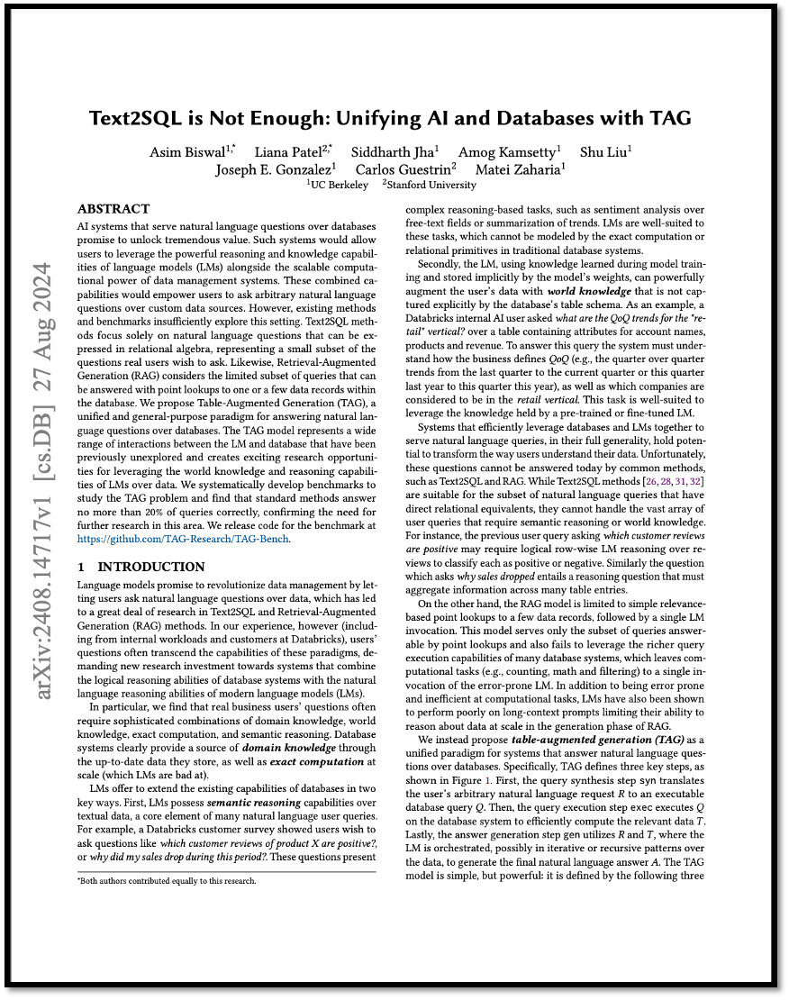

# \[2024] Text2SQL is Not Enough : Unifying AI and Database with TAG

<figure><figcaption><p>Text2SQL is Not Enough : Unifying AI and Databases with TAG</p></figcaption></figure>

> **Paper Link** : [https://arxiv.org/pdf/2408.14717](https://arxiv.org/pdf/2408.14717)

```
※ 본 포스팅은 논문의 가장 중요한 내용에 대한 리뷰를 정리하여 올리기 때문에 다소 축약되거나 의역된 내용이 많습니
```

## ABSTRACT

데이터베이스를 통해 자연어 질문에 응답하는 AI 시스템은 엄청난 가치를 창출할 잠재력을 가지고 있습니다. 이러한 시스템은 사용자가 언어 모델(LMs)의 강력한 추론 및 지식 능력을 데이터 관리 시스템의 확장 가능한 계산 능력과 결합하여 활용할 수 있도록 합니다. 이 결합된 능력은 <mark style="color:orange;">**사용자가 맞춤형 데이터 소스에 대해 자유로운 자연어 질문을 할 수 있도록 지원**</mark>합니다. 그러나 기존의 방법과 벤치마크는 이 환경을 충분히 탐구하지 못하고 있습니다. Text2SQL 방법은 관계 대수(Relational Algebra)로 표현할 수 있는 자연어 질문에만 초점을 맞추고 있으며, 이는 실제 사용자가 묻고자 하는 질문의 작은 부분만을 나타냅니다. 마찬가지로, Retrieval-Augmented Generation (RAG)은 데이터베이스 내 하나 또는 소수의 데이터 레코드에서 포인트 조회로 답변할 수 있는 제한된 범위의 질의에만 초점을 맞추고 있습니다. 우리는 데이터베이스를 대상으로 자연어 질문에 답변하기 위한 통합적이고 범용적인 패러다임인 Table-Augmented Generation(TAG)을 제안합니다. TAG 모델은 언어 모델(LM)과 데이터베이스 간의 다양한 상호작용을 표현하며, 이전에 탐구되지 않았던 영역을 다루어 LMs의 세계 지식과 추론 능력을 데이터에 활용할 수 있는 흥미로운 연구 기회를 제공합니다. 우리는 TAG 문제를 연구하기 위한 벤치마크를 체계적으로 개발했으며, 표준 방법으로는 20% 미만의 질의만 올바르게 답변할 수 있음을 발견하여 이 분야에서 추가 연구의 필요성을 확인했습니다. 벤치마크에 대한 코드는 [https://github.com/TAG-Research/TAG-Bench](https://github.com/TAG-Research/TAG-Bench)에서 공개됩니다.

## 1. INTRODUCTION

언어 모델은 사용자가 데이터에 대해 자연어 질문을 할 수 있게 함으로써 데이터 관리의 혁신을 약속하며, 이로 인해 Text2SQL 및 Retrieval-Augmented Generation (RAG) 방법에 대한 많은 연구가 이루어졌습니다. 그러나 우리의 경험(내부 작업 및 Databricks의 고객을 포함한)으로는, 사용자들의 질문이 종종 이러한 패러다임의 한계를 넘어서는 경우가 많습니다. 이는 데이터베이스 시스템의 논리적 추론 능력과 현대 언어 모델(LMs)의 자연어 추론 능력을 결합하는 시스템에 대한 새로운 연구 투자가 필요함을 시사합니다. 특히, 실제 비즈니스 사용자의 질문은 종종 도메인 지식, 세계 지식, 정확한 계산 및 의미적 추론의 정교한 조합을 요구한다는 것을 알게 되었습니다. 데이터베이스 시스템은 최신 데이터를 저장하여 도메인 지식의 출처를 제공하고, 대규모로 정확한 계산을 수행할 수 있기 때문에 (LMs가 잘하지 못하는 부분) 중요한 역할을 합니다. LMs는 데이터베이스의 기존 기능을 두 가지 주요 방식으로 확장할 수 있습니다.&#x20;

첫째, LMs는 텍스트 데이터에 대한 의미적 추론 능력을 가지고 있으며, 이는 많은 자연어 사용자 질문의 핵심 요소입니다. 예를 들어, Databricks 고객 설문조사에서는 사용자가 "제품 X에 대한 고객 리뷰 중 어떤 것이 긍정적인가?" 또는 "왜 이 기간 동안 내 매출이 떨어졌을까?"와 같은 질문을 하고 싶어 한다고 밝혔습니다. 이러한 질문은 감정 분석이나 트렌드 요약과 같은 복잡한 추론 기반 작업을 포함합니다. LMs는 전통적인 데이터베이스 시스템의 정확한 계산이나 관계형 연산으로 모델링할 수 없는 이러한 작업에 적합합니다.

둘째, LM은 모델 훈련 중에 학습한 지식과 모델의 가중치에 암묵적으로 저장된 지식을 사용하여 사용자의 데이터를 데이터베이스의 테이블 스키마에 명시적으로 캡처되지 않은 세계 지식으로 강력하게 보강할 수 있습니다. 예를 들어, Databricks의 내부 AI 사용자는 "소매(retail) 분야의 QoQ 트렌드는 무엇인가?"라는 질문을 계정 이름, 제품 및 수익에 대한 속성을 포함하는 테이블을 보고 묻었습니다. 이 질문에 답하기 위해 시스템은 비즈니스가 QoQ를 어떻게 정의하는지(예: 마지막 분기에서 현재 분기까지의 분기별 트렌드 또는 작년 이 분기에서 올해 이 분기까지의 트렌드)와 어떤 회사들이 소매 분야에 속하는지를 이해해야 합니다. 이 작업은 사전 훈련되거나 세부 조정된 LM이 가진 지식을 활용하기에 적합합니다.

데이터베이스와 LMs를 효율적으로 결합하여 자연어 질의에 응답하는 시스템은 그 전반적인 범위에서 사용자들이 데이터를 이해하는 방식을 혁신할 잠재력을 가지고 있습니다. 불행히도, 현재 이러한 질문들은 Text2SQL이나 RAG와 같은 일반적인 방법으로는 답할 수 없습니다. Text2SQL 방법은 직접적인 관계형 대응이 있는 자연어 질의의 일부에는 적합하지만, 의미적 추론이나 세계 지식이 필요한 광범위한 사용자 질의를 처리할 수 없습니다. 예를 들어, 이전에 제시된 "어떤 고객 리뷰가 긍정적인가?"라는 질문은 각 리뷰를 긍정적 또는 부정적으로 분류하기 위해 리뷰에 대한 논리적 행 단위 LM 추론이 필요할 수 있습니다. 마찬가지로, "왜 매출이 떨어졌는가?"라는 질문은 여러 테이블 항목에 걸쳐 정보를 집계해야 하는 추론 질문을 포함합니다.

반면, RAG 모델은 몇 개의 데이터 레코드에 대한 단순한 관련성 기반 포인트 조회와 그 뒤를 따르는 한 번의 LM 호출로 제한됩니다. 이 모델은 포인트 조회로 답할 수 있는 질의의 하위 집합만 처리할 수 있으며, 많은 데이터베이스 시스템의 풍부한 질의 실행 능력을 활용하지 못합니다. 이로 인해 계산 작업(예: 카운팅, 수학 및 필터링)은 오류가 발생하기 쉬운 LM을 한 번 호출하는 것으로 처리됩니다. 계산 작업에서 오류가 발생하기 쉽고 비효율적일 뿐만 아니라, LM은 긴 맥락의 프롬프트에서 성능이 떨어지는 것으로 나타났으며, 이는 RAG의 생성 단계에서 데이터를 대규모로 추론하는 능력을 제한합니다.

우리는 대신 데이터베이스에 대한 자연어 질문에 답하는 시스템을 위한 통합된 패러다임으로 테이블 보강 생성(table-augmented generation, TAG)을 제안합니다. 구체적으로, TAG는 Figure 1에 표시된 세 가지 주요 단계를 정의합니다. 첫째, 질의 합성 단계인 **syn**은 사용자의 임의의 자연어 요청 $$\text{R}$$을 실행 가능한 데이터베이스 질의 $$\mathcal{Q}$$로 변환합니다. 그다음, 질의 실행 단계인 **exec**은 데이터베이스 시스템에서 $$\mathcal{Q}$$를 실행하여 관련 데이터를 효율적으로 계산한 $$\text{T}$$를 얻습니다. 마지막으로, 답변 생성 단계인 **gen**은 $$\text{R}$$과 $$\text{T}$$를 활용하여 LM이 데이터를 기반으로 반복적이거나 재귀적인 방식으로 조정되어 최종 자연어 답변 $$\text{A}$$를 생성합니다. TAG 모델은 간단하지만 강력합니다. 다음 세 가지 방정식으로 정의되며, LMs와 데이터베이스 간의 이전에 충분히 연구되지 않았던 다양한 상호작용을 포착합니다.

* Query Synthesis : syn($$\text{R}$$) $$\rightarrow$$→ $$\mathcal{Q}$$   ...........  (1)
* Query Execution : exec($$\mathcal{Q}$$) → $$\text{T}$$ ........... (2)
* Answer Generation : gen($$\text{R}, \text{T}$$) → $$\text{A}$$ ........... (3)

특히, TAG 모델은 이전의 방법들인 Text2SQL과 RAG를 통합합니다. 이 두 방법은 TAG의 특수한 경우에 해당하며, 제한된 사용자 질문의 하위 집합만 처리합니다.

여러 이전 연구들이 TAG의 특수한 경우를 다루었지만, 우리는 LM 추론 및 지식 능력을 요구하는 현실적인 질의를 폭넓게 포함한 첫 번째 엔드 투 엔드(TAG) 벤치마크를 제공합니다. 우리는 이러한 유형의 질문이 제시하는 중요한 연구적 도전과 효율적인 TAG 구현의 가능성을 보여줍니다. 우리의 평가에서는 기본적인 Text2SQL과 RAG 벤치마크를 비롯하여, LM 생성을 결합한 Text2SQL과 LM 기반 재순위화를 활용한 검색 방법을 포함한 두 가지 더 강력한 벤치마크를 분석합니다. 다양한 질의 유형에서 각 벤치마크 방법이 일관되게 높은 정확도를 달성하지 못하고, 정확한 일치율이 20%를 넘지 않음을 발견했습니다. 반면, 우리는 최신 LOTUS 런타임 위에 수동으로 작성한 TAG 파이프라인을 구현하여 벤치마크에 비해 최대 20-65% 더 높은 정확도를 달성했습니다. 이 성능 격차는 효율적인 TAG 시스템 구축의 가능성을 보여줍니다.

## 2. THE TAG MODEL

이제 우리는 TAG 모델에 대해 설명합니다. TAG 모델은 자연어 요청 𝑅을 받아 데이터 소스를 기반으로 자연어 답변 𝐴를 반환합니다. TAG 시스템이 구현하는 세 가지 주요 단계를 설명합니다: 질의 합성, 질의 실행, 그리고 답변 생성입니다. 우리는 TAG를 이러한 단계를 한 번 수행하는 방식으로 정의하지만, TAG를 다중 홉(multi-hop) 방식으로 확장할 수도 있습니다.

### 2.1 Query Synthesis

syn 함수는 자연어 요청 𝑅을 받아 데이터베이스 시스템에서 실행할 질의 𝑄를 생성합니다. 사용자 요청이 주어지면, 이 단계는 (a) 요청에 답하기 위해 어떤 데이터가 관련이 있는지 추론하는 작업(예: 테이블 스키마를 사용)과 (b) 사용자 요청을 데이터베이스 시스템에서 실행할 수 있는 질의로 변환하기 위해 의미론적 파싱을 수행하는 작업을 담당합니다. 이 질의는 어떤 질의 언어로든 될 수 있지만, 우리 예시에서는 SQL을 사용합니다. Figure 1은 "가장 높은 수익을 올린 로맨스 영화 중 '고전'으로 간주되는 영화의 리뷰를 요약하라"는 사용자 질의를 위한 TAG 구현 예시를 보여줍니다. 여기서 데이터 소스는 각 영화의 제목, 수익, 장르, 그리고 관련된 리뷰에 대한 정보를 포함하고 있습니다. 이 단계에서 시스템은 LM의 의미적 추론 능력을 활용하여 영화 제목, 리뷰, 수익, 장르 속성을 사용하는 SQL 질의를 생성합니다. 이 예시에서는 데이터베이스 API가 SQL 질의 내에서 LM UDF를 실행할 수 있으므로, 이 단계는 쿼리 내에서 고전 영화를 식별하기 위해 각 행에 대해 LM을 호출하는 작업도 포함합니다.

### 2.2 Query Execution

질의 실행 단계에서 exec 함수는 데이터베이스 시스템에서 질의 𝑄를 실행하여 테이블 𝑇를 얻습니다. 이 단계는 데이터베이스 질의 엔진을 활용하여 방대한 양의 저장된 데이터에 대해 효율적으로 질의를 실행합니다.

<figure><figcaption><p><strong>Figure 1</strong> : 영화에 관한 테이블에서 사용자의 자연어 질문에 답하기 위한 TAG 구현 예시입니다. <br>TAG 파이프라인은 세 가지 단계로 진행됩니다: 질의 합성, 질의 실행, 그리고 답변 생성.</p></figcaption></figure>

데이터베이스 API는 다양한 시스템에서 제공될 수 있으며, 우리는 이를 3장에서 다룹니다. 일부 API는 LM 기반 연산자를 허용할 수 있으며, 이를 통해 데이터베이스 엔진이 exec 내에서 LM의 세계 지식과 추론 능력을 활용할 수 있습니다.

**Figure 1**에서 보여주는 예시에서는 데이터베이스 질의가 SQL로 작성된 선택 및 순위 질의이며, 관련된 행을 포함하는 테이블을 반환합니다. 이 질의는 LM을 사용하여 영화 제목에 따라 어떤 영화가 고전 영화인지를 평가하고, 장르 필터를 사용하여 로맨스 영화를 찾습니다. 또한, 수익을 기준으로 결과를 순위 매겨 가장 높은 수익을 올린 영화를 찾습니다. 그림에서 보듯이, 결과 테이블에는 영화 "타이타닉"에 대한 리뷰가 포함되어 있습니다.

### 2.3 Answer Generation

TAG의 답변 생성 단계는 RAG의 생성 단계를 반영합니다. 이 단계에서는 gen function이 계산된 데이터 $$T$$를 사용하여 사용자의 자연어 요청 $$R$$에 대한 답변 $$A$$를 언어 모델(LM)을 통해 생성합니다.

**Figure 1**은 예시 TAG 파이프라인의 최종 단계를 보여주며, 사용자의 원래 요청에 대한 답변으로 "타이타닉" 리뷰 요약을 출력합니다. 이 예시에서 관련 데이터 $$T$$는 모델이 처리할 수 있도록 문자열로 인코딩됩니다. 인코딩된 테이블은 원래 사용자 요청 $$R$$과 함께 언어 모델(LM)에 전달됩니다. 이 단계에서는 리뷰 열을 요약하기 위해 모델의 의미적 추론 능력을 활용하여 답변을 생성합니다.

## 3. TAG DESIGN SPACE

이 섹션에서는 TAG 모델의 범용성을 탐구하고, 이를 통해 생성되는 풍부한 설계 공간을 설명하며, 추가 연구를 위한 몇 가지 충분히 연구되지 않은 기회를 강조합니다.

**Query Types** TAG 모델은 다양한 자연어 사용자 질의에 대응할 만큼 표현력이 충분합니다. 우리는 질의를 두 가지 중요한 기준으로 분류해 살펴봅니다: (a) 질의에 답하기 위해 필요한 _**데이터 집계 수준(=level of data aggregatin)**_&#xACFC; (b) 질의에 답하는 데 필요한 _**지식 및 기능(=knowledge and capabiltiy)**_&#xC785;니다. 먼저, TAG 모델은 데이터베이스의 한두 개의 행을 조회하는 검색 기반 질문과 같은 단일 질의뿐만 아니라, 데이터베이스의 여러 행을 논리적으로 분석해야 하는 요약 또는 순위 기반 질문과 같은 집계 질의도 처리할 수 있습니다. 둘째, TAG 모델은 시스템이 데이터 제공이나 추론 기반 기능을 요구하는 다양한 자연어 질의도 처리할 수 있습니다. 여기에는 감정 분석이나 분류와 같은 작업이 포함됩니다.

**Data Model** 기본 데이터 모델은 다양한 형태를 취할 수 있습니다. 우리의 구현에서는 관계형 데이터베이스를 사용하여 구조화된 속성을 저장하고 검색하며, 이를 후속 질문-응답 작업에서 지식 기반으로 활용합니다. 다른 구현에서는 보다 비구조적인 데이터(예: 자유 텍스트, 이미지, 동영상, 오디오)나 반구조화된 데이터를 사용할 수도 있으며, 이러한 데이터는 키-값, 그래프, 벡터, 문서, 객체 저장소 등 다양한 데이터 모델로 저장될 수 있습니다.

**Database Execution Engine and API** 데이터를 저장하는 데 사용되는 기본 시스템은 다양한 데이터베이스 실행 엔진을 사용할 수 있습니다. Text2SQL은 사용자의 질의에 대해 관계형 데이터를 검색하기 위해 SQL 기반 쿼리 엔진을 사용하는 환경을 다룹니다. 이 환경에서 syn은 테이블 스키마와 같은 데이터 소스에 대한 지식을 활용하여 검색 단계를 수행하기 위한 SQL 쿼리를 반환합니다. 또 다른 일반적인 환경에서는 벡터 임베딩 기반 검색 시스템이 사용되며, 이 경우 syn은 자연어 질의를 임베딩으로 변환하고 exec는 벡터 저장소에서 유사도 기반 검색을 수행합니다.

위의 두가지 환경이 널리 연구되었지만, 충분히 연구되지 않은 몇 가지 대안적 환경은 더 넓은 범위의 질의를 처리하기 위해 TAG 시스템을 효율적으로 구현할 수 있는 흥미로운 기회를 제공합니다. 예를 들어, 최근 연구들은 관계형 모델에 의미적 연산자(semantic operators)를 추가하고 있습니다. 이는 선언적 AI 기반 연산자 (예: 필터링, 정렬, 집계, 자연어 지정자를 사용한 검색)나 LM 사용자 정의 함수와 같은 범용 LM 함수 집합을 제공합니다. 또한 MADLib, Google의 BigQuery ML, Microsoft의 Predictive SQL과 같은 쿼리 언어는 SQL 기반 API에 머신러닝(Machine Learning) 기반 함수들을 기본적으로 통합하여 확장하고 있습니다. 이러한 시스템을 활용하면 최적화된 추론 기반 검색 패턴을 실행할 수 있는 독특한 기회를 제공합니다. 예를 들어, **Figure 1**에 제시된 예시에서, 의미적 연산자(semantic operators)를 활용하여 구현된 TAG 파이프라인은 쿼리 실행 단계에서 sem\_filter 연산자를 사용해 해당 행이 '고전(classic)'인지 여부에 따라 행을 필터링할 수 있습니다.

**LM Generation Patterns** 관련 데이터 테이블 $$T$$가 주어지면, gen은 사용자의 요청 $$R$$에 대한 최종 자연어 답변 $$A$$를 생성하기 위해 다양한 구현 선택으로 구성될 수 있습니다. Text2SQL은 최종 생성 단계를 생략하고 쿼리 실행에서 멈추는 반면, RAG 파이프라인은 일반적으로 관련 데이터를 문맥에 포함시켜 단일 언어 모델(LM) 호출을 통해 답변을 생성합니다. 이 환경에서 테이블 인코딩, 프롬프트 압축, 프롬프트 튜닝과 관련된 하위 문제를 연구하여 문맥 학습 결과를 최적화하려는 여러 연구가 이루어지고 있습니다.

최근 연구인 LOTUS은 다수의 데이터 행에 걸친 추론 기반 변환, 집계, 또는 순위 매기기가 필요한 질의에 답하기 위해 반복적(iterative) 또는 재귀적(recursive) LM 생성 패턴을 구성하는 잠재력을 강조합니다. 초기 연구들은 이러한 LM 기반 알고리즘이 제공하는 풍부한 설계 가능성과 여러 다운스트림 작업에서의 유망한 결과를 보여주고 있습니다.

## 4. EVALUATION

이 섹션에서는 첫 번째 TAG 벤치마크를 소개하고, 다음 질문들을 다루기 위해 여러 기준 모델을 평가합니다:

* How do existing methods for table question answering perform on queries requiring semantic reasoning or world knowledge?
* How does a hand-written implementation of the TAG model, which divides computational and reasoning steps across DBMS and LM operations, perform on these queries?

### 4.1 Benchmark Methodology

기존 벤치마크는 모델이 데이터 소스에 있는 데이터만으로 전적으로 답할 수 있는 기본적인 질의에서 어떻게 성능을 발휘하는지에 대해 탐구했습니다. 우리는 이전 연구를 바탕으로 질의를 수정하여 데이터 소스에서 직접적으로 사용할 수 없는 지식이나 의미적 추론을 필요로 하는 방식으로 확장했습니다. 우리는 LMs가 평가된 널리 사용되는 Text2SQL 벤치마크인 BIRD를 선택했습니다. BIRD는 대규모 테이블과 다양한 도메인 및 질의 유형을 제공하기 때문입니다.

**Dataset** 우리의 질의는 BIRD에서 선택한 5개의 도메인을 포함하며, 각 도메인은 질의 유형에서 다양성을 제공합니다. 우리는 california\_schools, debit\_card\_specializing, formula\_1, codebase\_community, european\_football\_2를 질의에 사용할 데이터베이스 소스로 선택했습니다.

**Queries** BIRD 벤치마크는 매치 기반, 비교, 순위 매기기, 집계 질의 등 기본적인 질의 유형을 정의합니다. 우리는 이들 유형 중에서 질의를 선택하고, 모델이 답변하기 위해 세계 지식이나 의미적 추론이 필요하도록 수정합니다. 예를 들어, 세계 지식이 필요한 수정된 질의로는 california\_schools DB에서 Bay Area에 있는 학교만을 요청하는 추가적인 조건을 포함하는 질의가 있습니다. 이 정보는 테이블에 없으며, 모델의 세계 지식이 필요합니다. 다음으로, LM 추론이 필요한 수정된 질의는 codebase\_community DB에서 특정 게시물에 대한 가장 빈정대는 댓글 3개를 요청하는 질의입니다. 이러한 질의에 대한 평가는 사람에 의해 레이블이 달린 진실 데이터를 기준으로 합니다. 우리의 최종 벤치마크는 80개의 수정된 질의로 구성되며, 그 중 40개는 parametric knowledge를 요구하고 40개는 추론을 요구합니다. 또한, 각 4가지 선택된 BIRD 질의 유형에서 20개씩 포함됩니다.

**Evaluation Metric** 우리는 매치 기반, 비교, 순위 매기기 질의 유형에 대해 정확도를 레이블이 지정된 정답과의 정확한 일치 비율로 측정합니다. 집계 질의의 경우, 각 기준 모델을 사용한 결과에 대한 질적 분석을 제공합니다. 또한, 각 질의에 대한 실행 시간을 초 단위로 측정합니다.

**Experimental Setup** 우리는 Meta의 Llama-3.1 모델의 인스트럭션 튜닝 버전(70B 파라미터)을 Text2SQL과 최종 출력 생성을 위한 언어 모델(LM)로 사용합니다. SQL을 포함한 기준 모델에는 SQLite3를 데이터베이스 API로 사용하고, RAG 기준 모델에는 E5 base 임베딩 모델을 사용합니다. Llama-3.1-70B-Instruct는 vLLM을 사용하여 8개의 A100 80GB GPU에서 실행됩니다.

### 4.2 Baselines

_**Text2SQL**_ 이 기준 모델에서는 LM이 SQL 코드를 생성하고, 이를 실행하여 답변을 얻습니다. 주어진 자연어(NL) 질의에 대해, 우리는 질의의 도메인에 있는 모든 테이블의 테이블 스키마를 포함하는 LM 프롬프트를 구성하며, 이 프롬프트 형식은 BIRD 작업에서 사용된 것과 동일합니다. 우리는 SQLite3에서 생성된 SQL 코드를 실행하고, 잘못된 답변의 수를 측정하여 이 기준 모델을 평가합니다. 여기에는 모델이 유효한 SQL 코드를 생성하지 못한 경우도 포함됩니다.

_**Retriever Augmented Generation (RAG)**_ RAG 스타일의 방법은 테이블 검색을 위해 탐구된 바 있습니다. 여기서 표 형식의 데이터는 검색을 위해 인덱스에 임베딩됩니다. 우리의 기준 모델에서는 행 수준 임베딩을 사용합니다. 주어진 행은 각 열에 대해 "- col: val" 형식으로 직렬화된 후 FAISS인덱스에 임베딩됩니다. 질의 시에는 벡터 유사도 검색을 수행하여 10개의 관련 행을 검색한 후, 이를 자연어 질문과 함께 모델에 입력으로 제공합니다.

_**Retriever + LM Rank**_ 우리는 RAG 기준 모델을 확장하여 LM을 활용해 검색된 행에 대해 0과 1 사이의 점수를 할당하고, 모델에 입력하기 전에 행의 순위를 다시 매깁니다. 이는 STaRK 작업에서 수행된 방식과 같습니다. 우리는 순위 재조정을 위해 Llama-3.1-70B-Instruct를 사용합니다.

_**Text2SQL + LM**_ 이 기준 모델에서는 먼저 모델이 주어진 자연어 질에 답하기 위해 관련 행 세트를 검색하는 SQL을 생성하도록 요청합니다. 이는 Text2SQL 기준 모델과 중요한 차이점이 있는데, Text2SQL에서는 모델이 직접 SQL 코드를 생성하여 실행 시에 질의에 대한 답을 제공하도록 요청됩니다. RAG 기준 모델과 유사하게, 관련 행들이 검색된 후 모델에 문맥으로 입력됩니다.

_**Hand-written TAG**_ 우리는 또한 자동 쿼리 생성 대신 테이블 스키마에 대한 전문가 지식을 활용하는 손으로 작성된 TAG 파이프라인을 평가합니다. 우리는 LOTUS를 사용하여 손으로 작성된 TAG 파이프라인을 구현합니다. LOTUS API는 프로그래머가 표준 관계형 연산자뿐만 아니라 LM 기반 필터링, 순위 매기기, 집계와 같은 의미적 연산자를 사용하여 쿼리 파이프라인을 선언적으로 지정할 수 있게 해줍니다. LOTUS는 또한 최적화된 의미적 쿼리 실행 엔진을 제공하며, 이를 사용하여 손으로 작성된 TAG 파이프라인의 쿼리 실행과 답변 생성 단계를 구현합니다.

### 4.3 Results

Table 1은 각 방법의 정확도(exact match : EM)와 실행 시간(execution time : ET)을 보여줍니다. 표에서 알 수 있듯이, 선택된 BIRD 질의 유형에 대해 손으로 작성된 TAG 기준 모델은 일관되게 40% 이상의 정확도를 달성하는 반면, 다른 모든 기준 모델은 20%를 넘지 못합니다.

Text2SQL 기준 모델은 모든 기준 모델에서 성능이 좋지 않으며, 실행 정확도가 20%를 넘지 않습니다. 특히, 순위 매기기 질의에서는 10%의 정확도만 기록하는데, 이는 많은 순위 매기기 질의가 텍스트에 대한 추론을 요구하기 때문입니다. Text2SQL + LM 생성 기준 모델은 비슷하게 전반적으로 성능이 좋지 않지만, 매치 기반 질의와 비교 질의에서는 10%의 정확도만 기록하며 더 나쁜 성과를 보입니다. 이러한 질의 유형에서는 실행된 SQL 후에 많은 행을 모델에 입력하려다 보니 여러 가지 문맥 길이 오류가 발생합니다.

RAG 기준 모델에 주목하면, 모든 질의 유형에서 단 하나의 질의도 정확하게 답하지 못하는 것을 알 수 있습니다. 이는 이 영역에서 RAG 모델이 질의에 잘 맞지 않음을 강조합니다. LM 순위 재조정을 추가하면 Retrieval + LM 순위 모델이 비교 질의에서 정확하게 답할 수 있지만, 여전히 RAG를 제외한 다른 모든 모델보다 성능이 떨어집니다.

우리의 Hand-written TAG 기준 모델은 전체적으로 55%의 정확도로 질의에 답하며, 비교 질의에서는 정확한 일치 정확도가 65%로 가장 높은 성과를 보입니다. 이 기준 모델은 순위 매기기 질의를 제외한 모든 질의 유형에서 50% 이상의 정확도를 일관되게 기록하는데, 이는 항목을 정확하게 순서대로 나열하는 데 더 높은 난이도가 있기 때문입니다. 전체적으로 이 방법은 표준 기준 모델에 비해 20%에서 65%의 정확도 향상을 제공합니다.

또한, Table 2는 섹션 3에서 논의된 질의 유형에 대한 표준 방법들의 약점을 강조합니다. 특히, 기본 Text2SQL은 답변 생성 단계를 생략했기 때문에 LM 추론이 필요한 질의에서 정확한 일치 정확도가 10%로 매우 낮습니다. 한편, RAG 기준 모델과 Retrieval + LM Rank 기준 모델은 모든 질의 유형에서 성능이 좋지 않으며, 단 하나의 질의만 정확하게 답합니다. 이는 데이터에 대한 정확한 계산을 처리하는 데 LM에 의존하기 때문입니다. 이에 반해, 손으로 작성된 TAG 기준 모델은 지식이 필요한 질의와 추론이 필요한 질의 모두에서 50% 이상의 정확도를 달성하며, TAG 모델이 다룰 수 있는 질의의 다양성을 강조합니다.

특히, Hand-written TAG 방법은 뛰어난 정확도뿐만 아니라 다른 기준 모델들에 비해 최대 3.1배 더 낮은 실행 시간으로 효율적인 구현을 제공합니다. hand-written base model은 모든 질의에 대해 평균 2.94초가 소요됩니다. 이 상대적으로 낮은 실행 시간은 효율적인 배치 추론을 활용하여 효율적인 TAG 시스템을 설계할 수 있음을 강조합니다.

마지막으로, 우리는 집계 질의에 대한 각 기준 모델의 결과를 질적으로 분석합니다. 그림 2는 "Sepang 국제 서킷에서 열린 경기에 대한 정보를 제공하세요."라는 예시 질의에 대한 RAG, Naive TAG, hand-written base TAG의 결과를 보여줍니다. RAG 기준 모델은 관련된 대부분의 경기가 검색되지 않아 일부 경기에 대한 정보만 제공합니다. 반면, Text2SQL + LM 기준 모델은 DBMS에서 어떤 정보도 활용할 수 없고, 오직 파라메트릭 지식에만 의존하여 추가적인 분석을 제공하지 않습니다. 손으로 작성된 기준 모델은 1999년부터 2017년까지 Sepang 국제 서킷에서 열린 모든 경기에 대한 철저한 요약을 제공합니다. 우리는 벤치마크에서 제공하는 다른 집계 질의에서도 비슷한 경향을 관찰했으며, 초기 결과는 TAG 시스템이 많은 데이터를 성공적으로 집계하여 유익한 답변을 제공할 수 있는 잠재력을 강조합니다. 정량적 분석은 향후 작업에 맡기겠습니다.

<figure><figcaption><p>Table 1 : TAG 벤치마크 질의에 대한 정확도와 실행 시간(ET), 모든 질의와 각 질의 유형에 대해 평균한 결과: TAG는 답변 품질을 크게 향상시키면서 가장 빠르거나 거의 가장 빠른 실행 시간을 달성합니다.</p></figcaption></figure>

<figure><figcaption><p>Figure 2 : 예시 집계 결과: RAG 기준 모델은 질의에 대한 불완전한 답변을 제공하며, Text2SQL + LM은 DB의 데이터를 사용하여 질문에 답하지 못합니다. 손으로 작성된 TAG 기준 모델은 DB의 데이터와 자체 세계 지식을 종합하여 가장 철저한 답변을 제공합니다.</p></figcaption></figure>

<figure><figcaption><p>Table 2 : 지식 또는 추론이 필요한 질의에 대해 평균한 TAG 벤치마크 결과: TAG는 지식과 추론 질의 유형 모두에서 50% 이상의 정확한 일치 정확도로 일관되게 좋은 성과를 보입니다.</p></figcaption></figure>

## 5. RELATED WORK

_**Text2SQL**_ LM을 사용한 Text2SQL은 이전 연구에서 광범위하게 탐구되었습니다. WikiSQL, Spider, BIRD는 모두 교차 도메인 Text2SQL을 위한 인기 있는 데이터셋입니다. 이 데이터셋들은 자연어 질의를 SQL로 변환하는 작업을 평가하는 많은 도메인의 구조화된 데이터를 포함하고 있습니다. 그러나 이 방향은 SQL 생성 이상의 모델 기능을 활용하지 않으며, 추론이나 지식이 필요한 질의나 정적 데이터 소스를 넘는 질의는 범위 밖으로 둡니다.

_**Retriever-Augmented-Generation**_ Retrieval-augmented generation (RAG)은 LMs가 파라메트릭 지식을 넘어 대규모 텍스트 컬렉션을 활용할 수 있게 합니다. SQuAD와 HotPotQA는 각각 단일 문서와 여러 문서 출처에서의 질문-응답에 중점을 둡니다. Dense Table Retrieval (DTR) 모델은 RAG를 표 형식 데이터로 확장하여 질의를 위한 관련 셀과 행을 검색할 수 있도록 표 형식의 문맥을 임베딩합니다. Join-aware table retrieval는 복잡한 조인 테이블을 포함하는 질의에서 성능을 향상시키기 위해 DTR 모델에 테이블-테이블 유사도 점수 항목을 추가합니다. 기존의 RAG 작업과 달리, TAG 모델은 질의 실행 단계에서 LM 기능을 활용하고, 대량의 데이터에 대한 정확한 계산을 위해 DBMS 연산을 허용하여 사용자가 데이터에 대해 수행하는 더 넓은 범위의 질의를 포괄합니다.

_**NL Queries over Semi-structured Data**_ 이전 연구에서는 반구조화된 데이터 소스에서 테이블 엔티티와 비구조화된 엔티티 필드 간의 관계 정보를 탐구했습니다. STaRK는 구조적 및 비구조적 정보를 포함하는 반구조화된 지식 기반(SKB)에서 테이블 검색 방법론을 평가합니다. SUQL은 하이브리드 데이터에 대한 사용자의 비구조화된 구성 요소를 처리하기 위해 LM을 의미론적 파서로 사용하는 대화형 검색 작업을 다룹니다. 이러한 연구들은 주로 반구조화된 데이터에서 자연어 검색 질의에 중점을 두고 있지만, 우리는 검색과 조회를 넘어서 더 많은 LM 기능을 활용한 다양한 질의를 탐구하려고 합니다.

_**Agentic Data Assistants**_ 최근 연구에서는 LM 에이전트를 데이터 어시스턴트로 활용하는 방법을 탐구했습니다. Spider2-V는 코드 생성 및 GUI 제어 작업을 포함한 멀티모달 에이전트 성능을 탐구합니다. 우리는 TAG 모델을 syn, exec, gen 함수의 한 번의 반복으로 명확하게 정의하지만, 향후 연구에서는 이를 에이전트 루프로 확장하는 방법을 탐구할 수 있습니다.

## 6. CONCLUSION

이 연구에서는 데이터베이스에 대한 자연어 질문에 답하기 위한 통합 모델로서 테이블 증강 생성(TAG)을 제안했습니다. 우리는 두 가지 중요한 유형의 질의를 연구하기 위한 벤치마크를 개발했습니다: 세계 지식을 요구하는 질의와 의미적 추론 능력을 요구하는 질의입니다. 우리의 체계적인 평가 결과, 기준 방법들이 이러한 작업에서 의미 있는 진전을 이루지 못한다는 것을 확인했습니다. 그러나 손으로 작성된 TAG 파이프라인은 최대 65% 더 높은 정확도를 달성할 수 있어, TAG 시스템 구축을 위한 상당한 연구 기회가 존재함을 보여줍니다.

## 7. ACKNOWLEDGEMENTS

이 연구는 과거에 Stanford DAWN 프로젝트와 Berkeley의 Sky Computing Lab의 제휴 회원들과 후원자들, 특히 Accenture, AMD, Anyscale, Cisco, Google, IBM, Intel, Meta, Microsoft, Mohamed Bin Zayed University of Artificial Intelligence, NVIDIA, Samsung SDS, SAP, VMware, 그리고 Sloan Fellowship의 지원을 받았습니다. 본 자료에 표현된 의견, 연구 결과, 결론 또는 추천 사항은 저자들의 의견이며, 후원자들의 견해를 반드시 반영하지는 않습니다.


***

## A. Sample Queries

우리 벤치마크를 위한 BIRD 질의에 대한 수정 사항을 상세히 설명합니다. 각 질의는 답변을 위해 LM 지식 또는 추론이 필요하도록 수정되었습니다. 아래에 샘플 질의를 보여드립니다.

<figure><figcaption><p>sample queries</p></figcaption></figure>

## B. LM Prompts

우리는 질의 생성 및 답변 생성을 위한 지침 조정된 Llama-3.1 80B 모델에 사용된 프롬프트를 요약합니다.

### B.1 Query Synthesis

질의 생성 단계, 즉 우리의 경우 Text2SQL 단계에서는 원래 BIRD 벤치마크와 동일한 테이블 스키마 인코딩과 LM 프롬프트를 사용합니다. 질의 생성을 위한 예시 프롬프트는 아래와 같습니다.

<figure><figcaption></figcaption></figure>

<figure><figcaption></figcaption></figure>

### B.2 Answer Generation

Text2SQL + LM 및 RAG 베이스라인에서는 답변 생성 단계에서 LM이 제공된 행들을 바탕으로 사용자 질문에 답해야 합니다. 우리는 집계 쿼리에 대해 별도의 프롬프트를 사용하며, 일치 기반, 비교, 순위 쿼리는 동일한 프롬프트를 공유합니다. 두 가지 프롬프트는 아래에 나와 있습니다.

<figure><figcaption></figcaption></figure>

<figure><figcaption></figcaption></figure>

## C. HandWritten Pipelines

우리는 LOTUS 패키지를 사용하여 손으로 작성한 TAG 파이프라인을 구성합니다. 벤치마크에 있는 각 쿼리에 대해 데이터프레임 변환 및 필터링과 LOTUS 의미론적 LM 연산자를 포함한 파이프라인을 파이썬으로 작성했습니다. 아래에 예시 파이프라인을 볼 수 있습니다.

<figure><figcaption></figcaption></figure>

<figure><figcaption></figcaption></figure>
