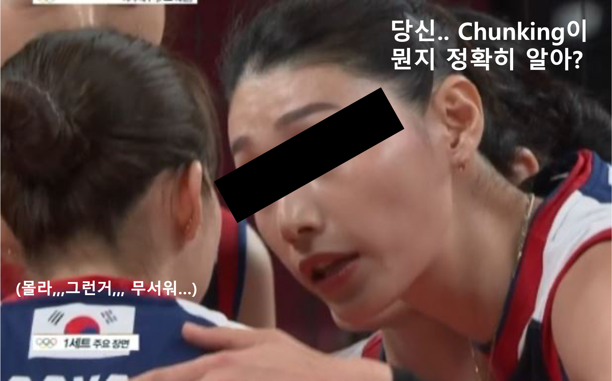

# 당신.. Chunking이 뭔지 정확히 알아..?

<figure><figcaption>
당신.. Chunking이 뭔지 알아..?
</figcaption></figure>

[**이전 포스트**](chunk.md)에 이어서 더 많은 이야기를 해보자. 직전 포스트를 봤으면 알겠지만 우리는 "Chunking"이라는 작업을 단순하게 바라보지 말아야 한다. 이 행위 자체가 결국 데이터의 품질을 결정하기 때문에 한단계 추상화된 목표까지 고려해서 Chunking을 수행해야하고, 가장 베스트한 성능을 위해 Chunk가 가져야할 속성에 대해 이야기했었다. 본 포스트에서는 앞서말한 Chunk의 속성을 최대한으로 유지할 수 있게 Chunking하기 위한 일련의 기준에 대해 말하고자 한다.

잠깐 돌아가서 정리해보자. 필자는 RAG라는 분야에서의 Chunk에 대해 알아보았고, RAG의 본 목적은 LLM이 답변하는데 있어 관련된 정보(=context)를 넣어주어 다양한 방면에서 이득을 취하는것에 있다. 실질적으로 RAG는 LLM을 활용한 Conversation System, 즉 Chatbot에 많이 기용된다.

