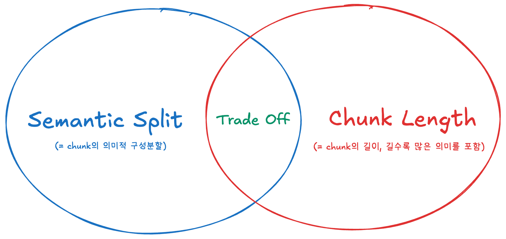

# 그래서 제일 좋은 Chunking이 뭔데?

<figure><figcaption>
그래서 제일 좋은 chunking이 뭐야?
</figcaption></figure>

앞선 Chunking에 관한 2개 포스트([당신.. chunking이 뭔지 정확히 알아?](..-chunking-...md), [그래서 제일 좋은 chunking이 뭔데?](chunking.md))에 이어서 이번포스팅에는 가장 성능이 좋은 Chunking 전략이 어떤  방법인지 너무나도 궁금했던 필자가 진행한 실험내용과 고민들을 같이 보도록 하자.&#x20;

## Ⅰ. Background

### ⅰ) Chunking Strategies

앞서 반복적으로 말했지만, Chunking이라는 것은 쉽게 유형화 할 수 있는 것이 아니다. Chunking된 결과물의 기준이 보편적이지 않을뿐만 아니라 Chunking의 대상인 Corpus의 구조도 고려해야하기 때문이다. 한편으로는 데이터 구조와 의미를 반영하여 적절하게 Chunking하는 것이 굉장히 이상적인 목표인만큼 여기서는 현존하는 Chunking Strategy 중에서 가장 성능이 좋은 Chunking이 무엇인지 살펴보자. 아래의 6가지 Chunking 방식을 대상으로 실험을 수행하였고, 각 방식의 장단점을 살펴보자. (각각의 Chunking 방식을 정의, 최소단위, 장/단점으로 정리하였다.)

* **Naive Chunking**
  * _정의_ : 주어진 구분자(=seperator)를 기반으로 수행하는 chunking.
  * _최소단위_ : 문자 (=character)
  * _장점_ : 빠른 수행속도
  * _단점_ : chunk들 사이 의미보존이 잘 되지않음. 길이편차도 심한편
* **Fixed Sized Chunking**
  * _정의_ : 정해진 크기(=fixed size)를 기준으로 수행하는 chunking.
  * _최소단위_ : 문자 (=character)
  * _장점_ : 빠른 수행속도, chunk들 사이 길이편차가 거의 없음.
  * _단점_ : chunk들 사이 의미보존이 잘 되지 않음.
* **Fixed Sized Chunking (with Overlap)**
  * _정의_ : 정해진 크기(=fixed size)를 기준으로 chunking하되 일정비율(%)만큼 내용을 겹친다(=overlap). \
    표현에 따라 **Sliding Window Chunking**이라고 부르기도 한다.
  * _최소단위_ : 문자 (=character)
  * _장점_ : 빠른 수행속도, chunk들 사이 길이편차가 거의 없음.&#x20;
  * _단점_ : Overlap에 의하여 Fixed Size Chunking에 비해서 의미보존이 잘되나 여전히 한계가 명확함. 전체적으로 의미보존이 잘 되지 않음.
* **Recursive Chunking**
  * _정의_ : 구분자(=seperator)를 기준으로 하여 재귀적으로 최대한의 depth까지 들어가서 수행하는 chunking.
  * _최소단위_ : 문자 (=character)
  * _장점_ : 빠른 수행속도, 재귀적 알고리즘을 통해 성능면에서 naive chunking, fixed size chunking, fixed size chunking with overlap보다 뛰어남.
  * _단점_ : chunk들간의 의미보존이 잘 되지 않음.
* **Sentence Window Chunking**
  * _정의_ : 정해진 크기(=chunk size)가 넘지않는 선에서 최소단위를 유지한 채 수행하는 chunking.
  * _최소단위_ : 문장 (=sentence)
  * _장점_ : 최소단위가 문자인 chunking방식들에 비해 뛰어난 의미보존
  * _단점_ : 최소단위가 문장인만큼 chunk들 사이의 길이편차가 심함, 문장분리 성능의 영향을 받음.
* **Semantic Chunking**
  * _정의_ : 문장별 유사도를 측정후 buffersize에 따라 병합/분리하여 chunking 수행
  * _최소단위_ : 문장 (=sentence)
  * _장점_ : 가장 의미를 잘 보존하는 chunking 방식
  * _단점_ : 문장별 유사도 측정단계에서 가장 큰 소요시간과 리소스를 차지함, 문장 분리 성능의 영향을 받음.

### ⅱ) Evaluation

&#x20;제조관련된 도메인의 데이터셋으로 평가 데이터셋을 구성하였다. 순서는 아래와 같다.

1. _**평가 데이터셋 제작**_
   1. 제조 도메인의 데이터를 크롤링하여 context를 수집한다.
   2. 수집한 context 중 품질좋은 일부를 선정한다.
   3. 선정된 context를 바탕으로 question을 생성한다.
2. _**평가방식**_
   1. 아래 2가지 평가를 진행하여 종합적으로 평가한다.
   2. 정량평가
      1. chunk별 길이분포
      2. retriever metric : hit-rate
   3. 정성평가
      1. quality check
   4. 종합평가
      1. 각 평가의 결과를 바탕으로 ranking을 매긴 후 Scoring하여 결과도출&#x20;

## Ⅱ. Experiments

### ⅰ) 정량평가

정량평가는 아래와 같은 2가지 기준으로 평가하였다.

#### (1). Chunk별 길이분포

chunk별 길이분포를 정량평가 기준으로 선정한 이유는 앞선 2개 post의 내용에서부터 비롯된다. 또한, chunking의 궁극적인 목적이 RAG pipeline에서의 Retrieval인 것을 감안했을 때 의미적으로 잘 분리가 되어야 하며, chunk들의 길이분포 또한 편차가 없는편이 좋다고 생각했다. 여기서 chunk들의 길이분포 편차가 없다는 것을 떠올린 이유가 무엇이냐면, chunk는 결국 paragraph에 해당하고, paragraph는 sentence의 집합이다. sentence는 word의 집합이니 결국 chunk의 길이가 길면 길수록 많은 sentence를 수용하고 sentence 길이가 길수록 많은 word를 내포하니 결국 풍부한 의미를 가질 수 있다고 바라본 것이다. 결국, <mark style="color:orange;">**chunk의 길이가 길수록 많은 의미를 담을 수 있다고 생각이 된 것**</mark>이다.

<figure><figcaption>
[ Fig.01 ] Trade-off relationship of 'semantic split' and 'chunk length'
</figcaption></figure>

#### (2). Retriever Metric : Hit-Rate

Retriever은 굉장히 다양한 지표가 존재하지만, 구성된 Evaluation Dataset이 **Single-Hop Dataset**이고 개수가 많이 존재하지 않기 때문에 Hit-rate만 사용하였다. Retriever시 Hybrid Search를 수행하였으며 Convex Combination 방식으로 Lexical Search, Semantic Search결과를 종합하였다. 이때, 각 검색방식에 따른 가중치는 Lexical Search에 0.8, Semantic Search에 0.2를 적용하였다.

### ⅱ) 정성평가

&#x20;정성평가의 경우 Quality Check를 수행한 것인데, 아래와 같은 순서대로 수행하였다.

* 아래 공통된 기준과 같이 chunking strategy별 결과를 같이 서로 다른 5명에게 배포한다.
  * 하나의 의미적 topic으로 구성되어있는가?
  * 완전한 형태 (e.g. 문장의 끊어짐 없이 완결적인 구성)로 되어있는가?
* 공통기준을 바탕으로 하여 chunking strategy별 순위를 매긴다.
* 개별 평가순위를 바탕으로 하여 정성평가 결과를 수합한다.

### ⅲ) 종합평가

앞선 결과를 종합하여 결과를 도출하려고 한다. 하나의 기준으로 종합하고자 하는 것은 현재 실험에서는 2가지 기준을 선정하였지만, 2가지로 국한되지 않고 더 확장될 수 있음을 고려한 것이다. 왜냐하면 Chunking이라는 작업의 특성상 외부 요인에 성능영향을 많이 받으면서 보편적 기준이 존재하지 않기 때문이다. 한편 RAG의 Hybrid Search를 수행할 때 점수 종합을 RRF (= Reciprocal Rank Fusion)과 CC (= Convex Combination) 방식을 살펴보았을 때 단순 Rank를 대상으로 하여 결과를 도출하는 RRF와 각기 다른 검색방식을 가중합하여 도출하는 CC방식을 일부 차용하여 **RC-Score (= Rank Combination Score)**&#xC744; 만들어 평가하였다.

$$
\text{RC-Score}(m,r) = (\omega_{Quality} *  S_{Quality}(m,r)) + (\omega_{Retriever} *  S_{Retriever}(m,r))
$$

**RC-Score** 평가지표는 위와 같으며 하나의 평가기준에 대한 결과 Ranking을 Score화하여 가중치와 함께 가중합한다. 본 실험에서는 8:2 비율을 사용하였다. $$S_{eval}(m,r)$$ 은 평가기준에 따른 score이며, $$m$$은 chunking strategy, $$r$$은 ranking을 의미한다. 이 2가지 parameter를 바탕으로 score를 산출하는 수식은 아래와 같다.

$$
\text{Score}_{eval}(m,r) = MAX(\pi_{eval}+1)-r_{eval}(m)
$$

$$\pi_{eval}$$은 $$eval$$ 기준에 따라 수행된 전체 chunking strategy 결과의 순위가 담긴 List이며 $$r_{eval}(m)$$은 해당 $$eval$$ 기준에 따른 특정 chunking strategy $$m$$의 결과 순위이다. 위와 같은 방식으로 종합점수를 산출하면 각기 다른 기준의 평가방식에 따른 chunking strategy ranking을 공통된 기준으로 정규화하였기에 신뢰성있는 비교가 가능할 것으로 판단하였다.

## Ⅲ. Conclusion

### ⅰ) 정량평가의 적합성

* **Naive Chunking**

<figure><figcaption>
[ Fig. 02 ] Naive Chunking 방식에 따른 chunk length
</figcaption></figure>

* **Fixed Size Chunking**

<figure><figcaption>
[ Fig. 03 ] Fixed Size Chunking 방식에 따른 chunk length
</figcaption></figure>

* **Fixed Size Chunking with Overlap**

<figure><figcaption>
[ Fig. 04 ] Fixed Size Chunking with Overlap 방식에 따른 chunk length
</figcaption></figure>

* **Recursive Chunking**

<figure><figcaption>
[ Fig. 05 ] Recursive Chunking 방식에 따른 chunk length
</figcaption></figure>

* **Sentence Window Chunking**

<figure><figcaption>
[ Fig. 06 ] Sentence Window Chunking 방식에 따른 chunk length
</figcaption></figure>

* **Semantic Chunking**

<figure><figcaption>
[ Fig. 07 ] Semantic Chunking 방식에 따른 chunk length
</figcaption></figure>

초반 설계와 다르게 데이터의 속성 및 구조를 고려할 수 있는 환경이 아닌 상태에서 동일한 데이터에 각기 다른 Chunking Strategy를 적용하고 Chunk 길이 분포를 바탕으로한 통계량를 평가기준으로 삼는 것은 공정성 및 신뢰근거가 부족하다고 판단하였다. Chunk 길이 분포는 RAG에서 Retriever된 후 Augmented되면서 더 많은양의 의미가 담길 수 있냐 없냐를 결정할 고려할 중요한 소요임이 분명하지만 해당 실험에서 주된 평가소요가 될 수없다는 판단을 내렸다.

<mark style="color:red;">**최종적으로 정량평가에서 Chunk의 길이 분포를 배제하였다.**</mark>

### ⅱ) 종합결과

&#x20;실험결과를 보자.

<figure><figcaption>
[ Fig. 08 ] RC-Score from each chunking strategies
</figcaption></figure>

평가결과, 가장 종합적인 성능이 높은 방식은 Semantic Chunking으로 판단하였다. \
다만, 아래와 같은 한계점이 분명히 존재한다.

## Ⅳ. Limitation

* 특정 도메인 내용의 데이터를 사용하여 평가하였으므로 General한 성능으로 볼 수 없다.
* Retrieval Metric의 경우 아래와 같은 외부요인에 영향을 받을 수 밖에 없다.
  * Embedding Model의 성능
  * Evaluation Dataset의 구성 (품질)
* Ranking Combination Score의 계산시, 사전에 작성한 평가기준에 따라 각기다른 가중치값이 부여되고 이에 따라 전체 Score 값이 달라진다.
* overlap 여부를 고려하지 않고 수행하였다.

***

뭔가.. 순수한 Chunking 방식의 성능을 평가하고 싶었지만 마땅한 방식이 없고, Chunking에 대한 연구가 많은 없다는 점에서부터 시작된 자체연구결과이다. Chunking 평가에 대해 더 고도화하여 앞으로도 이어져서 연구가 되어야 할 것 같다.

