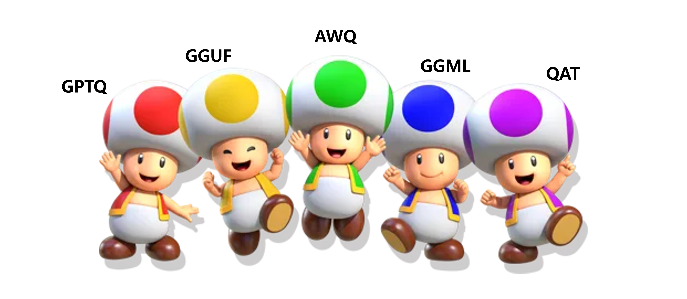

# LLM Quantization 방법론 알아보기

<figure><figcaption><p>LLM Quantization</p></figcaption></figure>


언어모델의 양자화(Quantization)는 모델을 압축하여 빠르고 효율적으로 만드는 기술이다. 모델의 가중치와 활성화 값을 줄여 메모리를 절약하고 연산 속도를 높이는데 목적을 두고 있다. RAG를 하는 필자에게 양자화는 크게 와닿는 기술은 아니지만 기본적인 것은 알고있어야 할 듯하여 이참에 정리해보려고 한다.

## 1. Quantization이란?

LLM에서 양자화는 신경망의 구조인 wx+b 수식의 w와 b 값의 범위를 높은 정밀도의 숫자에서 낮은 정밀도의 숫자로 변환하는 것을 의미한다. 양자화를 하게되면 수식의 범주가 변화하고 이는 디스크의 저장공간에 영향을 주기 때문에 메모리 요구량을 낮출 수 있는 기술이 된다. 일단은 양자화의 근본적인 예시를 알아보도록 하자.&#x20;

대표적인 예시로 아래와 같이 FP16 형식의 행렬이 있다고 가정해보자. 이 행렬을 int8형식으로 양자화 후, 역양자화 하는것을 살펴보면 아래의 과정순서를 따라 양자화 및 역양자화하게 된다.

```python
array([[0.5415, ..., ..., ..., ...],
       [..., ..., ..., ..., ...],
       [..., ..., ..., ..., ...],
       [..., ..., ..., ..., ...],
       [..., ..., ..., ..., ...]], dtype=float16)
```

거창하게 설명하고자 하지만 사실 FP16의 범위(-65504.000 \~ +65504.000)를 Int8(-128 \~ +127)사이의 범위로 스케일링 해주는것과 다름없다. 즉, 가장 단순무식한 방법은 그냥 정규화를 하는건데 그러면 정보손실이 어마어마하게 일어나게 된다. 가령, 임의의 행렬값이 64988이던 65503이던 모두 126이 되어버리는것과 같은 원리인 것이다. 즉, 실수부분을 배제하더라도 약 500개 이상의 숫자가 126이라는 하나의 값으로 치환되버리는 것이다. 그래서 확률분포를 이용해 보정을 한다. 양자화는 결국 메모리량을 줄일 수 있는 좋은 기술이지만 동시에 일련의 정보손실을 감안해야 한다. 정보손실은 성능에 직결되는 요소이며 장단점을 잘 고려하여 적용해야 한다. 본격적으로 다양한 양자화방식에 대해 알아보자.

최근 LLM의 발전에 따라 보편적으로 사용하는 양자화방식을 정리하면 다음과 같다.

* PTQ (Post Training Quantization)
  * GPTQ
  * GGUF / GGML
  * QLoRA's 4bits
* QAT (Quantization Aware Training)
* AWQ (Activation Aware Quantization)

## 2. PTQ (Post Training Quantization)

### 2-1. GPTQ (Post Training Quantization for GPT Models)

**GPTQ**는 사후 훈련 양자화( post training quantization ) 방법으로 pre-trained LLM의 매개변수를 낮은 정밀도로 변환하는 것을 의미한다. GPTQ는 GPU에서 선호되며 CPU에서는 사용되지 않는다. 아래와 같은 다양한 방식이 존재하다고 한다.

* **Static Range GPTQ**
  * 양자화 범위를 사전에 측정된 고정된 범위(min/max 값)에 기반하여 설정한다.
  * 추론중에는 범위가 변하지 않는다.
* **Dynamic Range GPTQ**
  * 양자화 범위를 런타임에 동적으로 계산하여 적용한다.
  * 일반적으로 weight가 아닌 activation 양자화에 더 많이 사용되며 추론중 추가 연산이 필요하다.
* **Weight Quantization**
  * 모델의 weight 파라미터를 float (e.g. FP16)에서 int (e.g. INT8)로 변환한다.
  * weight quantization을 loss-aware하게 최적화하여 모델크기 감소, 연산속도 증가효과를 가져온다.
  * inference시 효율적이다.

### 2-2. GGML(GPT-Generated Model Language)

**GGML**은 원래 Meta(구 Facebook)의 LLaMA 모델을 경량화하여 로컬에서 실행할 수 있도록 만든 라이브러리이며 아래와 같은 특징을 지닌다.

* **C 기반 경량 라이브러리**로, CUDA 없이도 CPU에서 모델 실행 가능
* 모델을 `.bin` 형식으로 저장 (`ggml-model-f16.bin` 등)
* 다양한 양자화 지원 (Q4\_0, Q4\_1, Q5\_0, Q8\_0 등)으로 모델 크기 축소 및 속도 향상
* `llama.cpp`, `gpt4all`, `koboldcpp` 등과 호환
* 비교적 **낡은 형식**, 메타데이터 저장 기능 부족
* 구조적으로 유연성이 낮음
* 모델 메타 정보가 거의 없어 추후 유지 보수에 어려움
* 다양한 모델 포맷과의 호환성이 떨어짐

### 2-3. GGUF (GPT-Generated Unified Format)

**GGUF**는 GGML의 후속 개념으로, 더 구조적이고 확장 가능한 모델 파일 포맷이다. `.gguf` 확장자를 사용하며 아래와 같은 특징을 지닌다.

* 모델 메타데이터 포함 (모델 종류, 토크나이저 정보, 양자화 방식 등)
* 모델 호환성 강화 : 여러 모델 종류 (LLaMA, GPT, Mistral, Falcon 등) 지원
* 향후 업데이트나 커스텀 토크나이저 적용이 쉬움
* `llama.cpp` 최신 버전에서 GGUF만 지원
* `.gguf` 파일 하나로 모델과 설정 통합 가능
* 상대적으로 새 포맷이라 모든 툴이 아직 완벽히 지원하지 않음
* GGML보다 파일 크기가 약간 더 커질 수 있음

## 3. QAT (Quantization Aware Training)

**QAT (Quantization Aware Training)** 은 pre-trained model 또는 PTQ (Pre-Trained Quantization) 모델로 시작하는데 이 모델을 QAT를 사용하여 fine tune 하는 것이다. 여기서의 목표는 PTQ 모델을 사용한 경우 발생한 정확도 손실을 복구하는 것인데 즉, 모델의 가중치와 활성화를 학습하면서 양자화한다.\
\
QAT는 forward에 영향을 미치지만 backward는 영향을 받지 않는다. QAT에서는 매개변수가 양자화되었을 때 정확도 손실이 발생하지 않는 레이어에 대해 양자화가 수행되고 매개변수가 양자화되면 정확도에 부정적인 영향을 미치는 레이어는 양자화되지 않는다. 즉, QAT의 기본 아이디어는 해당 레이어의 가중치 정밀도에 따라 입력을 낮은 정밀도로 양자화하는 것이다.&#x20;

## 4. AWQ (Activation Aware Quantization)

이 방법은 GPU 또는 CPU에서 사용하기 위한 것으로 모든 가중치를 양자화하지 않고 모델의 유효성을 유지하기 위해 중요하지 않은 가중치를 양자화하는 방식이다. AWQ의 특징은 아래와 같다.

* 효율성 증가&#x20;
  * AWQ는 32비트에서 8/4/2비트 가중치로의 모델 압축을 4배에서 8배까지 가능하게 하며, 이는 저장 공간 및 처리 능력을 현저히 줄여줍니다.
* 빠른 추론 속도
  * INT8/4 하드웨어에서 최대 3배 빠른 추론을 제공하여 사용자 경험을 개선하고 리소스 사용을 최소화합니다.
* 높은 정확도 유지
  * 단순 반올림 양자화보다 정확도를 훨씬 더 잘 유지하며, 모델 재학습 없이도 다양한 데이터셋에 걸쳐 견고하게 작동합니다.
* 범용적 통합
  * AWQ는 ONNX Runtime, PyTorch, TensorFlow Lite 등과 같은 인기 있는 오픈 소스 모델 배포 도구에 통합되어 있어, 생산화를 단순화합니다.

## 5. Conclusion

양자화는 제한된 H/W Resource 환경에서 모델을 적절하게 운용하기 위한 방법론으로 다양한 방식과 아래와 같은 특징을 지닌다.&#x20;

* **장점** : 메모리 절약, 추론 속도 향상, 다양한 하드웨어와의 호환성.
* **단점** : 구현의 복잡성, 정밀도 손실 가능성, 특정 하드웨어에 대한 의존성.

LLM의 성능을 높이기 위해 크기가 점점 커지는 반면 활용되는 부분 역시 더 늘어나고 있다. 이를통해 간접적으로 양자화의 필요성이 높아지고 있다고 생각하는데, 모델 크기와 가용 리소스사이의 적절한 Trade-Off가 어느지점에 수렴할지 기대가 된다.
