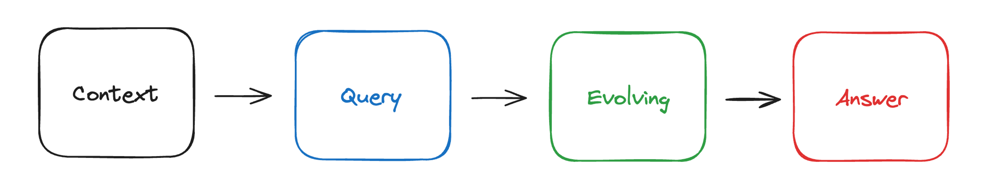
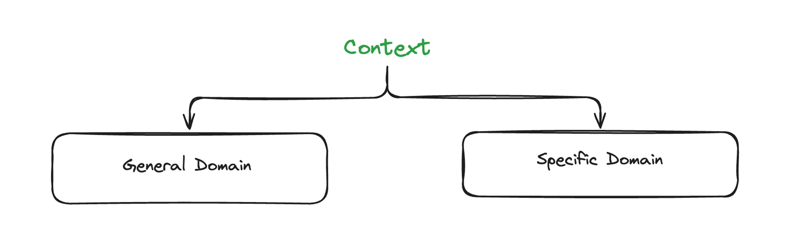
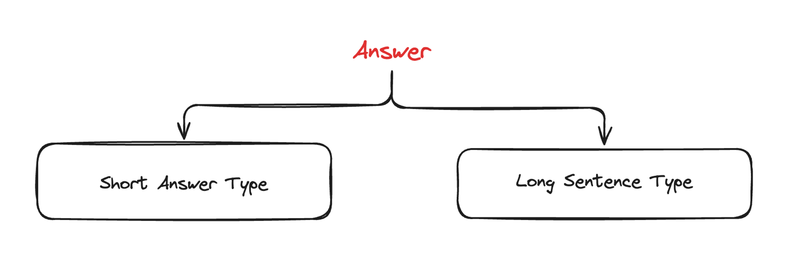

# 아무도 RAG 평가 셋 만드는 것에 관심가지지 않아\~

<figure><figcaption><p>아무도 RAG 평가셋 만드는 것에 관심가지지 않아~</p></figcaption></figure>

## Ⅰ. RAG 평가는 어떻게 하지?

여러분은 Retriever Augmented Generation(RAG) System을 어떻게 평가해야하는지 알고있는가?\
예전과 다르게 많은 사람들이 RAG에 관심을 가지면서 점차 평가에 대한 소요도 늘어나기 시작했다. 대중적으로는 RAGAS와 Llama-Index, Langchain과 같은 프레임워크에서 제공해주기도 하며 최근에는 평가에 대한 오픈소스들도 늘어나는 추세이다. 가장 대표적으로 AutoRAG와 RAGEval이 존재한다. 근데 널리 알려진 프레임워크들을 잘 살펴보면 만드는 방법이 다 동일하다...!&#x20;

<figure><figcaption><p>RAG 평가 셋 제작 프로세스</p></figcaption></figure>

주어진 Context로부터 Query를 만들고, 해당 Query와 Context를 바탕으로 Answer를 생성하여 이 3가지 쌍(triple-pair)를 Evaluation Dataset으로 정한 뒤, 실제 RAG Pipeline에 접목시켜 평가한다. 사용자에 따라, 평가 셋을 만드는 환경에 따라 Query를 생성할 때 Evolving과정을 넣기도 하고 아니기도 한다. 필자는 Evolving단계가 꼭 필요하다는 주의이다. 아래에 해당 파트에서 조금 더 자세하게 설명하도록 하겠다. 평가(evaluation)의 관점에서 RAG는 다양한 관점에서 바라봐야한다.&#x20;

<figure><figcaption><p><strong>Figure 01</strong> : RAG Metric List (<a href="https://github.com/Marker-Inc-Korea/AutoRAG?tab=readme-ov-file">https://github.com/Marker-Inc-Korea/AutoRAG?tab=readme-ov-file</a>)</p></figcaption></figure>

위의 **Figure 01**에 보면서 얘기를 나누어보자. RAG의 평가는 크게 Retriever 평가와 Generation 평가가 이루어져야 한다. 먼저 Retriever 평가의 경우 기존의 통계적 평가지표인 Precision, Recall, F1 3가지를 가져가며 추천시스템에서 널리 사용되는 mAP, mRR, NDCG도 사용될 수 있다. 또한, Retriever의 task적인 면에서 주어진 query에 따라 top-k개의 context가 뽑히는걸 생각하면 Context-Precision, Context-Recall을 사용하는 곳도 있다. 일반적으로 언급되는 Precision, Recall이 Context-Precision, Context-Recall과 동일시되기도 한다. Generation 평가를 살펴보자. 정량적인 평가방식으로 BLEU, Rouge, METEOR, BERT\_Score, Sem Score를 보통 사용한다. 다만, 평가 metric의 경우 목적과 환경에 맞게 적절하게 선택해야 한다. 당연한 말이지만 평가지표 수치의 높고 낮음이 절대적인 성능을 대변하지 않기 때문이다. 정성적인 평가방식으로는 G-Eval을 많이 사용한다. G-Eval은 LLM을 이용한 평가방식으로 평가기준을 사용자가 잘 정립하여 prompt를 작성해주어야 한다.

## Ⅱ. 평가 데이터셋의 품질은 어떻게 올리지?

여기서 한가지 맹점이 있다. RAG평가에 수요가 늘어난것도 좋고, 해당 분야의 연구가 활발한것도 좋다. 더 많은 평가지표가 활용될 수 있는것 또한 반길일이다. <mark style="color:orange;">**근데, 너무 광범위하지 않나..?**</mark> 필자는 항상 그런 생각을 했다. 아래 prompt를 보자.

```python
RAG_PROMPT_TEMPLATE = """
<|system|>
Using the information contained in the context,
give a comprehensive answer to the question.
Respond only to the question asked, response should be concise and relevant to the question.
Provide the number of the source document when relevant.
If the answer cannot be deduced from the context, do not give an answer.</s>
<|user|>
Context:
{context}
---
Now here is the question you need to answer.

Question: {question}
</s>
<|assistant|>
"""
```

위 코드는 huggingface의 cookbook에 내장된 rag\_evaluation part의 RAG Prompt이다. prompt를 천천히 읽어보면 별로 내용이 없다는 것을 알 수 있을것이다. RAG System은 본질적으로 LLM의 답변을 더욱 더 정교하게 만들고 신뢰성을 보완해주며 다양한 용도에 맞게 응용될 수 있는 가능성을 가지고 있다고 생각한다. 그렇다면 평가도 용도에 맞게 변형해서 사용해야하지 않을까? RAGAS를 찾아봐도, RAGEval과 AutoRAG를 다 들여다봐도 평가셋을 만들어내는 파이프라인에 대한 이야기는 많이 해도 용도에 맞는 평가셋 제작에 대한 인사이트는 얻을 수 없었다. (이중에서는 단연 AutoRAG 한 곳만 생성하는 평가 데이터셋의 품질을 신경쓰더라. 다만, AutoRAG의 본래 목적은 RAG 파이프라인에 대한 최적화이므로 다양한 내용이 포함되지는 않은듯하다.)  즉, RAG의 본 목적을 따진다면 평가 데이터셋을 만드는 것도 RAG Pipeline이 적용될 환경과 User-Scenario를 고려하여 만들어져야 한다고 생각한다. 한마디로 <mark style="color:purple;">**RAG Pipeline의 목적에 align되는 Evaluation Dataset을 만드는 시도가 필요하다**</mark>고 할 수 있겠다.

## Ⅲ. Align된 RAG Evaluation Dataset 만들기

그렇다면 어떻게 만들어볼 수 있을까? 호기롭게 내뱉기는 했으나 막상 할 수 있는게 뭐가 있지 싶었다.. 평가 데이터셋을 만드는 방식은 위와 동일할 것이고 사용환경과 목적을 먼저 가정하기로 했다. 가장 사용을 많이 하는 ChatBot에 사용될 RAG Pipeline으로 가정해보자. 그렇다면 실제 사용자는 우리가 만든 AI Chatbot과 대화(=Conversation)을 하게 될 것이고 세밀한 성능평가를 위해 일단은 단일 턴(Single-Turn)만 고려하겠다.

### Ⅲ-1. Context 분류

가장 먼저 확인해야할 것이 바로 Context에 대한 분류이다. 사실 평가 데이터셋을 만들 때 가장 권장하는 방법은 사람이 직접 Ground-Truth로 사용할 Context를 선정하는 것인데, 필자는 이 작업을 사람이 직접하는 이유가 가장 목적과 의도에 부합하는 데이터를 선정할 수 있어서라고 생각한다. 그렇기 때문에 방법론적인 방면에서는 고정되어 있다고 생각하고, 사용하는 환경은 단언할 수 있는것이 아니기에 Context의 경우 내용에 따른 분류만 생각해도 될 것이다. 여기서 내용에 따른 분류는 주어진 Context의 담화주제(=Discourse Topic)가 특정한 도메인에 해당하는지 아닌지가 될 것이다. 크게 2가지 일반 도메인과 특수 도메인으로 구분하는데 일반 도메인은 특정한 도메인 분야에 속하지 않은 내용을 의미하고 특수 도메인은 특정한 도메인 분야에 속한 내용을 의미한다.

<figure><figcaption><p>Figure 02 : Context 분류</p></figcaption></figure>

* **내용에 따른 분류** : 주어진 Context의 담화주제(Discourse Topic)가 특정한 도메인 분야에 해당하는지에 따른 분류이다.&#x20;
  * \- **일반 도메인 (General Domain)** : 특정한 분야에 속하지 않음 (e.g. Discourse Topic이 상대방에 대한 내용)&#x20;
  * \- **특수 도메인 (Specific Domain)** : 특정한 분야에 속함 (e.g. Discourse Topic이 특정한 분야에 대한 내용, 의료, 금융, 제조 등등)


**담화주제(=Discourse Topic)**&#xB294; 하나의 문장(sentence)이 아닌 전체 텍스트(또는 담화, 여기서는 Context)속에서 중심이 되는 개념을 말한다. 텍스트 전체를 아우르는 개념이라서, 한 문장의 “화제(topic)” 보다 더 큰 범위를 가지며 개별 문장들의 화제와 관련 있지만, 모든 문장을 아우를 수 있는 내용을 의미한다.


### Ⅲ-2. Question 분류

그 다음으로는 Question 분류차례이다. 사실 Question 분류가 가장 복잡할 것이다. 왜냐하면 Answer의 경우 Context와 Question이 준비되어있으면 그에 따라 자동적으로 결정되기 때문이다. 아래 그림을 보면서 얘기해보자!

<figure><figcaption><p><strong>Figure 03</strong> : Question 분류</p></figcaption></figure>

크게 3가지 분류로 구분할 수 있겠다. 가장 먼저 **"참조정보 개수에 따른 분류"**&#xC774;다. 흔히들 들어봤을터인데, Multi-Hop Question과 Single-Hop Question에 대한 분류로 이해하면 되겠다.

* **참조정보 개수에 따른 분류** : 주어진 Context로부터 생성한 Question이 참조하는 정보(=Context)개수에 따른 분류이다.
  * **단일참조 질문 (Single-Hop Question)** : 1개의 Context 정보를 바탕으로 생성한 Question 유형
  * **다중참조 질문 (Multi-Hop Question)** : 2개 이상의 Context 정보를 바탕으로 생성한 Question 유형

두번째 분류는 **"의도에 따른 분류"**&#xC774;다. 우리는 대화(=Conversation)상황을 가정하고 있기 때문에 직접적으로 드러나지 않겠지만 어떠한 이야기를 하던 "화자"가 존재하고, "화자"가 존재하면 당연하게 "청자"도 존재한다. 두번째 분류는 기본적으로 "청자"의 범위를 고려하여 구분하고, 범위가 좁혀진 "청자"에게 어떠한 목적으로 하는 질문인지를 유형화 시킨것이다. 해당 분류는 기술해놓은 내용 이외에도 다양하게 구성될 수 있다.&#x20;

* **의도(=목적)에 따른 분류** : 주어진 Context로부터 생성한 Question의 의도(=목적)유형에 따른 분류이다. 해당 분류는 답변형태에 따른 분류를 내포한다.
  * **정보탐색형 (Search)** : 어떠한 대상에 대한 정보를 물어보는 유형
  * **대상비교형 (Comparison)** : 2가지 이상의 대상에 대한 비교/대조 내용을 물어보는 유형
  * **의견도출형 (Debate)** : 대상의 범위에 관계없이 의견을 물어보는 유형

&#x20;마지막 분류는 **"정보표현 여부에 따른 분류"**&#xC774;다. RAG의 성질에 가장 근접한 내용을 담고있다고 볼 수 있는데, 주어진 Context에 기반하여 Question을 생성하는 만큼 우선적으로 Context의 정보량에 따른 구분이 이루어졌다고 이해하면 편할 것이다.&#x20;

* **정보표현 여부에 따른 분류** : Conversation에 포함된 정보의 표현방식에 기반하였는지에 따른 분류이다.
  * **사실기반형 (Fact-Base)** : 직접적으로 표현된 정보를 기반으로 함.
  * **추론기반형 (Reasoning-Base)** : 직접적으로 표현된 정보를 바탕으로 추론/사고 과정을 통해 직접적으로 표현되지 않은 정보를 유추함.
  * **의견기반형 (Opinion-Base)** : 정보의 표현여부에 관계없이 본인의 의견을 도출함.

### Ⅲ-3. Answer 분류

&#x20;마지막으로 Answer의 분류이다. 앞서 얘기했듯 Answer의 경우 Context와 Question에 따라 자연스럽게 따라온다. 아래 그림을 보자.

<figure><figcaption><p><strong>Figure 04</strong> : Answer 분류</p></figcaption></figure>

기본적으로 **"답변형태에 따른 분류"**&#xB77C;고 표현하였고 우리가 잘 알고있는 답변길이에 따른 분류인 단답형/장문형으로 오해할 수 있다. 가령, "독일 태생의 이론물리학자로 상대성 이론을 창시한 학자 이름이 무엇이냐?"라는 Question이 있다면, 이에 대한 답변이 우리가 이미 알고있는 단답형/장문형 2가지로 분류로는 구분하기 어렵다. 왜냐하면 단답형 답변으로는 "아인슈타인입니다."라고 할 수 있겠고, 장문형으로는 "독일에서 태어난 이론물리학자는 많지만, 그중 상대성 이론을 창시하였고 후대에 전해진 사람은 아인슈타인이라고 말할 수 있습니다."라고 표현할 수 있다는 것이다. 그렇기때문에 필자가 정의한 "답변형태에 따른 분류"의 기준은 바로 **Question이 요청한 정보량인가 아닌가**로 바라볼 수 있다. 물론 2개 유형 모두 사실된 내용을 바탕으로 해야함은 변치 않는다.

* **답변형태에 따른 분류** : Conversation과 Question에 따라 도출될 수 있는 답변유형에 따른 분류이다.&#x20;
  * **단답형 (Short-answer type)** :  Question이 요구한 정보량만을 가지고 사실된 내용을 바탕으로 생성한 답변
  * **장문형 (Long-sentence type)** : Question이 요구한 정보량에 관계없이 사실된 내용을 바탕으로 생성한 답변

## Ⅳ. Conclusion

평가에 대해서는 다양한 방법론들이 존재하고 앞서 소개한 내용이 모든 환경에 적합하게 쓰이지는 않을 것이다. 다만,  중요한 것은 RAG에 대해 평가를 하는데 평가 데이터셋의 구성도 목적과 상황에 따라 Align되게 제작해야 한다는 점이고, 그러한 주장을 뒷받침할 Context, Question 그리고 Answer에 대해 일련의 유형체계를 제시하였다. 현실세계에서 RAG에 접목되는 상황은 매우 가변적이고 다양할테니 위의 분류체계의 일부가 겹치는 상황도 분명히 존재할 것이라 생각된다. 그럼에도 위와 같이 분류체계를 수립해나가야 한다고 강하게 말하고 싶다. 이는 사람이 살아가는데 인문학 및 언어의 연구가 필요한 이유와 같지 않을까? 더 다양한 Use-Case가 나오면 좋을 것 같다ㅎㅎ

